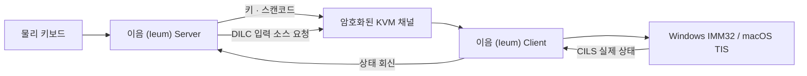

<!-- SPDX-FileCopyrightText: (C) 2026 Ieum Developers -->
<!-- SPDX-License-Identifier: GPL-2.0-only WITH LicenseRef-OpenSSL-Exception -->

  

<h1 align="center">이음 (Ieum)</h1>

<strong>한글과 CJK 입력기를 키 매핑이 아닌 입력 상태로 다루는 IME 네이티브 소프트 KVM</strong>

  한국어 · <a href="../README.en.md">English</a> · <a href="../README.zh-CN.md">简体中文</a>

  <a href="https://github.com/victoriousian/ieum/releases/tag/v0.1.0-alpha.3"><strong>이음 다운로드</strong></a>
  · <a href="#후원"><strong>후원하기</strong></a>

  
  
  

이음은 한 대의 키보드와 마우스로 Windows, macOS, Linux 컴퓨터를 오가게 해주는 소프트웨어
KVM입니다. 화면 경계를 넘는 것에서 멈추지 않고, 운영체제마다 다른 **한/영 상태, IME 조합 세션,
원시 키 위치와 유니코드 클립보드**를 하나의 입력 흐름으로 연결하는 데 초점을 둡니다.

> 현재 단계는 `v0.1.0-alpha.3`입니다. 자동 빌드와 단위 테스트는 통과했지만 Windows/macOS 실기
> 장시간 입력 매트릭스와 코드 서명은 아직 완료되지 않았습니다.

## 언어별 제품 표기와 인터페이스

한국어 UI에서는 **이음 (Ieum)** 과 “한글과 CJK 입력을 안정적으로 잇는 소프트웨어 KVM”을,
그 외 언어에서는 **Ieum** 과 “Software KVM across Windows, macOS, and Linux”를 표시합니다.
메인 화면은 시스템 팔레트와 서버/클라이언트 세그먼트를 중심으로 재구성했으며, WWDC26 Liquid
Glass의 명확한 기능 계층, 표준 컨트롤, 절제된 소재와 접근성 원칙을 Qt에 맞게 적용합니다.
상세 기준은 [이음 인터페이스 원칙](../docs/design/visual-system.md)에서 확인할 수 있습니다.

## 후원

**이음이 도움이 됐다면 개발을 후원해 주세요.** 후원금은 Windows 코드 서명, Apple Developer
Program과 공증, 실기 테스트 장비, 릴레이 인프라와 지속적인 유지보수에 사용합니다.

현재 `victoriousian` GitHub Sponsors 결제 프로필은 개설 준비 중입니다. 프로필이 활성화되면 이
위치와 저장소의 Sponsor 버튼에서 일회성·정기 후원을 받을 예정입니다. 금전 후원 전에도 저장소
Star, 사용 후기, 실기 테스트 결과와 버그 제보는 프로젝트에 직접적인 도움이 됩니다.

## 한국어 입력은 단순한 키 매핑이 아닙니다

일반 소프트 KVM은 물리 키를 문자 코드로 번역해 반대편에서 다시 키로 합성합니다. 정적인 자판
레이아웃에는 잘 맞지만 한글·중국어·일본어 입력은 **입력기 상태와 조합 중 문자열(preedit)** 에 의해
결정됩니다.

| 증상 | 구조적 원인 |
| --- | --- |
| Windows 한/영키로 Mac 입력기가 바뀌지 않음 | 한/영은 문자가 아니라 입력 모드 전환 명령인데 일반 키 이벤트로 처리됨 |
| 서버 표시와 실제 입력창의 한/영 상태가 다름 | 클라이언트의 실제 입력 소스를 확인하고 회신하는 채널이 없음 |
| `한`이 `ㅎㅏㄴ`처럼 간헐적으로 분리됨 | 입력 중 소스 전환, 이중 이벤트 주입 경로, 이벤트 순서 붕괴가 조합 세션을 끊음 |
| Mac에서 복사한 한글이 Windows에서 분리됨 | macOS의 분해형 문자열이 NFC로 정규화되지 않음 |

이음은 이 문제를 “특수키 하나 추가”가 아니라 **입력 상태를 프로토콜의 일부로 만드는 문제**로
다룹니다.

## 이음이 바꾸는 것

1. **입력 소스 제어 채널:** 프로토콜 1.9의 `DILC`/`CILS`로 입력 소스 변경을 요청하고 실제 적용된
   클라이언트 상태를 회신합니다.
2. **IME 네이티브 키 경로:** IME 활성 시 문자 재번역을 우회하고 PC Set-1 원시 스캔코드로 물리 키
   위치를 전달합니다.
3. **macOS 이벤트 합성 일관성:** 하나의 영속 `CGEventSource`와 FIFO 경로로 이벤트 순서를
   유지합니다.
4. **유니코드 클립보드 정규화:** macOS에서 공유되는 UTF-8 텍스트를 NFC로 정규화합니다.

## 현재 상태

| 영역 | 상태 |
| --- | --- |
| 이음 브랜드, 아이콘, 앱·설치 프로그램 이름 | 완료 |
| Windows x64/ARM64, macOS Intel/Apple Silicon 패키지 | CI 빌드·패키지 검사 통과 |
| `DILC`/`CILS`, raw scancode, macOS 이벤트 소스, NFC 경로 | 구현 및 자동 테스트 포함 |
| Linux/Flatpak 패키지 | 실험적 제공 |
| Windows ↔ macOS 실기 10분 입력 매트릭스 | **대기 중** |
| Windows 코드 서명, Apple 서명·공증 | **대기 중** |
| iPadOS | 시스템 전역 입력 주입용 공개 API가 없어 지원하지 않음 |

## 다운로드

[이음 (Ieum) v0.1.0-alpha.3 릴리스](https://github.com/victoriousian/ieum/releases/tag/v0.1.0-alpha.3)

| 운영체제 | 설치 파일 |
| --- | --- |
| Apple Silicon Mac | `Ieum-0.1.0-alpha.3-macos-arm64.dmg` |
| Intel Mac | `Ieum-0.1.0-alpha.3-macos-x86_64.dmg` |
| Intel/AMD 64비트 Windows | `Ieum-0.1.0-alpha.3-win-x64.msi` |
| Intel/AMD 64비트 Windows 한국어 설치 화면 | `Ieum-0.1.0-alpha.3-win-x64-ko-KR.msi` |
| ARM64 Windows | `Ieum-0.1.0-alpha.3-win-arm64.msi` |
| ARM64 Windows 한국어 설치 화면 | `Ieum-0.1.0-alpha.3-win-arm64-ko-KR.msi` |

Windows용 `portable.7z`와 Linux 패키지도 릴리스에 포함됩니다. 모든 파일은 함께 제공되는
`SHA256SUMS.txt`로 검증할 수 있습니다. 현재 알파 패키지는 서명되거나 Apple에 공증되지 않았습니다.

## 오픈소스와 유료 제품 방향

로컬 KVM 코어와 현재 배포 코드는
`GPL-2.0-only WITH LicenseRef-OpenSSL-Exception`으로 공개합니다. 로컬 KVM·IME·클립보드 코어는
GPL로 유지하고, 공식 서명·공증 배포, 안정 업데이트, 호스팅 릴레이·장치 검색, 팀 관리, 기업 통합과
우선 지원을 유료 제품 및 서비스 영역으로 검토합니다.

GPL 바이너리는 판매할 수 있지만 구매자는 대응 소스와 재배포 권리를 가집니다. 지속 가능한 유료
가치는 소스 제한보다 **공식 신뢰, 운영 편의, 호스팅 서비스와 지원**에 둡니다.

## 계보와 라이선스

이음 (Ieum)은 `deskflow/deskflow`의 `39bf4fb`에서 포크해 개발하고 있습니다. 프로토콜 호환성과 기존
macOS 권한 승계를 위해 일부 내부 바이너리명과 `org.deskflow.deskflow` 식별자는 유지합니다.
사용자에게 표시되는 제품명, 앱 아이콘, 설치 프로그램과 릴리스는 이음 (Ieum)으로 관리합니다.

코드는 `GPL-2.0-only WITH LicenseRef-OpenSSL-Exception`에 따라 배포하며 원저작자 고지와 라이선스
파일을 유지합니다. 전체 문서는 [한국어 README](../README.md)에서 확인할 수 있습니다.
