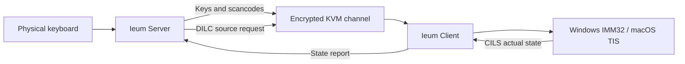

<!-- SPDX-FileCopyrightText: (C) 2026 Cherry Inc. -->
<!-- SPDX-License-Identifier: GPL-2.0-only WITH LicenseRef-OpenSSL-Exception -->

<p align="center">
  
</p>

<h1 align="center">Ieum</h1>

<p align="center"><strong>Software KVM across Windows, macOS, and Linux</strong></p>

<p align="center">Developer and contributor <strong>Heesang Kim (PhD)</strong> · Company <strong>Cherry Inc.</strong></p>

<p align="center">
  <a href="README.md">한국어</a> · English · <a href="README.zh-CN.md">简体中文</a>
</p>

<p align="center">
  <a href="https://github.com/victoriousian/ieum/releases/tag/v0.1.0-alpha.14"><strong>Download Ieum</strong></a>
  · <a href="#support-development"><strong>Support development</strong></a>
</p>

<p align="center">
  <a href="https://github.com/victoriousian/ieum/actions/workflows/continuous-integration.yml"></a>
  <a href="https://github.com/victoriousian/ieum/releases"></a>
  <a href="LICENSE"></a>
</p>

Ieum lets one keyboard and mouse move across Windows, macOS, and Linux computers. It goes beyond crossing a
screen edge: it connects **Korean/English mode, IME composition sessions, physical key positions, and Unicode
clipboard data** into one consistent input path across operating systems.

> The current release is `v0.1.0-alpha.14`. Automated builds and unit tests pass, but the long-running physical
> Windows/macOS input matrix and production code signing are not complete.

## Alpha.14 input reliability

- Delayed network input is processed in bounded slices, preventing a long mouse movement from collapsing into
  one jump and preventing an input burst from monopolizing the core event loop.
- Windows absolute pointer coordinates now use the entire virtual desktop, including secondary monitors and
  negative coordinates, instead of assuming the primary display.
- The macOS client keeps raw mouse capture while the pointer is on the remote screen and includes upstream fixes
  for macOS 27 background clicks and drag event numbering.
- Input-language changes no longer raise repeated Windows notification toasts. A stable `한`/`A` indicator in
  the main status bar, tray menu, and tray tooltip presents the same state quietly.
- Disconnect and refusal cleanup is deferred until the active network callback returns, and event handlers stay
  alive for the duration of dispatch.

Coordinate mapping, bounded dispatch, status presentation, and disconnect behavior have regression tests.
Physical long-running results still depend on each machine's network path and mouse polling rate and therefore
remain to be verified on the user's Windows/macOS pairs.

## Product identity and interface

The Korean UI presents **이음 (Ieum)** with a Korean/CJK input-focused description. Every other UI language
presents **Ieum** with “Software KVM across Windows, macOS, and Linux.” Executable names and settings paths
remain `Ieum` for compatibility.

The main window now uses system-palette materials, a server/client segmented control, clear functional layers,
and stable responsive dimensions. It adapts Apple's WWDC26 Liquid Glass guidance on hierarchy, standard
controls, restrained effects, resizable windows, and accessibility to Qt rather than imitating Apple pixels.
See the [interface principles](docs/design/visual-system.md) for implementation rules and official sources.

## Support development

**If Ieum is useful to you, please consider supporting its development.** Funding will be used for Windows code
signing, the Apple Developer Program and notarization, physical test hardware, relay infrastructure, and ongoing
maintenance.

The `victoriousian` GitHub Sponsors payment profile is currently being prepared. Ieum will not present an
unapproved payment link or personal bank account as an official funding channel. Once the profile is active,
one-time and recurring sponsorships will be available here and through the repository Sponsor button. Stars,
field-test results, usage reports, and actionable bug reports are valuable contributions in the meantime.

## Korean input is not just key mapping

Most software KVMs translate a physical key into a character identifier and synthesize a key on the remote
computer. That works for static keyboard layouts. Korean, Chinese, and Japanese text is instead produced by an
**IME state machine and an active composition session (preedit)**. If that state is missing, keys may arrive while
the intended text does not.

| Symptom | Structural cause |
| --- | --- |
| The Windows Korean/English key does not switch the Mac input source | The key is a mode command, not a character, but is transported as an ordinary key event |
| The server indicator and the focused remote field disagree | No channel reports the client's actual input source back to the server |
| A syllable such as `한` intermittently becomes decomposed Jamo | Source changes, mixed injection paths, or event reordering terminate the composition session |
| Korean clipboard text from macOS is decomposed on Windows | Decomposed macOS text reaches the wire without NFC normalization |

Ieum treats this as a protocol-level **input state synchronization problem**, not a missing special-key mapping.

## What Ieum changes

### 1. Input-source control channel

Protocol 1.9 adds `DILC` and `CILS`: the server requests an input-source change, and the client reports the source
that the operating system actually selected. The client state, not a server-side guess, is the source of truth.

### 2. IME-native key path

While an IME is active, Ieum can bypass character `KeyID` translation and transport the physical key as a PC
Set-1 scancode. The remote computer's native IME owns composition, without layout translation interfering with
CJK typing.

### 3. Consistent macOS event synthesis

IME input uses one persistent `CGEventSource` and FIFO path, with explicit timestamps, keyboard type, modifier
flags, and repeat state. This avoids switching between unrelated event injection layers from key to key.

### 4. Unicode clipboard normalization

UTF-8 text leaving macOS is normalized to NFC to reduce decomposed Korean text in Windows applications and
file names.



## Project status

| Area | Status |
| --- | --- |
| Ieum brand, icon, application and installer names | Complete |
| Windows x64/ARM64 and macOS Intel/Apple Silicon packages | CI build and package checks pass |
| `DILC`/`CILS`, raw scancode, macOS event source, NFC path | Implemented with automated tests |
| Linux and Flatpak packages | Experimental |
| Ten-minute physical Windows ↔ macOS input matrix | **Pending** |
| Windows signing and Apple signing/notarization | **Pending** |
| iPadOS | Unsupported because public APIs do not provide system-wide input injection |

The physical acceptance targets are zero mismatches across 20 input-source switches, zero decomposed syllables
during ten minutes of typing per application, and less than 2 ms p95 added input latency. This alpha does not
claim those hardware results before the matrix is run.

## Download

[이음 (Ieum) v0.1.0-alpha.14 release](https://github.com/victoriousian/ieum/releases/tag/v0.1.0-alpha.14)

| Operating system | Installer |
| --- | --- |
| Apple Silicon Mac | `Ieum-0.1.0-alpha.14-macos-arm64.dmg` |
| Intel Mac | `Ieum-0.1.0-alpha.14-macos-x86_64.dmg` |
| Intel/AMD 64-bit Windows | `Ieum-0.1.0-alpha.14-win-x64.msi` |
| Intel/AMD 64-bit Windows, Korean installer UI | `Ieum-0.1.0-alpha.14-win-x64-ko-KR.msi` |
| ARM64 Windows | `Ieum-0.1.0-alpha.14-win-arm64.msi` |
| ARM64 Windows, Korean installer UI | `Ieum-0.1.0-alpha.14-win-arm64-ko-KR.msi` |

Windows portable archives and experimental Linux packages are included. Verify downloads with the accompanying
`SHA256SUMS.txt`.

Starting with `alpha.11`, `Network IP: Automatic` prefers an active physical Ethernet or Wi-Fi address. This
keeps the Ieum server from listening on Tailscale, ZeroTier, VMware, Hyper-V/WSL, and similar virtual adapters
by default. It falls back to all interfaces when no physical network is available, and the previous behavior
can be restored by disabling **Prefer physical networks** in Advanced settings. This limits Ieum's listening
scope; it does not hide or bypass Genian NAC policy warnings about virtual adapters or default routes that
remain configured in the operating system.

In `alpha.12`, enabling **Preferences → Network → Tailscale quick connect** automatically checks the Tailscale
session and applies this device's Tailscale address and the default TCP port `24800`. In client mode, a Tailnet
desktop-device list replaces manual IP entry; a sole online computer is preselected, while multiple computers
require one name selection. Ieum fails closed instead of listening on every interface when Tailscale is
unavailable. It does not modify Tailscale configuration or access rules, so the Tailnet policy and host firewall
must permit TCP `24800` to the server.

In `alpha.13`, a server bound to a Tailscale or preferred physical address monitors that interface and rebinds
after the address returns or changes. Clients continue resolving and retrying after a disconnect. Stop, start,
and restart requests are serialized so a replacement core cannot race the previous core or its local IPC
endpoint. The macOS close button now reliably leaves Ieum in the menu bar; use **Quit** from that menu to fully
exit. GUI logs retain 10,000 lines and repaint in batches to limit CPU use during bursts.

The `alpha.5` Mac DMG had a broken code seal, and `alpha.6` exited before its asynchronous Accessibility request
could finish. In `alpha.7`, a Qt macOS Accessibility warning could feed back into the app log and repeatedly print
`QTextCursor::setPosition`. Those permission and logging fixes remain in `alpha.14`. If an enabled entry from an
older Ieum release remains but macOS does not trust the current app, `alpha.10` offers **Reset Previous Approval**.
After confirmation, it removes only Ieum's Accessibility record and registers the current
`/Applications/Ieum.app` again, avoiding the manual minus/add workflow.

The final `alpha.14` app passes strict code-signature verification, but it is not yet signed with a Developer ID
certificate or Apple-notarized. Move it to `/Applications`, try to open it once, then use **System Settings →
Privacy & Security → Open Anyway** if macOS blocks it. Accessibility and Input Monitoring permissions are also
required. Because ad-hoc signing gives each build a different code identity, a later update may require
**Reset Previous Approval** and approval again. Automatic permission inheritance requires a stable Developer ID
Application signature and Apple notarization.

Windows `alpha.2` through `alpha.7` accidentally reused Deskflow's MSI `UpgradeCode`, so a machine with Deskflow
could reject Ieum as an older version. `alpha.8` separated the installer identity, but its runtime still used
`deskflow-core` and `deskflow-daemon` executable and IPC names. A running Deskflow instance, or overlapping
Ieum service and desktop cores, could therefore route the GUI to the wrong core and leave TLS approval waiting
until timeout.

Since `alpha.9`, Ieum uses a monotonic MSI prerelease mapping (`alpha.14` maps to `0.1.114`),
`ieum-core.exe`, `ieum-daemon.exe`, and versioned
`ieum-core-v1`/`ieum-daemon-v1` IPC endpoints. A global ownership lock rejects duplicate cores, and the default
certificate migrates to `ieum.pem` so a fresh `/CN=Ieum` certificate is generated. CI performs a real
`alpha.9 → alpha.14` upgrade, validates the service IPC and duplicate-core rejection, and keeps Deskflow 1.26.0
and Ieum cores running simultaneously on x64 and ARM64. Existing `alpha.8` through `alpha.13` users can run the
`alpha.14` MSI directly without manually uninstalling. The
first connection may request fingerprint approval once because the certificate is replaced.

The global installer appears as **Ieum** in Installed apps and the Start menu; the Korean installer appears as
**이음 (Ieum)**. The installation directory is `C:\Program Files\Ieum`, the Windows service name is `Ieum`,
and the Start menu includes an uninstall shortcut. Windows packages are not yet code-signed, so SmartScreen may
show a warning.

## Quick start

1. Install Ieum on every computer you want to control.
2. Select `Server` on the computer with the physical keyboard and mouse.
3. On the same LAN, select `Client` on the other computers and enter the server address.
4. For Tailscale, enable **Preferences → Network → Tailscale quick connect** on both computers and select the
   server computer by name on the client.
5. Arrange the screens on the server, then start Ieum.

See the [IME guide](docs/user/ime.md) for input behavior and platform permissions.

## Open source and paid product direction

The local KVM core and current distribution are published under
`GPL-2.0-only WITH LicenseRef-OpenSSL-Exception`. Ieum will not place closed-source core features inside the same
GPL-covered executable.

The following commercial areas are **planned directions**, not products currently for sale.

| Area | Open/paid direction |
| --- | --- |
| Community | Local-network KVM, IME synchronization, clipboard, and protocol core remain GPL-licensed |
| Official distribution | Signed and notarized builds, stable update channels, easier onboarding, and verified binaries may be paid conveniences |
| Teams/Cloud | Hosted relay and discovery, team policy, SSO, audit history, and a management console may be separate services |
| Support | Priority support, deployment assistance, enterprise integration, and maintenance contracts may be paid |

GPL binaries may be sold, but recipients retain the right to receive corresponding source and redistribute their
copies. Sustainable paid value therefore comes from **official trust, operational convenience, hosted services,
and support**, not from restricting source access. Any proprietary component must remain at a defensible separate
process or network-service boundary and receive a license review before release. See the
[GNU GPL v2 FAQ](https://www.gnu.org/licenses/old-licenses/gpl-2.0-faq.en.html) for the underlying distribution
rules. This project direction is not legal advice; commercial distribution requires a separate copyright,
trademark, and service-boundary review.

## Roadmap

- [x] Fork bootstrap and full Ieum branding
- [x] Input-source control protocol and platform controllers
- [x] IME raw-scancode path, macOS event path, and NFC normalization
- [x] Automated Windows, macOS, and Linux packages
- [ ] Publish the physical Windows ↔ macOS input matrix
- [ ] Code signing, Apple notarization, and a stable update channel
- [ ] Define the product boundary for hosted relay and device discovery
- [ ] Finalize `v1.0.0` acceptance criteria

## Build and test

```sh
cmake -S . -B build -DCMAKE_BUILD_TYPE=Release
cmake --build build --config Release
ctest --test-dir build --output-on-failure
```

See the [build guide](docs/dev/build.md), [protocol reference](docs/dev/protocol_reference.md), and
[Phase 0 report](phase0_report.md). GitHub Actions validates Windows x64/ARM64, macOS Intel/Apple Silicon,
multiple Linux distributions, Flatpak, and FreeBSD.

## Lineage and license

Ieum is developed from `deskflow/deskflow` at commit `39bf4fb`. Some upstream source-directory names remain to
keep merges reviewable. Linux and Flatpak retain the `org.deskflow.deskflow` app ID, while runtime executables
and local IPC use Ieum-specific names. macOS uses the Ieum-specific `io.github.victoriousian.ieum` bundle ID to
avoid permission collisions. The user-facing product name, icon, installers, and releases are Ieum.

The project is distributed under `GPL-2.0-only WITH LicenseRef-OpenSSL-Exception`, preserving upstream copyright
and license notices.
