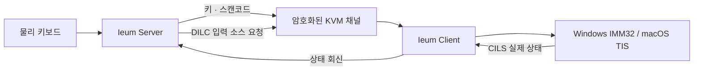

<!-- SPDX-FileCopyrightText: (C) 2026 Ieum Developers -->
<!-- SPDX-License-Identifier: GPL-2.0-only WITH LicenseRef-OpenSSL-Exception -->

<p align="center">
  
</p>

<h1 align="center">이음 (Ieum)</h1>

<p align="center"><strong>한글과 CJK 입력기를 키 매핑이 아닌 입력 상태로 다루는 IME 네이티브 소프트 KVM</strong></p>

<p align="center">
  한국어 · <a href="README.en.md">English</a> · <a href="README.zh-CN.md">简体中文</a>
</p>

<p align="center">
  <a href="https://github.com/victoriousian/ieum/releases/tag/v0.1.0-alpha.13"><strong>이음 다운로드</strong></a>
  · <a href="#설치와-첫-연결"><strong>설치 가이드</strong></a>
  · <a href="#후원"><strong>후원하기</strong></a>
</p>

<p align="center">
  <a href="https://github.com/victoriousian/ieum/actions/workflows/continuous-integration.yml"></a>
  <a href="https://github.com/victoriousian/ieum/releases"></a>
  <a href="LICENSE"></a>
</p>

이음은 한 대의 키보드와 마우스로 Windows, macOS, Linux 컴퓨터를 오가게 해주는 소프트웨어
KVM입니다. 화면 경계를 넘는 것에서 멈추지 않고, 운영체제마다 다른 **한/영 상태, IME 조합 세션,
원시 키 위치와 유니코드 클립보드**를 하나의 입력 흐름으로 연결하는 데 초점을 둡니다.

> 현재 단계는 `v0.1.0-alpha.13`입니다. 자동 빌드와 단위 테스트는 통과했지만 Windows/macOS 실기
> 장시간 입력 매트릭스와 코드 서명은 아직 완료되지 않았습니다.

## 설치와 첫 연결

처음 설치한다면 아래 순서대로 진행하세요.

1. [내 기기에 맞는 설치 파일](#1-설치-파일-고르기)을 고릅니다.
2. Windows에서만 [Visual C++ 런타임](#의존성은-어디까지-자동으로-설치되나요)을 먼저 확인합니다.
3. [Windows](#windows-설치), [macOS](#macos-설치), [Linux](#linux-설치) 절차에 따라 설치합니다.
4. 같은 공유기 안에서는 [로컬 네트워크로 연결](#같은-공유기에서-연결)하고, 떨어진 장소에서는
   [Tailscale 간편 연결](#tailscale로-연결)을 사용합니다.
5. 막히면 바로 [대표 문제 해결표](#설치와-연결이-막힐-때)를 확인합니다.

### 1. 설치 파일 고르기

최신 테스트 릴리스는
**[이음 (Ieum) v0.1.0-alpha.13](https://github.com/victoriousian/ieum/releases/tag/v0.1.0-alpha.13)**입니다.
한국어 사용자는 아래 직링크를 사용하면 릴리스 자산 목록에서 파일명을 찾을 필요가 없습니다.

| 기기 | 권장 다운로드 |
| --- | --- |
| 일반 Intel/AMD Windows PC | [Windows x64 한국어 MSI](https://github.com/victoriousian/ieum/releases/download/v0.1.0-alpha.13/Ieum-0.1.0-alpha.13-win-x64-ko-KR.msi) |
| Snapdragon 등 ARM Windows PC | [Windows ARM64 한국어 MSI](https://github.com/victoriousian/ieum/releases/download/v0.1.0-alpha.13/Ieum-0.1.0-alpha.13-win-arm64-ko-KR.msi) |
| M1 이후 Apple Silicon Mac | [macOS Apple Silicon DMG](https://github.com/victoriousian/ieum/releases/download/v0.1.0-alpha.13/Ieum-0.1.0-alpha.13-macos-arm64.dmg) |
| Intel Mac | [macOS Intel DMG](https://github.com/victoriousian/ieum/releases/download/v0.1.0-alpha.13/Ieum-0.1.0-alpha.13-macos-x86_64.dmg) |
| Linux x86_64 / aarch64 | [Flatpak, DEB, RPM, Arch 패키지 목록](https://github.com/victoriousian/ieum/releases/tag/v0.1.0-alpha.13) |
| 영문 Windows 설치 화면 또는 Windows 무설치본 | [전체 릴리스 파일](https://github.com/victoriousian/ieum/releases/tag/v0.1.0-alpha.13) |

아키텍처를 모르겠다면 다음 위치에서 확인합니다.

- **Windows:** 설정 → 시스템 → 정보 → 시스템 종류. `x64 기반 프로세서`는 x64, `ARM 기반
  프로세서`는 ARM64입니다.
- **macOS:** Apple 메뉴 → 이 Mac에 관하여. 칩이 `Apple M...`이면 Apple Silicon, 프로세서가
  `Intel`이면 Intel입니다.
- **Linux:** 터미널의 `uname -m` 결과가 `x86_64`면 x86_64, `aarch64` 또는 `arm64`면
  aarch64입니다.

### 의존성은 어디까지 자동으로 설치되나요?

| 환경 | 사용자가 준비할 것 | 패키지에 포함되거나 자동 처리되는 것 |
| --- | --- | --- |
| Windows | **Microsoft Visual C++ v14 런타임**이 없는 PC에서만 사전 설치 | Qt 6, OpenSSL, 앱 서비스와 Windows 방화벽 프로그램 예외 |
| macOS | 별도 런타임 없음. 최초 실행 뒤 시스템 권한만 승인 | Qt 6, OpenSSL과 앱 프레임워크 |
| Linux Flatpak | [Flatpak 설치](https://flatpak.org/setup/) | KDE/Qt 런타임은 Flatpak이 함께 내려받음 |
| Linux DEB/RPM/Arch | 배포판에 맞는 파일과 패키지 관리자 | 필요한 공유 라이브러리는 `apt`, `dnf`, `zypper`, `pacman`이 해결 |
| Tailscale | 원격 연결을 쓸 때만 [Tailscale](https://tailscale.com/download)을 양쪽에 설치·로그인 | 같은 공유기 안의 기본 연결에는 전혀 필요 없음 |

Windows MSI는 필요한 Visual C++ 런타임 버전을 검사하지만 현재는 런타임 설치기를 안에 묶지
않습니다. 설치 체인, 재부팅 처리, x64/ARM64와 코드 서명까지 검증하지 않은 자동 설치보다 공식
설치 링크를 먼저 제공하는 쪽을 택했습니다.

- [Visual C++ v14 x64 설치](https://aka.ms/vc14/vc_redist.x64.exe)
- [Visual C++ v14 ARM64 설치](https://aka.ms/vc14/vc_redist.arm64.exe)
- [Microsoft 공식 버전·지원 안내](https://learn.microsoft.com/cpp/windows/latest-supported-vc-redist)

이미 최신 런타임이 설치되어 있으면 다시 설치할 필요가 없습니다. MSI가 런타임 오류를 표시할 때만
위 파일을 설치하고 이음 설치를 다시 시작하세요.

### Windows 설치

지원 대상은 Windows 10/11 x64와 ARM64입니다.

1. 위 표에서 PC 아키텍처에 맞는 `*-ko-KR.msi`를 받습니다.
2. 처음 설치하는 PC에서 런타임 오류가 예상되면 위의 Visual C++ 설치 파일을 먼저 실행합니다.
3. 내려받은 MSI를 두 번 누릅니다. 현재 알파 패키지는 코드 서명 전이므로 게시자가 확인되지
   않았다는 SmartScreen 경고가 나올 수 있습니다. [해시를 먼저 확인](#다운로드-파일-검증)한 뒤
   **추가 정보 → 실행**으로 진행하세요.
4. 설치 마법사에서 **다음 → 설치**를 누르고 UAC 질문에 동의합니다. 이 단계에서
   `C:\Program Files\Ieum`, **Ieum** 백그라운드 서비스와 이음 코어의 Windows 방화벽 예외가
   등록됩니다.
5. 마지막 화면에서 **완료 후 이음 (Ieum) 실행**을 켠 채 마칩니다. 시작 메뉴 검색 결과와
   **설정 → 앱 → 설치된 앱**에는 한국어 설치본이 **이음 (Ieum)** 으로 표시됩니다.

설치 후 아래 화면이 열리면 정상입니다. 문서용 화면의 컴퓨터 이름과 IP는 예시 값으로
비식별 처리했습니다.

<p align="center">
  
</p>

창을 닫아도 기본 설정에서는 알림 영역에서 계속 실행됩니다. 다시 열 때는 알림 영역의 이음 아이콘을
두 번 누르거나 시작 메뉴에서 **이음 (Ieum)** 을 실행하세요. 창이 계속 보이지 않으면 다음 명령으로
강제로 표시할 수 있습니다.

```powershell
& 'C:\Program Files\Ieum\ieum.exe' --show
```

### macOS 설치

Apple Silicon 패키지는 macOS 14 이상, Intel 패키지는 macOS 12 이상을 대상으로 빌드합니다.

1. 칩 종류에 맞는 DMG를 내려받아 엽니다.
2. DMG 창의 `Ieum.app`을 **Applications** 폴더로 끌어 놓습니다. DMG 안에서 바로 실행하지
   마세요.
3. Finder → 응용 프로그램에서 **Ieum**을 한 번 엽니다.
4. 현재 알파 DMG는 Developer ID 서명과 Apple 공증 전입니다. “개발자를 확인할 수 없음” 또는
   “Apple에서 악성 소프트웨어를 확인할 수 없음”이 나오면 먼저
   [해시를 확인](#다운로드-파일-검증)하고 **시스템 설정 → 개인정보 보호 및 보안 → 확인 없이
   열기(Open Anyway) → 열기**를 선택합니다.
   [Apple의 공식 절차](https://support.apple.com/102445)도 함께 확인할 수 있습니다.
5. 이음의 권한 안내창을 열어 둔 상태에서 **시스템 설정 → 개인정보 보호 및 보안 → 손쉬운 사용**의
   이음을 켠 뒤 앱으로 돌아와 **다시 확인**을 누릅니다.
6. 서버로 쓸 Mac에서는 이음을 한 번 시작해 **입력 모니터링** 요청을 발생시킨 뒤
   **개인정보 보호 및 보안 → 입력 모니터링**에서도 이음을 켭니다. 변경 뒤 앱 재실행을 요구하면
   재실행합니다.

업데이트 뒤 켜진 구버전 항목만 남고 현재 앱이 승인되지 않으면 이음 권한 안내창에서
**이전 승인 초기화**를 선택하세요. 이 기능은 이음의 **손쉬운 사용** 기록만 초기화하고 현재
`/Applications/Ieum.app`을 다시 등록합니다. 입력 모니터링 목록이 갱신되지 않는 경우에는 그
목록의 구버전 이음을 제거한 다음 `+`로 현재 앱을 한 번 추가해야 할 수 있습니다.

창 왼쪽 위의 `X`를 누르면 기본 설정에서는 이음이 종료되지 않고 macOS 메뉴 막대의 이음 아이콘으로
숨습니다. 아이콘을 누르면 창을 다시 열 수 있고, 아이콘 메뉴의 **종료**를 선택해야 앱과 데스크톱
코어가 완전히 종료됩니다. `alpha.13`은 숨김 전환 중 macOS가 상태 아이콘을 떼는 경우 아이콘을
자동으로 다시 등록합니다.

> “손상되어 열 수 없음”은 단순 미공증 경고와 다릅니다. `alpha.13` 파일의 SHA-256이 다르면
> 실행하지 말고 삭제 후 다시 받으세요. 해시가 일치하는데도 같은 문구가 나오면 macOS 버전과
> 메시지 전체를 포함해 [버그를 제보](https://github.com/victoriousian/ieum/issues/new?template=bug_report.yml)해
> 주세요. 보안 속성을 강제로 지우는 터미널 명령은 권장하지 않습니다.

Apple이 안내하는 권한 위치는
[손쉬운 사용](https://support.apple.com/guide/mac-help/allow-accessibility-apps-to-access-your-mac-mh43185/mac)과
[입력 모니터링](https://support.apple.com/guide/mac-help/control-access-to-input-monitoring-on-mac-mchl4cedafb6/mac)에서
확인할 수 있습니다.

### Linux 설치

Linux 패키지는 아직 실험적입니다. 처음이라면 배포판 차이를 가장 적게 타는 Flatpak을 권장합니다.

```sh
# x86_64 예시
flatpak install --user ./Ieum-0.1.0-alpha.13-linux-x86_64.flatpak
flatpak run org.deskflow.deskflow
```

Flatpak 앱 ID는 업스트림 호환성을 위해 아직 `org.deskflow.deskflow`를 사용하지만 표시 이름과
실행 프로그램은 이음입니다. 첫 실행에서 Wayland의 입력 캡처·원격 데스크톱 포털이 나타나면 사용할
화면과 입력 권한을 승인하세요. 호스트의 Tailscale 실행 파일이 Flatpak 샌드박스에서 보이지 않을 수
있으므로 **Tailscale 간편 연결은 네이티브 DEB/RPM/Arch 패키지에서 사용하는 것을 권장**합니다.

배포판 전용 패키지는 내려받은 폴더에서 다음처럼 설치합니다. 패키지 관리자가 의존성을 함께
설치하도록 파일을 풀어 복사하지 말고 아래 명령을 사용하세요.

```sh
# Debian / Ubuntu
sudo apt install ./Ieum-*.deb

# Fedora
sudo dnf install ./Ieum-*.rpm

# openSUSE
sudo zypper install ./Ieum-*.rpm

# Arch Linux
sudo pacman -U ./Ieum-*.pkg.tar.zst
```

### 같은 공유기에서 연결

1. 키보드와 마우스가 실제로 연결된 컴퓨터에서 **이 키보드와 마우스 공유 / 서버**를 고릅니다.
2. **서버 설정**을 열어 원격 컴퓨터를 실제 책상 배치와 같은 방향으로 놓습니다. 각 화면 이름은
   원격 컴퓨터의 **이 기기** 이름과 정확히 같아야 합니다.
3. 나머지 컴퓨터에서 **공유된 키보드와 마우스 사용 / 클라이언트**를 고르고, 서버 메인 화면의
   **사용 중인 IP**를 입력합니다.
4. 양쪽에서 **시작**을 누릅니다. 최초 연결의 TLS 지문 창은 양쪽에 표시된 SHA-256 지문이 같은지
   확인한 뒤 승인합니다.
5. 서버 마우스를 화면 배치에서 정한 가장자리로 밀어 원격 화면으로 넘어가는지 확인합니다.

기본 포트는 TCP `24800`입니다. Windows MSI는 이음 코어의 방화벽 프로그램 예외를 설치합니다.
macOS나 Linux 방화벽을 별도로 사용한다면 서버 컴퓨터에서 이 포트의 수신을 허용해야 합니다.
한/영 상태 동기화와 CJK 원시 스캔코드 설정은 [IME 사용 안내](docs/user/ime.md)를 확인하세요.

### Tailscale로 연결

같은 공유기가 아니거나 공유기 설정을 건드리기 어렵다면 Tailscale을 선택할 수 있습니다.
Tailscale은 선택 사항이며 이음이 계정, ACL 또는 VPN 설정을 대신 변경하지 않습니다.

1. [Tailscale 공식 설치 안내](https://tailscale.com/docs/install)에 따라 두 컴퓨터에 설치하고
   같은 Tailnet으로 로그인합니다.
2. 양쪽 이음에서 **편집 → 환경설정 → 네트워크 → Tailscale 간편 연결**을 켭니다.
3. 새로고침 뒤 서버는 자신의 Tailscale 주소를 자동 적용합니다. 클라이언트는 IP를 입력하는 대신
   온라인 컴퓨터 이름을 고릅니다.
4. Tailnet ACL과 각 컴퓨터 방화벽에서 서버의 TCP `24800` 연결이 허용되는지 확인합니다.

<p align="center">
  
</p>

Tailscale이 꺼져 있거나 로그아웃된 경우 이음은 안전하지 않은 전체 인터페이스로 조용히 폴백하지
않고 시작을 중단합니다. 같은 공유기 연결로 돌아가려면 이 옵션을 끄고 **네트워크 IP: 자동**과
**물리 네트워크 우선**을 사용하세요.

`alpha.13`부터 서버는 선택한 Tailscale 또는 물리 네트워크 주소가 사라졌다가 돌아오거나 DHCP로
바뀌는 상황을 감지해 새 주소에 코어를 다시 바인딩합니다. 클라이언트 코어는 연결 실패 뒤 주소를
다시 확인하며 계속 재접속합니다. GUI의 **중지 → 시작**, **재시작**도 이전 코어와 로컬 IPC가
완전히 끝난 뒤 다음 코어를 시작하므로 앱 전체를 껐다 켜야 복구되던 중복 코어 경로를 막습니다.
다만 Tailnet ACL, TCP `24800` 방화벽 차단 또는 Tailscale 로그아웃 자체를 우회하지는 않습니다.

GUI 로그는 최근 10,000줄까지만 보관하고 50ms 단위로 묶어 화면에 반영합니다. 순간적으로 2,000줄을
넘는 폭주에서는 초과 표시를 한 줄로 요약해 로그 창 때문에 입력과 연결 UI가 느려지는 것을
방지합니다. 원인 분석에 모든 로그가 필요하면 환경설정의 파일 로그를 사용하세요.

### 업데이트와 제거

- **Windows 업데이트:** `alpha.8`부터 `alpha.12`까지는 앱과 서비스를 수동 삭제하지 말고
  `alpha.13` MSI를 바로 실행해 업그레이드합니다. 인증서가 바뀐 설치에서는 최초 연결 지문을 다시
  승인할 수 있습니다.
- **macOS 업데이트:** 이음을 완전히 종료하고 새 `Ieum.app`을 Applications의 기존 앱 위에
  복사합니다. 알파 빌드는 임시 서명이라 손쉬운 사용 재승인이 필요할 수 있습니다.
- **Linux 업데이트:** 같은 종류의 새 패키지를 위 설치 명령으로 다시 설치합니다.
- **Windows 제거:** 설정 → 앱 → 설치된 앱에서 **이음 (Ieum)** 또는 **Ieum**을 검색하거나,
  시작 메뉴의 이음 폴더에서 제거 바로 가기를 실행합니다. 설치 폴더만 수동 삭제하면 Windows
  Installer 등록과 서비스가 남으므로 그렇게 제거하지 마세요.

초기 `alpha.2`부터 `alpha.7`은 Deskflow의 MSI 계보를 잘못 공유했습니다. 해당 버전이 “더 최신
버전이 설치됨”을 표시하면 설치된 앱에서 **Deskflow**도 확인하세요. 목록에 아무것도 없는데 설치가
계속 차단되면 Microsoft의
[설치·제거 차단 문제 해결 절차](https://support.microsoft.com/windows/deployment/install-upgrade/fix-problems-that-block-programs-from-being-installed-or-removed)를
사용한 뒤 새 MSI를 실행하세요.

### 설치와 연결이 막힐 때

| 증상 | 확인할 것 |
| --- | --- |
| MSI가 Visual C++ 런타임을 요구함 | 위의 Microsoft 공식 x64/ARM64 런타임을 설치한 뒤 MSI를 다시 실행 |
| “더 최신 버전이 설치됨”으로 MSI가 종료됨 | 설치된 앱에서 `이음 (Ieum)`, `Ieum`, 초기 알파의 `Deskflow` 순서로 확인하고 위 Microsoft 복구 절차 사용 |
| 설치 후 창이 안 보임 | 알림 영역 아이콘을 두 번 누르거나 `ieum.exe --show` 실행. 작업 관리자에서 서비스부터 강제 종료하지 않기 |
| `could not contact existing core`, `QLocalSocket` 오류 | 두 컴퓨터 모두 `alpha.13`인지 확인. 이 버전은 남은 코어를 정리하고 최대 5회 자동 복구함. 계속 실패하면 관련 로그와 함께 제보 |
| 클라이언트가 `Timed out` | 서버가 시작 상태인지, 주소와 TCP `24800`, OS 방화벽과 Tailnet ACL이 맞는지 확인 |
| Mac에서 개발자를 확인할 수 없음 | 해시 확인 후 시스템 설정의 **개인정보 보호 및 보안 → 확인 없이 열기** 사용 |
| Mac에서 “손상됨” | 해시가 다르면 삭제·재다운로드. 해시가 같으면 우회 명령 대신 오류 전문과 macOS 버전으로 제보 |
| Mac 권한 목록에 현재 앱이 없음 | 앱을 Applications로 옮긴 뒤 **이전 승인 초기화 → 다시 확인**. 입력 모니터링만 남으면 현재 앱을 목록에 다시 추가 |
| `QTextCursor::setPosition: Position out of range`가 반복됨 | 이 문제를 걸러내는 수정이 `alpha.12`에 포함됨. 버전 정보와 로그를 복사해 재현 절차와 함께 제보 |
| NAC가 Ad Hoc 네트워크·잘못된 게이트웨이를 경고함 | **물리 네트워크 우선**을 유지. 이음은 VPN/가상 어댑터를 삭제하거나 보안 제품 경고를 우회하지 않으므로 조직 네트워크 정책도 확인 |

버그 제보 전 **도움말 → 이음 정보 → 버전 정보 복사**와 메인 화면의 관련 로그를 준비하면 운영체제,
Qt 버전과 정확한 오류를 함께 전달할 수 있습니다.
[버그 제보 양식 열기](https://github.com/victoriousian/ieum/issues/new?template=bug_report.yml)

### 다운로드 파일 검증

릴리스의
[`SHA256SUMS.txt`](https://github.com/victoriousian/ieum/releases/download/v0.1.0-alpha.13/SHA256SUMS.txt)와
계산 결과가 정확히 같은지 비교합니다. 파일명이 다르면 명령의 파일명만 바꾸세요.

```powershell
# Windows PowerShell
Get-FileHash '.\Ieum-0.1.0-alpha.13-win-x64-ko-KR.msi' -Algorithm SHA256
```

```sh
# macOS
shasum -a 256 ./Ieum-0.1.0-alpha.13-macos-arm64.dmg

# Linux
sha256sum ./Ieum-0.1.0-alpha.13-linux-x86_64.flatpak
```

현재 Windows 패키지는 코드 서명 전이고 macOS 패키지는 임시(ad-hoc) 서명으로 무결성 봉인만
검사하며 Apple 공증 전입니다. 공식 서명 전까지는 GitHub 릴리스 출처와 SHA-256을 함께 확인하세요.

## 언어별 제품 표기와 인터페이스

한국어 UI에서는 **이음 (Ieum)** 과 “한글과 CJK 입력을 안정적으로 잇는 소프트웨어 KVM”을
표시합니다. 그 외 언어에서는 **Ieum** 과 “Software KVM across Windows, macOS, and Linux”를
표시합니다. 실행 파일과 설정 경로는 기존 설치와의 호환성을 위해 `Ieum`으로 유지합니다.

메인 화면은 시스템 팔레트, 서버/클라이언트 세그먼트, 절제된 반투명 기능 레이어를 사용하도록
리팩터링했습니다. Apple의 WWDC26 Liquid Glass 지침 중 명확한 계층, 표준 컨트롤, 가변 창 크기,
효과의 절제와 접근성 원칙을 Qt에 맞게 적용했습니다. 구현 기준과 공식 출처는
[이음 인터페이스 원칙](docs/design/visual-system.md)에 정리되어 있습니다.

## 후원

**이음이 도움이 됐다면 개발을 후원해 주세요.** 후원금은 Windows 코드 서명, Apple Developer
Program과 공증, 실기 테스트 장비, 릴레이 인프라와 지속적인 유지보수에 사용합니다.

현재 `victoriousian` GitHub Sponsors 결제 프로필은 개설 준비 중입니다. 승인되지 않은 결제 링크나
개인 계좌를 공식 후원 경로처럼 게시하지 않으며, 프로필이 활성화되면 이 위치와 저장소의 Sponsor
버튼에서 일회성·정기 후원을 받을 예정입니다. 금전 후원 전에도 저장소 Star, 사용 후기, 실기 테스트
결과와 버그 제보는 프로젝트에 직접적인 도움이 됩니다.

## 한국어 입력은 단순한 키 매핑이 아닙니다

일반 소프트 KVM은 물리 키를 문자 코드로 번역해 반대편에서 다시 키로 합성합니다. 정적인 자판
레이아웃에는 잘 맞지만 한글·중국어·일본어 입력은 **입력기 상태와 조합 중 문자열(preedit)** 에 의해
결정됩니다. 이 상태를 전달하지 않으면 키가 도착해도 다음 문제가 생깁니다.

| 증상 | 구조적 원인 |
| --- | --- |
| Windows 한/영키로 Mac 입력기가 바뀌지 않음 | 한/영은 문자가 아니라 입력 모드 전환 명령인데 일반 키 이벤트로 처리됨 |
| 서버 표시와 실제 입력창의 한/영 상태가 다름 | 클라이언트의 실제 입력 소스를 확인하고 회신하는 채널이 없음 |
| `한`이 `ㅎㅏㄴ`처럼 간헐적으로 분리됨 | 입력 중 소스 전환, 이중 이벤트 주입 경로, 이벤트 순서 붕괴가 조합 세션을 끊음 |
| Mac에서 복사한 한글이 Windows에서 분리됨 | macOS의 분해형 문자열이 NFC로 정규화되지 않음 |

이음은 이 문제를 “특수키 하나 추가”가 아니라 **입력 상태를 프로토콜의 일부로 만드는 문제**로
다룹니다.

## 이음이 바꾸는 것

### 1. 입력 소스 제어 채널

프로토콜 1.9의 `DILC`/`CILS` 메시지로 서버가 입력 소스 전환을 요청하고, 클라이언트가 실제 적용된
입력 소스를 다시 보고합니다. 서버의 추정값이 아니라 클라이언트 운영체제의 상태를 진실의 원천으로
사용합니다.

### 2. IME 네이티브 키 경로

IME가 활성화되면 문자 `KeyID` 재번역을 우회하고 PC Set-1 원시 스캔코드로 물리 키 위치를 전달할
수 있습니다. 조합은 원격 컴퓨터의 네이티브 IME가 담당하므로 CJK 입력 중 레이아웃 번역이 개입하지
않습니다.

### 3. macOS 이벤트 합성 일관성

입력기 사용 중에는 하나의 영속 `CGEventSource`와 FIFO 경로를 사용하고, 이벤트 타임스탬프·키보드
종류·반복 상태를 명시합니다. 키마다 서로 다른 주입 계층을 오가는 동작을 피합니다.

### 4. 유니코드 클립보드 정규화

macOS에서 공유되는 UTF-8 텍스트를 NFC로 정규화해 Windows 애플리케이션과 파일명에서 발생하는
한글 자소 분리를 줄입니다.



## 현재 상태

| 영역 | 상태 |
| --- | --- |
| Ieum 브랜드, 아이콘, 앱·설치 프로그램 이름 | 완료 |
| Windows x64/ARM64, macOS Intel/Apple Silicon 패키지 | CI 빌드·패키지 검사 통과 |
| `DILC`/`CILS`, raw scancode, macOS 이벤트 소스, NFC 경로 | 구현 및 자동 테스트 포함 |
| Linux/Flatpak 패키지 | 실험적 제공 |
| Windows ↔ macOS 실기 10분 입력 매트릭스 | **대기 중** |
| Windows 코드 서명, Apple 서명·공증 | **대기 중** |
| iPadOS | 시스템 전역 입력 주입용 공개 API가 없어 지원하지 않음 |

실기 수용 기준은 한/영 전환 20회 상태 불일치 0건, 앱별 10분 입력에서 자소 분리 0건, 입력 지연
증가 p95 2ms 미만입니다. 현재 릴리스는 이 결과를 달성했다고 미리 주장하지 않습니다.

## 오픈소스와 유료 제품 방향

이음의 로컬 KVM 코어와 현재 배포 코드는
`GPL-2.0-only WITH LicenseRef-OpenSSL-Exception`으로 공개합니다. GPL 코어를 그대로 사용하면서
동일 실행 파일 안의 핵심 기능만 소스 비공개로 잠그는 모델은 사용하지 않습니다.

수익화는 다음 경계를 기준으로 검토합니다. 아래 유료 항목은 **계획**이며 현재 판매 중인 상품이
아닙니다.

| 영역 | 공개/유료 방향 |
| --- | --- |
| Community | 같은 네트워크의 로컬 KVM, IME 동기화, 클립보드와 프로토콜 코어는 GPL로 공개 |
| 공식 배포 | 코드 서명·Apple 공증, 안정 업데이트 채널, 간편 설치와 검증된 바이너리 제공에 비용 부과 가능 |
| Teams/Cloud | 호스팅 릴레이·장치 검색, 팀 정책, SSO, 감사 기록, 관리 콘솔을 별도 서비스로 제공 가능 |
| 지원 | 우선 기술지원, 배포 지원, 기업용 통합과 유지보수 계약 가능 |

GPL 바이너리는 유료로 배포할 수 있지만 구매자는 대응 소스를 받고 재배포할 권리를 가집니다. 따라서
지속 가능한 유료 가치는 소스 접근 제한보다 **공식 서명, 운영 편의, 호스팅 서비스와 지원**에 둡니다.
폐쇄형 모듈을 도입할 경우에는 코어와 별도 프로세스·네트워크 서비스 경계를 유지하고 사전 라이선스
검토를 거칩니다. 근거는 [GNU GPL v2 FAQ](https://www.gnu.org/licenses/old-licenses/gpl-2.0-faq.en.html)를
참고하세요. 이 방향은 법률 자문이 아니며 실제 유료 배포 전에는 저작권·상표·서비스 경계를 별도로
검토해야 합니다.

## 로드맵

- [x] 포크 부트스트랩과 Ieum 브랜드 전환
- [x] 입력 소스 제어 프로토콜과 운영체제별 컨트롤러
- [x] IME raw scancode 경로, macOS 이벤트 경로, NFC 정규화
- [x] Windows/macOS/Linux 설치 패키지 자동화
- [ ] Windows ↔ macOS 실기 입력 매트릭스 공개
- [ ] 코드 서명·Apple 공증과 안정 업데이트 채널
- [ ] 네트워크 릴레이·장치 검색의 제품/서비스 경계 설계
- [ ] 정식 `v1.0.0` 수용 기준 확정

## 빌드와 테스트

```sh
cmake -S . -B build -DCMAKE_BUILD_TYPE=Release
cmake --build build --config Release
ctest --test-dir build --output-on-failure
```

자세한 절차는 [빌드 문서](docs/dev/build.md), 프로토콜은
[프로토콜 레퍼런스](docs/dev/protocol_reference.md), 기준선과 남은 실기 검증은
[Phase 0 보고서](phase0_report.md)를 참고하세요.

GitHub Actions는 Windows x64/ARM64, macOS Intel/Apple Silicon, 여러 Linux 배포판, Flatpak과
FreeBSD 빌드를 검증합니다.

## 계보와 라이선스

Ieum은 `deskflow/deskflow`의 `39bf4fb`에서 포크해 개발하고 있습니다. upstream 병합을 위해 일부
소스 디렉터리명은 유지합니다. Linux/Flatpak은 `org.deskflow.deskflow` 앱 ID를 유지하지만, 실행
바이너리와 로컬 IPC는 이음 전용 이름을 사용합니다. macOS는 권한 충돌을 막기 위해 이음 전용
`io.github.victoriousian.ieum` 번들 ID를 사용합니다.
사용자에게 표시되는 제품명, 앱 아이콘, 설치 프로그램과 릴리스는 Ieum으로 관리합니다.

코드는 `GPL-2.0-only WITH LicenseRef-OpenSSL-Exception`에 따라 배포합니다. 원저작자 고지와 라이선스
파일은 그대로 유지합니다.
