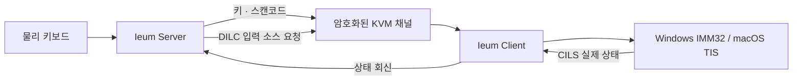

<!-- SPDX-FileCopyrightText: (C) 2026 Ieum Developers -->
<!-- SPDX-License-Identifier: GPL-2.0-only WITH LicenseRef-OpenSSL-Exception -->

<p align="center">
  
</p>

<h1 align="center">이음 (Ieum)</h1>

<p align="center"><strong>한글과 CJK 입력기를 키 매핑이 아닌 입력 상태로 다루는 IME 네이티브 소프트 KVM</strong></p>

<p align="center">
  한국어 · <a href="README.en.md">English</a> · <a href="README.zh-CN.md">简体中文</a>
</p>

<p align="center">
  <a href="https://github.com/victoriousian/ieum/releases/tag/v0.1.0-alpha.12"><strong>이음 다운로드</strong></a>
  · <a href="#후원"><strong>후원하기</strong></a>
</p>

<p align="center">
  <a href="https://github.com/victoriousian/ieum/actions/workflows/continuous-integration.yml"></a>
  <a href="https://github.com/victoriousian/ieum/releases"></a>
  <a href="LICENSE"></a>
</p>

이음은 한 대의 키보드와 마우스로 Windows, macOS, Linux 컴퓨터를 오가게 해주는 소프트웨어
KVM입니다. 화면 경계를 넘는 것에서 멈추지 않고, 운영체제마다 다른 **한/영 상태, IME 조합 세션,
원시 키 위치와 유니코드 클립보드**를 하나의 입력 흐름으로 연결하는 데 초점을 둡니다.

> 현재 단계는 `v0.1.0-alpha.12`입니다. 자동 빌드와 단위 테스트는 통과했지만 Windows/macOS 실기
> 장시간 입력 매트릭스와 코드 서명은 아직 완료되지 않았습니다.

## 언어별 제품 표기와 인터페이스

한국어 UI에서는 **이음 (Ieum)** 과 “한글과 CJK 입력을 안정적으로 잇는 소프트웨어 KVM”을
표시합니다. 그 외 언어에서는 **Ieum** 과 “Software KVM across Windows, macOS, and Linux”를
표시합니다. 실행 파일과 설정 경로는 기존 설치와의 호환성을 위해 `Ieum`으로 유지합니다.

메인 화면은 시스템 팔레트, 서버/클라이언트 세그먼트, 절제된 반투명 기능 레이어를 사용하도록
리팩터링했습니다. Apple의 WWDC26 Liquid Glass 지침 중 명확한 계층, 표준 컨트롤, 가변 창 크기,
효과의 절제와 접근성 원칙을 Qt에 맞게 적용했습니다. 구현 기준과 공식 출처는
[이음 인터페이스 원칙](docs/design/visual-system.md)에 정리되어 있습니다.

## 후원

**이음이 도움이 됐다면 개발을 후원해 주세요.** 후원금은 Windows 코드 서명, Apple Developer
Program과 공증, 실기 테스트 장비, 릴레이 인프라와 지속적인 유지보수에 사용합니다.

현재 `victoriousian` GitHub Sponsors 결제 프로필은 개설 준비 중입니다. 승인되지 않은 결제 링크나
개인 계좌를 공식 후원 경로처럼 게시하지 않으며, 프로필이 활성화되면 이 위치와 저장소의 Sponsor
버튼에서 일회성·정기 후원을 받을 예정입니다. 금전 후원 전에도 저장소 Star, 사용 후기, 실기 테스트
결과와 버그 제보는 프로젝트에 직접적인 도움이 됩니다.

## 한국어 입력은 단순한 키 매핑이 아닙니다

일반 소프트 KVM은 물리 키를 문자 코드로 번역해 반대편에서 다시 키로 합성합니다. 정적인 자판
레이아웃에는 잘 맞지만 한글·중국어·일본어 입력은 **입력기 상태와 조합 중 문자열(preedit)** 에 의해
결정됩니다. 이 상태를 전달하지 않으면 키가 도착해도 다음 문제가 생깁니다.

| 증상 | 구조적 원인 |
| --- | --- |
| Windows 한/영키로 Mac 입력기가 바뀌지 않음 | 한/영은 문자가 아니라 입력 모드 전환 명령인데 일반 키 이벤트로 처리됨 |
| 서버 표시와 실제 입력창의 한/영 상태가 다름 | 클라이언트의 실제 입력 소스를 확인하고 회신하는 채널이 없음 |
| `한`이 `ㅎㅏㄴ`처럼 간헐적으로 분리됨 | 입력 중 소스 전환, 이중 이벤트 주입 경로, 이벤트 순서 붕괴가 조합 세션을 끊음 |
| Mac에서 복사한 한글이 Windows에서 분리됨 | macOS의 분해형 문자열이 NFC로 정규화되지 않음 |

이음은 이 문제를 “특수키 하나 추가”가 아니라 **입력 상태를 프로토콜의 일부로 만드는 문제**로
다룹니다.

## 이음이 바꾸는 것

### 1. 입력 소스 제어 채널

프로토콜 1.9의 `DILC`/`CILS` 메시지로 서버가 입력 소스 전환을 요청하고, 클라이언트가 실제 적용된
입력 소스를 다시 보고합니다. 서버의 추정값이 아니라 클라이언트 운영체제의 상태를 진실의 원천으로
사용합니다.

### 2. IME 네이티브 키 경로

IME가 활성화되면 문자 `KeyID` 재번역을 우회하고 PC Set-1 원시 스캔코드로 물리 키 위치를 전달할
수 있습니다. 조합은 원격 컴퓨터의 네이티브 IME가 담당하므로 CJK 입력 중 레이아웃 번역이 개입하지
않습니다.

### 3. macOS 이벤트 합성 일관성

입력기 사용 중에는 하나의 영속 `CGEventSource`와 FIFO 경로를 사용하고, 이벤트 타임스탬프·키보드
종류·반복 상태를 명시합니다. 키마다 서로 다른 주입 계층을 오가는 동작을 피합니다.

### 4. 유니코드 클립보드 정규화

macOS에서 공유되는 UTF-8 텍스트를 NFC로 정규화해 Windows 애플리케이션과 파일명에서 발생하는
한글 자소 분리를 줄입니다.



## 현재 상태

| 영역 | 상태 |
| --- | --- |
| Ieum 브랜드, 아이콘, 앱·설치 프로그램 이름 | 완료 |
| Windows x64/ARM64, macOS Intel/Apple Silicon 패키지 | CI 빌드·패키지 검사 통과 |
| `DILC`/`CILS`, raw scancode, macOS 이벤트 소스, NFC 경로 | 구현 및 자동 테스트 포함 |
| Linux/Flatpak 패키지 | 실험적 제공 |
| Windows ↔ macOS 실기 10분 입력 매트릭스 | **대기 중** |
| Windows 코드 서명, Apple 서명·공증 | **대기 중** |
| iPadOS | 시스템 전역 입력 주입용 공개 API가 없어 지원하지 않음 |

실기 수용 기준은 한/영 전환 20회 상태 불일치 0건, 앱별 10분 입력에서 자소 분리 0건, 입력 지연
증가 p95 2ms 미만입니다. 현재 릴리스는 이 결과를 달성했다고 미리 주장하지 않습니다.

## 다운로드

[이음 (Ieum) v0.1.0-alpha.12 릴리스](https://github.com/victoriousian/ieum/releases/tag/v0.1.0-alpha.12)

| 운영체제 | 설치 파일 |
| --- | --- |
| Apple Silicon Mac | `Ieum-0.1.0-alpha.12-macos-arm64.dmg` |
| Intel Mac | `Ieum-0.1.0-alpha.12-macos-x86_64.dmg` |
| Intel/AMD 64비트 Windows 한국어 설치 화면 (권장) | `Ieum-0.1.0-alpha.12-win-x64-ko-KR.msi` |
| Intel/AMD 64비트 Windows 영문 설치 화면 | `Ieum-0.1.0-alpha.12-win-x64.msi` |
| ARM64 Windows 한국어 설치 화면 (권장) | `Ieum-0.1.0-alpha.12-win-arm64-ko-KR.msi` |
| ARM64 Windows 영문 설치 화면 | `Ieum-0.1.0-alpha.12-win-arm64.msi` |

Windows용 `portable.7z`와 Linux 패키지도 릴리스에 포함됩니다. 모든 파일은 함께 제공되는
`SHA256SUMS.txt`로 검증할 수 있습니다.

`alpha.11`부터 `네트워크 IP: 자동`은 활성 물리 Ethernet/Wi-Fi 주소를 우선 선택합니다. 이음 서버가
Tailscale, ZeroTier, VMware, Hyper-V/WSL 같은 가상 어댑터까지 기본으로 수신하지 않도록 하며,
물리망이 없을 때는 연결성을 위해 기존의 전체 인터페이스 바인딩으로 폴백합니다. 고급 설정의
**물리 네트워크 우선**을 끄면 이전 동작을 사용할 수 있습니다. 이 설정은 이음의 수신 범위만
제한하며, 운영체제에 남아 있는 가상 어댑터나 기본 경로에 대한 Genian NAC 정책 경고를 숨기거나
우회하지는 않습니다.

`alpha.12`에서는 **설정 → 네트워크 → Tailscale 간편 연결**을 켜는 것만으로 Tailscale 실행·로그인
상태, 이 기기의 전용 주소와 기본 포트 `24800`을 자동 적용합니다. 클라이언트 화면은 IP 입력란 대신
Tailnet의 데스크톱 기기 이름을 표시하며, 온라인 PC가 하나면 미리 선택하고 여러 대면 사용자가 이름
하나만 고르면 됩니다. Tailscale이 준비되지 않았을 때 전체 인터페이스로 폴백하지 않고 시작을
중단합니다. 이 기능은 Tailscale 설정이나 ACL을 변경하지 않으므로 Tailnet 정책과 호스트 방화벽에서
서버의 TCP `24800` 연결이 허용되어 있어야 합니다.

`alpha.5`의 Mac DMG에는 깨진 코드 서명 봉인이 있었고, `alpha.6`은 비동기 접근성 권한 요청이
끝나기 전에 앱이 종료되는 문제가 있었습니다. `alpha.7`에서는 macOS의 Qt 접근성 경고가 앱 로그로
되먹임되어 `QTextCursor::setPosition` 메시지가 반복될 수 있었습니다. 이 수정들은 `alpha.12`에도
유지됩니다. `alpha.10`은 켜져 있는 구버전 이음 항목이 남았는데 현재 앱이 승인되지 않는 경우
**이전 승인 초기화**를 제공합니다. 확인하면 이음의 손쉬운 사용 기록만 제거하고 현재
`/Applications/Ieum.app`을 macOS에 다시 등록하므로, 수동으로 `-`와 `+`를 누를 필요가 없습니다.

`alpha.12`는 DMG 안의 최종 앱에 대해 엄격한 코드 서명 검증을 통과하지만, 아직 Developer ID 서명과
Apple 공증은 적용되지 않았습니다. 앱을 `/Applications`로 옮기고 한 번 실행한 뒤 macOS가 차단하면
**시스템 설정 → 개인정보 보호 및 보안 → 확인 없이 열기**에서 허용하세요. 접근성 및 입력 모니터링
권한도 필요합니다. 임시(ad-hoc) 서명은 빌드마다 코드 정체성이 달라지므로 이후 업데이트에서도
**이전 승인 초기화**와 재승인이 필요할 수 있습니다. 권한을 자동 승계하려면 안정적인 Developer ID
Application 서명과 Apple 공증이 필요합니다.

Windows `alpha.2`~`alpha.7`은 원본 Deskflow의 MSI `UpgradeCode`를 재사용해, Deskflow가 설치된
PC에서 이음을 더 낮은 버전으로 오인하고 설치를 차단할 수 있었습니다. `alpha.8`은 이음 전용
`UpgradeCode`로 설치 계보를 분리했지만, 실행 파일과 IPC 이름은 여전히 `deskflow-core`와
`deskflow-daemon`을 사용했습니다. 그 결과 Deskflow가 실행 중이거나 이음의 서비스 코어와
데스크톱 코어가 겹치면 GUI가 다른 코어에 연결되고 TLS 승인 단계가 시간 초과될 수 있었습니다.

`alpha.9`부터 MSI 버전 `0.1.109`와 `ieum-core.exe`, `ieum-daemon.exe`, 버전이 지정된
`ieum-core-v1`/`ieum-daemon-v1` IPC를 사용합니다. 전역 소유권 잠금으로 중복 코어도 거부하며,
기본 인증서를 `ieum.pem`으로 이관해 `/CN=Ieum` 인증서를 새로 생성합니다. CI는
`alpha.9 → alpha.12` 실제 업그레이드, 서비스 IPC 응답, 중복 코어 거부, 실행 중인 Deskflow
1.26.0과 이음 코어의 동시 생존을 x64와 ARM64에서 검사합니다. `alpha.8`~`alpha.10` 사용자는
기존 버전을 수동 삭제하지 말고 `alpha.12` MSI를 바로 실행하면 됩니다. `alpha.11`도 MSI를 바로
실행해 업그레이드할 수 있습니다. 인증서가 교체되므로 최초
연결에서는 새 지문을 한 번 승인해야 할 수 있습니다.

한국어 설치본은 설정의 설치된 앱과 시작 메뉴에 **이음 (Ieum)**, 영문 설치본은 **Ieum** 으로
표시됩니다. 설치 경로는 `C:\Program Files\Ieum`, 서비스 이름은 `Ieum`입니다. 시작 메뉴에는 제거
바로 가기도 생성됩니다. 현재 Windows 패키지는 코드 서명 전이므로 SmartScreen 경고가 표시될 수
있습니다.

## 빠른 시작

1. 제어할 컴퓨터 모두에 Ieum을 설치합니다.
2. 키보드와 마우스가 연결된 컴퓨터에서 `Server`를 선택합니다.
3. 같은 네트워크에서는 나머지 컴퓨터의 `Client`에 서버 주소를 입력합니다.
4. Tailscale을 쓸 때는 양쪽의 **설정 → 네트워크 → Tailscale 간편 연결**을 켜고 클라이언트에서
   서버 컴퓨터 이름을 고릅니다.
5. 서버 화면 배치에서 각 컴퓨터의 위치를 지정한 뒤 시작합니다.

IME 동작과 운영체제별 권한은 [IME 사용 안내](docs/user/ime.md)를 확인하세요.

## 오픈소스와 유료 제품 방향

이음의 로컬 KVM 코어와 현재 배포 코드는
`GPL-2.0-only WITH LicenseRef-OpenSSL-Exception`으로 공개합니다. GPL 코어를 그대로 사용하면서
동일 실행 파일 안의 핵심 기능만 소스 비공개로 잠그는 모델은 사용하지 않습니다.

수익화는 다음 경계를 기준으로 검토합니다. 아래 유료 항목은 **계획**이며 현재 판매 중인 상품이
아닙니다.

| 영역 | 공개/유료 방향 |
| --- | --- |
| Community | 같은 네트워크의 로컬 KVM, IME 동기화, 클립보드와 프로토콜 코어는 GPL로 공개 |
| 공식 배포 | 코드 서명·Apple 공증, 안정 업데이트 채널, 간편 설치와 검증된 바이너리 제공에 비용 부과 가능 |
| Teams/Cloud | 호스팅 릴레이·장치 검색, 팀 정책, SSO, 감사 기록, 관리 콘솔을 별도 서비스로 제공 가능 |
| 지원 | 우선 기술지원, 배포 지원, 기업용 통합과 유지보수 계약 가능 |

GPL 바이너리는 유료로 배포할 수 있지만 구매자는 대응 소스를 받고 재배포할 권리를 가집니다. 따라서
지속 가능한 유료 가치는 소스 접근 제한보다 **공식 서명, 운영 편의, 호스팅 서비스와 지원**에 둡니다.
폐쇄형 모듈을 도입할 경우에는 코어와 별도 프로세스·네트워크 서비스 경계를 유지하고 사전 라이선스
검토를 거칩니다. 근거는 [GNU GPL v2 FAQ](https://www.gnu.org/licenses/old-licenses/gpl-2.0-faq.en.html)를
참고하세요. 이 방향은 법률 자문이 아니며 실제 유료 배포 전에는 저작권·상표·서비스 경계를 별도로
검토해야 합니다.

## 로드맵

- [x] 포크 부트스트랩과 Ieum 브랜드 전환
- [x] 입력 소스 제어 프로토콜과 운영체제별 컨트롤러
- [x] IME raw scancode 경로, macOS 이벤트 경로, NFC 정규화
- [x] Windows/macOS/Linux 설치 패키지 자동화
- [ ] Windows ↔ macOS 실기 입력 매트릭스 공개
- [ ] 코드 서명·Apple 공증과 안정 업데이트 채널
- [ ] 네트워크 릴레이·장치 검색의 제품/서비스 경계 설계
- [ ] 정식 `v1.0.0` 수용 기준 확정

## 빌드와 테스트

```sh
cmake -S . -B build -DCMAKE_BUILD_TYPE=Release
cmake --build build --config Release
ctest --test-dir build --output-on-failure
```

자세한 절차는 [빌드 문서](docs/dev/build.md), 프로토콜은
[프로토콜 레퍼런스](docs/dev/protocol_reference.md), 기준선과 남은 실기 검증은
[Phase 0 보고서](phase0_report.md)를 참고하세요.

GitHub Actions는 Windows x64/ARM64, macOS Intel/Apple Silicon, 여러 Linux 배포판, Flatpak과
FreeBSD 빌드를 검증합니다.

## 계보와 라이선스

Ieum은 `deskflow/deskflow`의 `39bf4fb`에서 포크해 개발하고 있습니다. upstream 병합을 위해 일부
소스 디렉터리명은 유지합니다. Linux/Flatpak은 `org.deskflow.deskflow` 앱 ID를 유지하지만, 실행
바이너리와 로컬 IPC는 이음 전용 이름을 사용합니다. macOS는 권한 충돌을 막기 위해 이음 전용
`io.github.victoriousian.ieum` 번들 ID를 사용합니다.
사용자에게 표시되는 제품명, 앱 아이콘, 설치 프로그램과 릴리스는 Ieum으로 관리합니다.

코드는 `GPL-2.0-only WITH LicenseRef-OpenSSL-Exception`에 따라 배포합니다. 원저작자 고지와 라이선스
파일은 그대로 유지합니다.
