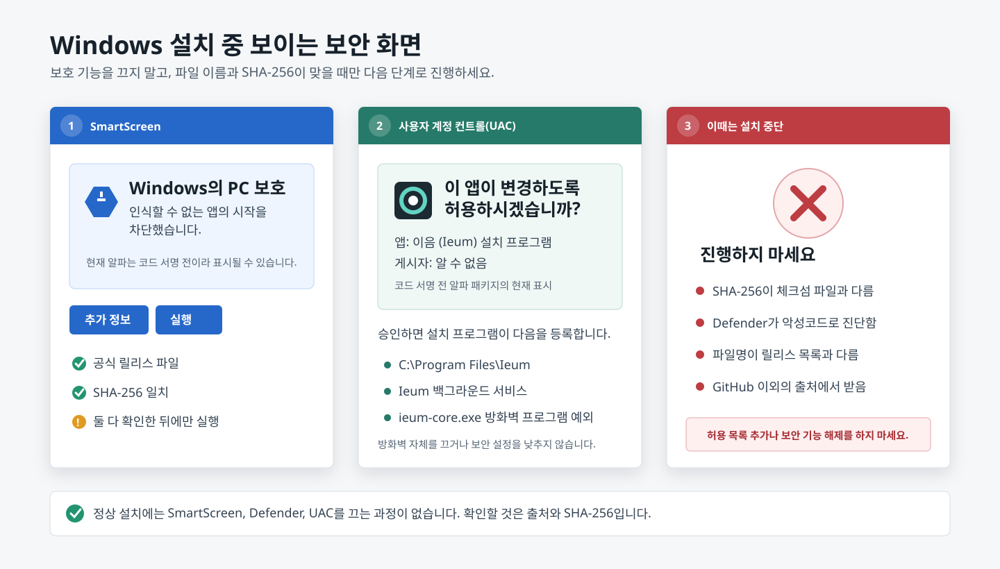
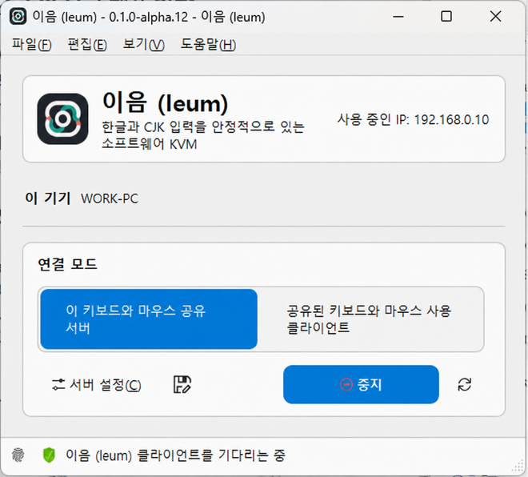
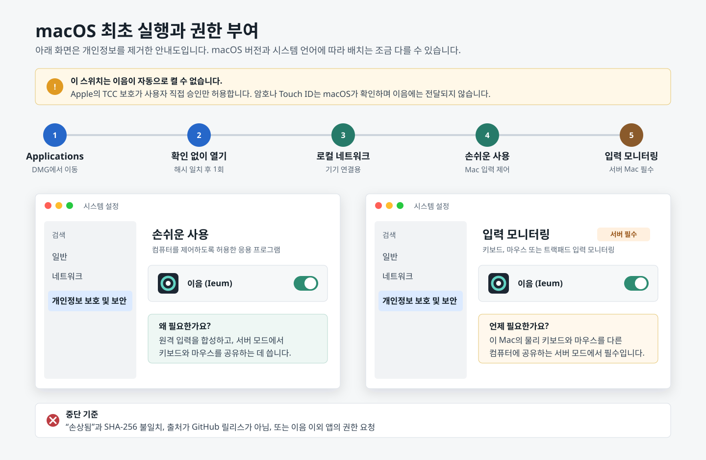
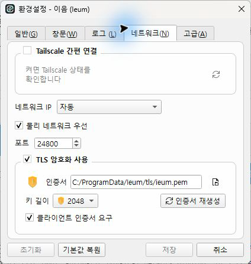
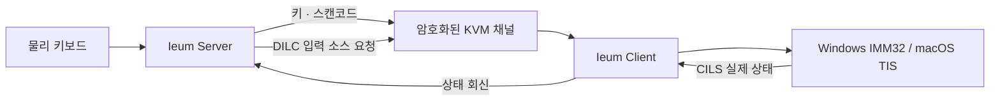
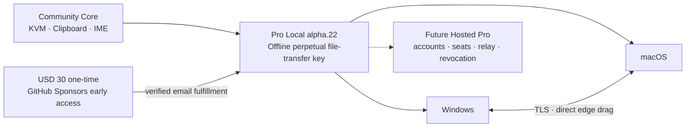
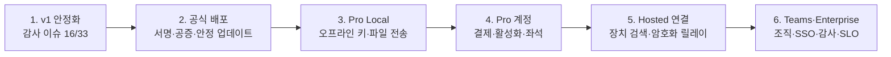

<!-- SPDX-FileCopyrightText: (C) 2026 Ieum contributors -->
<!-- SPDX-License-Identifier: GPL-2.0-only WITH LicenseRef-OpenSSL-Exception -->

<p align="center">
  
</p>

<h1 align="center">이음 (Ieum)</h1>

<p align="center"><strong>한글과 CJK 입력기를 키 매핑이 아닌 입력 상태로 다루는 IME 네이티브 소프트 KVM</strong></p>

<p align="center"><strong>Cherry Company</strong>가 유지관리합니다.</p>

<p align="center">
  한국어 · <a href="README.en.md">English</a> · <a href="README.zh-CN.md">简体中文</a>
</p>

<p align="center">
  <a href="https://github.com/Cherry-Company/ieum/releases/tag/v0.1.0-alpha.23"><strong>이음 다운로드</strong></a>
  · <a href="#설치와-첫-연결"><strong>설치 가이드</strong></a>
  · <a href="#설치-전-1분-보안-확인"><strong>보안·권한 안내</strong></a>
  · <a href="https://github.com/sponsors/victoriousian"><strong>GitHub Sponsors로 후원</strong></a>
</p>

<p align="center">
  <a href="https://github.com/Cherry-Company/ieum/actions/workflows/continuous-integration.yml"></a>
  <a href="https://github.com/Cherry-Company/ieum/releases"></a>
  <a href="LICENSE"></a>
  <a href="https://github.com/sponsors/victoriousian"></a>
</p>

이음은 한 대의 키보드와 마우스로 Windows, macOS, Linux 컴퓨터를 오가게 해주는 소프트웨어
KVM입니다. 화면 경계를 넘는 것에서 멈추지 않고, 운영체제마다 다른 **한/영 상태, IME 조합 세션,
원시 키 위치와 유니코드 클립보드**를 하나의 입력 흐름으로 연결하는 데 초점을 둡니다.

> 현재 단계는 `v0.1.0-alpha.23`입니다. 자동 빌드와 단위 테스트는 통과했지만 Windows/macOS 실기
> 장시간 입력 매트릭스와 코드 서명은 아직 완료되지 않았습니다.

## 이음의 정식 배포를 함께 완성해 주세요

후원은 막연한 응원이 아니라 **Windows 정식 코드 서명, Apple Developer ID 서명·공증, Windows
ARM64·Apple Silicon 실기 회귀 테스트와 안정적인 릴리스 유지**에 사용합니다.

**[GitHub Sponsors에서 이음 후원하기](https://github.com/sponsors/victoriousian)**

| 월간 티어 | 공개 약속 |
| --- | --- |
| **$3 이음 후원자** | 지속 개발 지원과 간결한 후원자 소식 |
| **$10 이음 유지 후원자** | 위 혜택, 월간 개발 보고, 희망 시 후원자 명단 이름 등재 |
| **$30 이음 품질 후원자** | 위 혜택과 재현 가능한 버그 제보 우선 분석. 수정 보장·SLA는 아님 |
| **$100 이음 조직 후원자** | 위 혜택, 희망 시 조직명·로고 등재, 분기별 기술 진행 보고. 상업 지원은 별도 |

월간 티어 외에 일회성 사용자 지정 금액도 선택할 수 있습니다. 후원 여부와 관계없이 로컬 KVM,
한글·CJK 입력 동기화와 클립보드 코어는 공개 프로젝트로 유지합니다. 릴리스마다
[배분 금액과 후원으로 완료한 작업](docs/release/sponsorship-impact.md)을 함께 공개하며, 이번
`alpha.23`에 배분된 후원금은 **USD 0**입니다. 새 Early Access 판매가는 실제 결제가 확인되기 전까지
후원 수입으로 계산하지 않습니다.

### alpha.22 Windows ↔ macOS Pro Local 파일 드래그

`alpha.22`에서는 Windows와 macOS 어느 쪽이 서버나 클라이언트여도 화면 경계에서 파일 전송을 시작할
수 있습니다. 파일 전송은 **Pro Local** 기능이며, 로컬 KVM·한글/CJK 입력 동기화·클립보드는 라이선스
없이 그대로 사용할 수 있습니다.

- 파일 전송에 참여할 Windows 또는 macOS 컴퓨터마다 **환경설정 → Files → Import license file →
  Activate** 순서로 같은 `*.ieum-license.txt`를 활성화합니다.
- 모든 컴퓨터에서 TLS를 켠 뒤 보내기 또는 받기를 직접 선택해야 합니다. 이전 버전에 저장된 전송 설정은
  유효한 라이선스가 없으면 꺼지며, 키를 나중에 넣어도 자동으로 다시 켜지지 않습니다.
- 파일 전송 서비스는 시작·제안·수락·데이터 청크마다 현재 권한을 다시 확인합니다. 만료되거나 제거된
  키는 진행 중 세션도 실패 처리하며, 키를 다시 넣어도 실패한 세션을 되살리지 않습니다.
- 파일 제안·수락·취소·결과는 프로토콜 `1.12`, 실제 바이트는 프로토콜 `1.13`으로 분리했습니다.
  데이터는 한 번에 최대 60 KiB만 이벤트 루프에서 처리합니다.
- 송신 직전 파일 ID·크기·수정 시각을 다시 확인하고, 수신은 권한을 제한한 숨김 임시 디렉터리에 쓴 뒤
  SHA-256과 크기를 검증합니다. 같은 이름이 있으면 덮어쓰지 않고 새 이름으로 게시합니다.
- 화면 토폴로지에 연결된 방향이면 Windows→macOS와 macOS→Windows 모두 시작할 수 있고, 서버·클라이언트
  역할과 무관하게 동작합니다. 현재 드래그는 복사이며 원본 파일을 이동하거나 삭제하지 않습니다.
- **Pro Local Early Access는 USD 30 일회성**입니다. 앱에서 만든 claim code가 포함된 GitHub Sponsors
  페이지에서 결제한 뒤 GitHub 사용자명과 claim code를 `easecompany@protonmail.ch`로 보내면, 소유자가
  결제를 확인하고 파일전송 영구 권한 파일을 이메일로 발급합니다. 이 구매에 향후 모든 Pro 기능이
  포함되는 것은 아닙니다.
- 현재 키는 오프라인 서명 파일이라 장치 수를 세거나 원격으로 회수하지 않습니다. 발급용 개인키와
  발급기는 프로젝트 소유자만 보관하며 공개 저장소·릴리스·후원자에게 배포하지 않습니다. 자세한
  설치와 범위는 [Pro Local 파일 전송 안내](docs/dev/pro_local_file_transfer.md)를 참고하세요.

### alpha.19 좌표·업데이트·권한 복구 변경

`alpha.19`는 장시간 사용에서 드러난 혼합 DPI 좌표 누적 오차, 실행 중 업데이트와 macOS
권한 복구 경로를 집중적으로 다룹니다.

- 서버에서 나간 모니터 비율을 클라이언트 모니터에 두 번 적용하던 경로를 제거했습니다. 연결된
  물리 모니터 경계 길이를 하나의 누적 영역으로 매핑해 해상도·배율·음수 원점과 물리적 빈 공간을
  다루고, Windows 코어는 Per-Monitor V2 DPI 인식을 사용합니다.
- Windows MSI는 새 버전의 실행 중 GUI에 **업데이트 준비** 명령을 보내 설정과 세션 표시를 정상 종료한 뒤
  교체합니다. 명령을 모르는 `alpha.18` 이하 GUI·코어는 MSI의 기존 종료 규칙으로 정리합니다. 로컬
  x64 실행 중 교체 검증은 구 프로세스 종료, 서비스·IPC 복구와 새 코어 기동을 함께 확인합니다.
- 업데이트 확인에 한 번 동의했다면 로그인 자동 실행 뒤에도 백그라운드에서 새 버전을 확인합니다.
  알림에서 현재 OS·CPU·언어에 맞는 정확한 MSI/DMG를 바로 열 수 있습니다. 다만 서명된 업데이트 메타데이터,
  건강 확인과 롤백이 없는 현재 단계에서 무인 설치를 자동 실행하지는 않습니다.
- macOS의 **이전 승인 초기화**는 손쉬운 사용 설정을 먼저 열고, TCC UI 반영을 기다린 후 이음의 번들 ID
  기록만 초기화합니다. 현재 `/Applications/Ieum.app`을 다시 등록하고 설정을 재오픈하며, 목록에서 앱이
  안 보일 때는 **Applications에서 이음 보기**로 현재 앱을 Finder에 표시합니다. 권한 스위치 자체는 Apple 보안
  경계이므로 사용자가 켜야 하며, 업데이트 간 안정적 승계에는 Developer ID 서명·공증이 필요합니다.
- 크래시 또는 심각한 오류가 나면 서버로 자동 전송하는 대신 **로컬 진단 패스포트**를 만듭니다. 홈 경로와
  IP를 가리고 설정·클립보드·TLS 자료·전체 로그는 수집하지 않습니다. GitHub 로그인이 없어도 파일이나 클립보드를
  다른 채널로 전달할 수 있고, 예상치 못한 종료는 다음 실행에서 감지합니다.
- Windows 네이티브 빌드와 좌표·업데이트·진단 회귀 테스트, x64 글로벌·한국어 MSI 구조 검증은
  통과했습니다. 실제 Windows↔macOS 장시간 커서 왕복과 각 게임의 전체 창 모드는 여전히 실기 수용
  항목이며, 사용자 배치에서 확인하기 전에는 완전 해결이라고 표시하지 않습니다.

### alpha.18 전체 창 게임 잠금과 물리 모니터 좌표 변경

`alpha.17`은 실제 게임과 혼합 모니터 실기에서 전체 창 게임 잠금과 진입 좌표 수용 기준을
통과하지 못했습니다. `alpha.18`은 그 결과를 기준으로 두 경로를 다시 구현한 검증용 릴리스입니다.

- Windows의 독점 전체 화면뿐 아니라 **테두리 없는 전체 창**, 실제 창·클라이언트 영역과 게임의
  포인터 캡처(`ClipCursor`)를 함께 판별합니다. 수동 Scroll Lock 잠금 비활성화가 자동 게임 보호까지
  우회하던 경로를 분리했고, 서버와 현재 활성 클라이언트 어느 쪽에서 게임을 실행해도 상태를
  서버에 전달합니다.
- 프로토콜 `1.11`에서 각 컴퓨터의 전체 가상 화면 한 장이 아니라 **물리 모니터 사각형 목록**을
  교환합니다. 커서가 빠져나온 실제 모니터 경계의 픽셀 비율을 상대 컴퓨터의 진입 모니터 경계에
  대응시켜, 세로·가로 모니터와 서로 다른 해상도가 섞여도 양방향 진입 높이가 누적해서 틀어지지
  않도록 했습니다.
- 이 좌표 변경은 **양쪽 컴퓨터 모두 alpha.18일 때** 활성화됩니다. 한쪽이 구버전이면 연결 호환성을
  위해 기존 전체 가상 화면 비율 방식으로 동작하며, 사용자가 만든 부분 화면 매핑은 자동 변환보다
  우선합니다.
- Windows 네이티브 전체 빌드와 관련 회귀 테스트, 클립보드 실세션 환경 테스트를 제외한 36개 CTest,
  레거시 키 입력 15개 테스트를 통과했습니다. 실제 게임별 전체 창 동작과 Windows↔macOS 혼합 모니터
  장시간 이동은 패키지 설치 후 계속 확인할 실기 수용 항목이며, 확인 전에는 해결 완료로 표시하지
  않습니다.
- 공개 저장소의 Apple Silicon CI와 DMG 패키징은 임시 GitHub-hosted `macos-15-arm64` 환경에서
  수행합니다. 실기 수용 테스트는 릴리스 패키징과 분리하며, 그 결과도 호스티드 빌드 검증과
  구분해 표시합니다.

### alpha.17 입력 전환·재연결·화면 경계 안정성 변경

`alpha.17`에는 다음 변경을 포함했습니다.

- Windows 서버에서 macOS 클라이언트로 보내는 `Alt/한영`과 `Control+Space`를 입력 상태 제어로
  처리합니다. macOS는 CJK 입력 소스를 선택한 뒤 실제 포커스 앱의 입력 컨텍스트까지 활성화해
  메뉴 막대만 바뀌고 입력 언어는 그대로 남는 경로를 보강했습니다.
- 재부팅이나 네트워크 단절 뒤 클라이언트가 처음 20회는 250ms, 이후 1초, 장기적으로 최대 2초
  간격으로 자동 재접속합니다. 연결 성공, 사용자 중지와 앱 종료 시에는 남은 재시도 타이머를
  확실히 취소합니다.
- 혼합 해상도·배율·음수 원점 모니터의 화면 합집합과 경계 좌표를 다시 계산합니다. Windows DWM
  프레임 범위, 숨겨진 창 제외, 화면 점유율과 짧은 히스테리시스를 사용해 전체 화면 게임 중 우발적인
  화면 전환도 줄였습니다.
- 로그는 묶어서 표시하고 숨겨진 로그 패널에서는 렌더링을 미룹니다. 대기 로그 수에 상한을 두고
  네트워크·메뉴 막대 감시는 저정밀 타이머를 사용해 유휴 상태 UI 작업을 줄였습니다.
- 입력기·CJK·원시 키·화면 진입·Mac 키 지연 설정은 **환경설정 → 입력**에 모았습니다. 서비스와
  명령 자동화는 **시스템**, 포인터와 클립보드 공유는 **포인터 및 공유**로 정리했습니다.
- `alpha.17` Apple Silicon 패키지는 ARM64로 네이티브 빌드하고 테스트·DMG 마운트·서명 구조
  검증을 통과했습니다. 다만 Developer ID 서명과 Apple 공증은 아직
  없으므로 프리릴리스의 macOS 설치에는 Gatekeeper 수동 승인이 필요할 수 있습니다.

### alpha.16 입력·창·업데이트 안정성 변경

`alpha.16`에는 다음 변경을 포함했습니다.

- 재부팅, 해상도 변경과 디스플레이 재연결 뒤 남은 좌표를 새 화면 범위로 제한하고 이동 잔여값을
  초기화합니다. 서로 다른 해상도 사이에서는 진입 지점을 화면 높이·너비의 같은 비율로 변환합니다.
- 서버 컴퓨터에서 전체 화면 앱이 전면에 있으면 화면 경계 전환을 자동으로 잠급니다. 단축키 없이
  게임을 보호하며 **서버 설정 → 고급 → 전체 화면 앱 실행 중 자동으로 화면 전환 잠금**에서 끌 수
  있습니다.
- **서버 설정 → 고급 → 원격 포인터 속도**를 `25%`부터 `400%`까지 조절할 수 있습니다. 작은
  이동의 소수 잔여값을 보존하므로 저속에서도 커서가 멈추지 않으며, 저장하면 연결을 끊지 않고
  실행 중인 서버 구성을 즉시 다시 읽습니다.
- macOS에서 메뉴 막대 항목을 주기적으로 확인해 사라진 경우 제한적으로 복구합니다. 창을 `X`로
  숨긴 뒤 Dock 아이콘을 눌러도 기존 창을 다시 표시하고 앞으로 가져옵니다.
- Windows 서버의 물리 한/영 키를 Mac으로 보낼 때 단순 토글 대신 Mac이 보고한 현재 입력 상태의
  반대 상태를 명시적으로 요청합니다. Mac은 실제 입력 소스 변경 알림을 확인한 뒤 다음 키를
  처리하므로 메뉴 표시는 바뀌었지만 입력 언어는 그대로인 순서 경쟁을 줄입니다.
- Windows 클립보드 잠금은 제한된 시간 동안 재시도하고, 읽기에 실패하면 빈 클립보드를 원격으로
  보내지 않습니다. 객체 수명이 끝날 때 남은 Win32 클립보드 잠금도 정리합니다.
- Windows MSI는 서비스를 내린 상태에서 구버전을 제거한 뒤 새 서비스를 시작합니다. 실제 실행 중인
  `alpha.16` 교체 설치에서 종료 코드 `0`, 재부팅 요구 없음, 서비스 자동 복구와 설정·TLS 파일
  보존을 확인했습니다.

화면 비율 변환은 운영체제가 보고한 픽셀 좌표를 기준으로 합니다. 모니터의 실제 받침대 높이, 베젤과
물리적 상하 오프셋은 운영체제가 알려주지 않으므로 서로 다른 크기의 모니터가 물리적으로 어긋나
배치된 경우까지 자동 추정하지는 않습니다.

### alpha.15 자동 기동과 연결 복구

- macOS에서 창을 닫을 때 앱의 활성화 정책을 바꾸지 않도록 수정했습니다. 메뉴 막대의 이음 아이콘과
  메뉴 객체는 앱이 종료될 때까지 유지되며, `X`는 기본 설정에서 창만 숨깁니다.
- Windows와 macOS에서 **환경설정 → 일반 → 로그인할 때 이음 자동 실행**을 기본으로 켭니다.
  Windows는 현재 사용자 시작 프로그램, macOS 13 이상은 ServiceManagement 로그인 항목을 사용합니다.
- Windows의 자동 시작 서비스는 이전에 저장한 코어 구성을 부팅 때 불러옵니다. 로그인 뒤 GUI가 같은
  시작 명령을 다시 보내더라도 실행 중인 로그인 화면 코어의 PID와 연결을 교체하지 않습니다.
- 자동 기동 시 Tailscale이 아직 준비되지 않았으면 경고창을 반복하지 않고 1~5초 간격으로
  재확인합니다. 온라인 데스크톱이 하나뿐이면 클라이언트가 그 기기를 자동 선택합니다.
- 서버가 뒤늦게 올라오는 부팅 직후에는 클라이언트가 처음 5초 동안 250ms 간격으로 빠르게
  재접속하고, 이후에는 기본 1초 간격으로 안정화합니다.
- 서버와 클라이언트 모두 네트워크 주소 변화를 감시합니다. 사용자가 누른 **중지**, 인증서 거부와
  같은 의도적인 중단은 자동 재시도가 되살리지 않습니다.

자동 설치 업데이트는 아직 켜지지 않습니다. 서명되지 않은 패키지를 자동 실행하는 것보다 현재
릴리스 알림과 수동 설치를 유지하며, 서명 검증·단계적 교체·상태 확인·롤백을 포함한
[업데이트 전달 기준](docs/dev/update-delivery.md)을 먼저 충족합니다.

### alpha.14 입력 안정성 변경

- 지연된 네트워크 입력을 짧은 단위로 나눠 처리해 긴 마우스 이동이 한 지점으로 뭉치는 현상을
  줄이고, 이벤트 루프가 입력 폭주에 장시간 점유되지 않도록 했습니다.
- Windows 클라이언트의 절대 좌표를 주 모니터가 아닌 전체 가상 데스크톱 기준으로 계산해, 보조
  모니터와 음수 좌표에서 커서가 멈추거나 잘못 이동하는 경로를 보정했습니다.
- macOS 클라이언트에서는 원격 화면에 있는 동안 마우스를 계속 캡처하고, macOS 27의 배경 클릭과
  드래그 이벤트 번호를 보존하는 upstream 수정까지 포함했습니다.
- 한/영 상태 변경은 Windows 알림 토스트를 반복해서 띄우지 않습니다. 메인 창 상태 표시줄의
  고정된 `한`/`A` 표시와 알림 영역 아이콘의 메뉴·도움말에서 조용히 확인할 수 있습니다.
- 연결 종료와 거절은 현재 네트워크 콜백이 끝난 뒤 처리하고, 이벤트 핸들러 수명도 보존해
  끊김·재접속 중 자기 자신을 정리하던 불안정 경로를 제거했습니다.

좌표 변환, 수신 분할, 상태 표시와 연결 종료에는 자동 회귀 테스트를 추가했습니다. 다만 실제
Tailscale·Wi-Fi 품질과 마우스 폴링률은 환경마다 다르므로, 두 대의 실기에서 장시간 사용 결과는
계속 확인해야 합니다.

## 설치와 첫 연결

처음 설치한다면 아래 순서대로 진행하세요.

1. [내 기기에 맞는 설치 파일](#1-설치-파일-고르기)을 고릅니다.
2. Windows에서만 [Visual C++ 런타임](#의존성은-어디까지-자동으로-설치되나요)을 먼저 확인합니다.
3. [Windows](#windows-설치), [macOS](#macos-설치), [Linux](#linux-설치) 절차에 따라 설치합니다.
4. 같은 공유기 안에서는 [로컬 네트워크로 연결](#같은-공유기에서-연결)하고, 떨어진 장소에서는
   [Tailscale 간편 연결](#tailscale로-연결)을 사용합니다.
5. 막히면 바로 [대표 문제 해결표](#설치와-연결이-막힐-때)를 확인합니다.

### 1. 설치 파일 고르기

최신 테스트 릴리스는
**[이음 (Ieum) v0.1.0-alpha.23](https://github.com/Cherry-Company/ieum/releases/tag/v0.1.0-alpha.23)**입니다.
한국어 사용자는 아래 직링크를 사용하면 릴리스 자산 목록에서 파일명을 찾을 필요가 없습니다.

| 기기 | 권장 다운로드 |
| --- | --- |
| 일반 Intel/AMD Windows PC | [Windows x64 한국어 MSI](https://github.com/Cherry-Company/ieum/releases/download/v0.1.0-alpha.23/Ieum-0.1.0-alpha.23-win-x64-ko-KR.msi) |
| Snapdragon 등 ARM Windows PC | [Windows ARM64 한국어 MSI](https://github.com/Cherry-Company/ieum/releases/download/v0.1.0-alpha.23/Ieum-0.1.0-alpha.23-win-arm64-ko-KR.msi) |
| M1 이후 Apple Silicon Mac | [macOS Apple Silicon DMG](https://github.com/Cherry-Company/ieum/releases/download/v0.1.0-alpha.23/Ieum-0.1.0-alpha.23-macos-arm64.dmg) |
| Intel Mac | [macOS Intel DMG](https://github.com/Cherry-Company/ieum/releases/download/v0.1.0-alpha.23/Ieum-0.1.0-alpha.23-macos-x86_64.dmg) |
| Linux x86_64 / aarch64 | [Flatpak, DEB, RPM, Arch 패키지 목록](https://github.com/Cherry-Company/ieum/releases/tag/v0.1.0-alpha.23) |
| 영문 Windows 설치 화면 또는 Windows 무설치본 | [전체 릴리스 파일](https://github.com/Cherry-Company/ieum/releases/tag/v0.1.0-alpha.23) |

아키텍처를 모르겠다면 다음 위치에서 확인합니다.

- **Windows:** 설정 → 시스템 → 정보 → 시스템 종류. `x64 기반 프로세서`는 x64, `ARM 기반
  프로세서`는 ARM64입니다.
- **macOS:** Apple 메뉴 → 이 Mac에 관하여. 칩이 `Apple M...`이면 Apple Silicon, 프로세서가
  `Intel`이면 Intel입니다.
- **Linux:** 터미널의 `uname -m` 결과가 `x86_64`면 x86_64, `aarch64` 또는 `arm64`면
  aarch64입니다.

### 의존성은 어디까지 자동으로 설치되나요?

| 환경 | 사용자가 준비할 것 | 패키지에 포함되거나 자동 처리되는 것 |
| --- | --- | --- |
| Windows | **Microsoft Visual C++ v14 런타임**이 없는 PC에서만 사전 설치 | Qt 6, OpenSSL, 앱 서비스와 Windows 방화벽 프로그램 예외 |
| macOS | 별도 런타임 없음. 최초 실행 뒤 시스템 권한만 승인 | Qt 6, OpenSSL과 앱 프레임워크 |
| Linux Flatpak | [Flatpak 설치](https://flatpak.org/setup/) | KDE/Qt 런타임은 Flatpak이 함께 내려받음 |
| Linux DEB/RPM/Arch | 배포판에 맞는 파일과 패키지 관리자 | 필요한 공유 라이브러리는 `apt`, `dnf`, `zypper`, `pacman`이 해결 |
| Tailscale | 원격 연결을 쓸 때만 [Tailscale](https://tailscale.com/download)을 양쪽에 설치·로그인 | 같은 공유기 안의 기본 연결에는 전혀 필요 없음 |

Windows MSI는 필요한 Visual C++ 런타임 버전을 검사하지만 현재는 런타임 설치기를 안에 묶지
않습니다. 설치 체인, 재부팅 처리, x64/ARM64와 코드 서명까지 검증하지 않은 자동 설치보다 공식
설치 링크를 먼저 제공하는 쪽을 택했습니다.

- [Visual C++ v14 x64 설치](https://aka.ms/vc14/vc_redist.x64.exe)
- [Visual C++ v14 ARM64 설치](https://aka.ms/vc14/vc_redist.arm64.exe)
- [Microsoft 공식 버전·지원 안내](https://learn.microsoft.com/cpp/windows/latest-supported-vc-redist)

이미 최신 런타임이 설치되어 있으면 다시 설치할 필요가 없습니다. MSI가 런타임 오류를 표시할 때만
위 파일을 설치하고 이음 설치를 다시 시작하세요.

### 설치 전 1분 보안 확인

이음의 현재 알파 패키지는 Windows 코드 서명과 Apple Developer ID 서명·공증 전입니다. 따라서
운영체제의 경고 자체를 없애지는 못합니다. 대신 아래 세 가지를 모두 확인한 뒤 진행하세요.

1. 주소창이 `github.com/Cherry-Company/ieum/releases`인 공식 릴리스에서 받았는지 확인합니다.
2. 파일명이 현재 릴리스 목록과 같은지 확인하고 [SHA-256을 대조](#다운로드-파일-검증)합니다.
3. SmartScreen, Defender, Gatekeeper를 끄거나 예외 목록에 영구 추가하지 않습니다.

SHA-256 일치는 내려받은 파일이 릴리스에 게시된 파일과 동일하다는 뜻입니다. 파일의 안전성을
독립적으로 보증하는 코드 서명을 대신하지는 않습니다. 현재는 공개 소스, 공개 CI 기록,
릴리스 체크섬을 함께 확인하는 과도기입니다.

### Windows 설치

지원 대상은 Windows 10/11 x64와 ARM64입니다.

<p align="center">
  <a href="artwork/screenshots/windows-install-security-guide-ko.svg">
    
  </a>
</p>

<p align="center"><sub>개인정보 없는 재구성 안내도입니다. 눌러서 크게 볼 수 있으며 Windows 버전과 조직 정책에 따라 문구가 조금 다를 수 있습니다.</sub></p>

1. 위 표에서 PC 아키텍처에 맞는 `*-ko-KR.msi`를 받습니다.
2. 처음 설치하는 PC에서 런타임 오류가 예상되면 위의 Visual C++ 설치 파일을 먼저 실행합니다.
3. 내려받은 MSI를 두 번 누릅니다. 현재 알파 패키지는 코드 서명 전이므로 게시자가 확인되지
   않았다는 SmartScreen 경고가 나올 수 있습니다. [해시를 먼저 확인](#다운로드-파일-검증)한 뒤
   **추가 정보 → 실행**으로 진행하세요.
4. 설치 마법사에서 **다음 → 설치**를 누르고 UAC 질문에 동의합니다. 이 단계에서
   `C:\Program Files\Ieum`, **Ieum** 백그라운드 서비스와 이음 코어의 Windows 방화벽 예외가
   등록됩니다.
5. 마지막 화면에서 **완료 후 이음 (Ieum) 실행**을 켠 채 마칩니다. 시작 메뉴 검색 결과와
   **설정 → 앱 → 설치된 앱**에는 한국어 설치본이 **이음 (Ieum)** 으로 표시됩니다.

Windows가 보여주는 경고는 다음처럼 구분하세요.

| 화면 | 현재 알파에서의 의미 | 행동 |
| --- | --- | --- |
| **Windows의 PC 보호 / 인식할 수 없는 앱** | 코드 서명 평판이 없어서 SmartScreen이 게시자를 확인하지 못함 | 공식 릴리스와 SHA-256이 모두 맞을 때만 **추가 정보 → 실행** |
| **사용자 계정 컨트롤 / 게시자 알 수 없음** | 설치 폴더, 서비스와 방화벽 프로그램 예외를 등록하기 위한 관리자 승인 | 파일명과 해시를 다시 본 뒤 **예** |
| Defender 또는 백신이 구체적인 악성코드 이름으로 차단 | 단순 미서명 경고와 다름 | 허용하지 말고 삭제한 뒤 탐지명과 파일 해시를 제보 |
| 회사·학교 정책이 설치를 차단 | 관리자가 의도적으로 제한한 장치 | 정책을 우회하지 말고 IT 관리자에게 확인 |

UAC 승인은 `C:\Program Files\Ieum` 설치, 로그인·UAC 보안 화면에서도 동작하는 **Ieum** 서비스,
`ieum-core.exe`의 Windows 방화벽 프로그램 예외를 등록하는 데 쓰입니다. 방화벽 전체를 끄지
않으며, 일반 연결은 TCP `24800`을 사용합니다.

설치 후 아래 화면이 열리면 정상입니다. 문서용 화면의 컴퓨터 이름과 IP는 예시 값으로
비식별 처리했습니다. 아래 실캡처는 `alpha.12`에서 만들었지만 `alpha.19`의 기본 배치와 조작
순서는 같습니다. `alpha.14`부터 상태 표시줄에 현재 입력 언어를 보여주는 `한`/`A` 표시가 있습니다.

<p align="center">
  <a href="artwork/screenshots/windows-main-ko.png">
    
  </a>
</p>

창을 닫아도 기본 설정에서는 알림 영역에서 계속 실행됩니다. 다시 열 때는 알림 영역의 이음 아이콘을
두 번 누르거나 시작 메뉴에서 **이음 (Ieum)** 을 실행하세요. 창이 계속 보이지 않으면 다음 명령으로
강제로 표시할 수 있습니다.

```powershell
& 'C:\Program Files\Ieum\ieum.exe' --show
```

### macOS 설치

Apple Silicon 패키지는 macOS 14 이상, Intel 패키지는 macOS 12 이상을 대상으로 빌드합니다.

<p align="center">
  <a href="artwork/screenshots/macos-permissions-guide-ko.svg">
    
  </a>
</p>

<p align="center"><sub>현재 macOS 메뉴 이름을 기준으로 개인정보를 제거해 재구성한 안내도입니다. 모바일에서는 눌러서 확대하세요.</sub></p>

macOS가 권한 스위치를 사용자에게 직접 켜게 하는 것은 오류가 아니라 **TCC(투명성·동의·제어)**
보호입니다. 이음이 이 과정을 자동 승인하거나 시스템 설정을 우회할 수는 없습니다. 권한을 켤 때
암호나 Touch ID가 나오면 macOS가 직접 확인하며, 이음은 암호나 생체 정보를 받지 않습니다.

1. 칩 종류에 맞는 DMG를 내려받아 엽니다.
2. DMG 창의 `Ieum.app`을 **Applications** 폴더로 끌어 놓습니다. DMG 안에서 바로 실행하지
   마세요.
3. Finder → 응용 프로그램에서 **Ieum**을 한 번 엽니다.
4. 현재 알파 DMG는 Developer ID 서명과 Apple 공증 전입니다. “개발자를 확인할 수 없음” 또는
   “Apple에서 악성 소프트웨어를 확인할 수 없음”이 나오면 먼저
   [해시를 확인](#다운로드-파일-검증)하고 **시스템 설정 → 개인정보 보호 및 보안 → 확인 없이
   열기(Open Anyway) → 열기**를 선택합니다.
   [Apple의 공식 절차](https://support.apple.com/102445)도 함께 확인할 수 있습니다.
5. **로컬 네트워크의 기기를 찾고 연결하도록 허용**하는 질문이 나오면 **허용**합니다. 이 권한은
   화면을 전송하지 않으며 같은 LAN 또는 Tailscale 주소의 이음 기기와 통신하는 데 사용됩니다.
6. 이음의 권한 안내창을 열어 둔 상태에서 **시스템 설정 → 개인정보 보호 및 보안 → 손쉬운 사용**의
   이음을 켠 뒤 앱으로 돌아와 **다시 확인**을 누릅니다.
7. 서버로 쓸 Mac에서는 이음을 한 번 시작해 **입력 모니터링** 요청을 발생시킨 뒤
   **개인정보 보호 및 보안 → 입력 모니터링**에서도 이음을 켭니다. 변경 뒤 앱 재실행을 요구하면
   재실행합니다.

#### macOS 권한이 실제로 하는 일

| macOS 항목 | 언제 필요한가 | 이음에서의 용도 | 거부하면 |
| --- | --- | --- | --- |
| **로컬 네트워크** | 서버·클라이언트 모두 | 사용자가 지정한 LAN/Tailscale 주소의 이음 기기와 통신 | 검색과 연결이 실패할 수 있음 |
| **손쉬운 사용** | 서버·클라이언트 모두 | 원격 입력을 macOS에 합성하고 KVM 입력 이벤트를 처리 | 커서·키보드 제어 또는 서버 시작 불가 |
| **입력 모니터링** | 이 Mac의 키보드·마우스를 공유하는 서버에서 필수 | 다른 앱이 앞에 있어도 물리 입력을 읽어 원격 기기로 전달 | 서버가 로컬 입력을 공유할 수 없음 |
| **화면 기록** | **요청하지 않음** | 이음은 화면 영상을 전송하는 원격 데스크톱 앱이 아님 | 해당 없음 |
| **전체 디스크 접근·카메라·마이크** | **요청하지 않음** | KVM 동작에 사용하지 않음 | 해당 없음 |

손쉬운 사용과 입력 모니터링은 운영체제 차원에서 강한 권한입니다. 공식 릴리스와 체크섬을 확인한
이음에만 허용하고, 사용하지 않을 때는 언제든 시스템 설정에서 끌 수 있습니다. 클라이언트로만 쓸
Mac에서는 입력 모니터링을 먼저 켜지 말고, macOS가 실제로 요청하는 경우에만 승인하세요.

업데이트 뒤 켜진 구버전 항목만 남고 현재 앱이 승인되지 않으면 이음 권한 안내창에서
**이전 승인 초기화**를 선택하세요. `alpha.19`는 손쉬운 사용 설정을 먼저 열고 UI 반영을 기다린 뒤,
이음의 번들 ID 기록만 초기화하고 현재 `/Applications/Ieum.app`을 다시 등록합니다. 목록에 이음이
보이지 않으면 **Applications에서 이음 보기**로 현재 앱을 Finder에 표시한 뒤 `+`로 선택할 수 있습니다.
임시 서명 릴리스에서는 이 수동 확인을 완전히 없앨 수 없으며, 안정적인 Developer ID 코드 신원과 Apple
공증이 권한 자동 승계의 필수 조건입니다.

창 왼쪽 위의 `X`를 누르면 기본 설정에서는 이음이 종료되지 않고 macOS 메뉴 막대의 이음 아이콘으로
숨습니다. 아이콘을 누르면 창을 다시 열 수 있고, 아이콘 메뉴의 **종료**를 선택해야 앱과 데스크톱
코어가 완전히 종료됩니다. `alpha.16`부터 메뉴 막대 항목이 비정상적으로 사라지면 제한적으로
재생성하고, `X`로 숨긴 뒤 Dock 아이콘을 눌렀을 때도 기존 창을 다시 표시합니다.

> “손상되어 열 수 없음”은 단순 미공증 경고와 다릅니다. `alpha.19` 파일의 SHA-256이 다르면
> 실행하지 말고 삭제 후 다시 받으세요. 해시가 일치하는데도 같은 문구가 나오면 macOS 버전과
> 메시지 전체를 포함해 [버그를 제보](https://github.com/Cherry-Company/ieum/issues/new?template=bug_report.yml)해
> 주세요. 보안 속성을 강제로 지우는 터미널 명령은 권장하지 않습니다.

Apple이 안내하는 권한 위치는
[손쉬운 사용](https://support.apple.com/guide/mac-help/allow-accessibility-apps-to-access-your-mac-mh43185/mac)과
[입력 모니터링](https://support.apple.com/guide/mac-help/control-access-to-input-monitoring-on-mac-mchl4cedafb6/mac)에서
확인할 수 있습니다.

### 자동 시작과 로그인 화면

**환경설정 → 일반 → 로그인할 때 이음 자동 실행**은 기본으로 켜집니다. 이 설정은 GUI와 메뉴
아이콘을 사용자 로그인 뒤 백그라운드에서 띄우는 기능이고, 실제 코어의 로그인 전 동작과는
구분됩니다.

| 플랫폼 | 부팅·로그인 시 동작 | 반드시 먼저 할 일 |
| --- | --- | --- |
| Windows MSI | `Ieum` 서비스가 부팅 시 자동 시작하고, 마지막으로 저장한 서버/클라이언트 구성을 로그인 화면 세션에서 실행 | 이음을 한 번 열어 역할·주소를 설정하고 **시작**까지 누른 뒤 서비스 모드를 유지 |
| Windows 무설치본 | 사용자 로그인 뒤 GUI만 실행 가능하며 서비스가 없어 로그인 화면 제어 불가 | 실제 로그인 화면 KVM이 필요하면 MSI 사용 |
| macOS | macOS 13 이상에서 승인된 로그인 항목이 **사용자 로그인 뒤** `Ieum --background` 실행 | 시스템 설정의 **일반 → 로그인 항목**과 이음의 손쉬운 사용 권한 확인 |

깨끗한 PC의 첫 부팅에는 아직 역할과 상대 주소가 없으므로 Windows 서비스도 자동으로 구성을
추측하지 않습니다. 한 번 구성을 저장한 다음 부팅부터 로그인 전 코어가 동작합니다. 로그인 화면에는
사용자 클립보드가 없으므로 이 단계에서 보장되는 것은 키보드·마우스 경로이며, 클립보드 공유는
사용자 세션이 열린 뒤 시작됩니다.

macOS의 FileVault 해제 화면은 macOS와 사용자 데이터 볼륨이 열리기 전의 별도 preboot 환경입니다.
일반 앱, 로그인 항목과 손쉬운 사용 권한이 아직 존재하지 않으므로 이음이 그 화면에 기동될 수
없습니다. FileVault 이전 단계까지 원격 입력이 필요하면 하드웨어 KVM이 필요합니다. 이음은 이를
우회하려고 보안 설정을 낮추지 않습니다.

#### 연결 데이터와 개인정보

- 이음은 광고 SDK나 사용 추적 텔레메트리를 포함하지 않습니다.
- 업데이트 확인은 최초 질문에서 사용자가 동의한 경우에만 GitHub의 `VERSION` 파일을 조회합니다.
  이 요청에는 이음 버전, 운영체제 이름과 시스템 언어가 포함됩니다.
- 키보드·마우스와 클립보드는 설정한 이음 기기 사이의 직접 TLS 연결로 전달됩니다. 기본값인
  **클라이언트 인증서 요구**를 끄지 마세요.
- 클립보드 공유는 기본으로 켜져 있습니다. 민감한 클립보드를 공유하고 싶지 않다면
  **서버 설정 → 클립보드 공유**를 끌 수 있습니다.
- 로그에는 장치 이름, IP 주소와 연결 오류가 포함될 수 있으므로 공개 이슈에 올리기 전에
  개인정보를 가리세요.

전체 보안 범위와 취약점 신고 방법은 [보안 정책](docs/SECURITY.md)에서 확인할 수 있습니다.

### Linux 설치

Linux 패키지는 아직 실험적입니다. 처음이라면 배포판 차이를 가장 적게 타는 Flatpak을 권장합니다.

```sh
# x86_64 예시
flatpak install --user ./Ieum-0.1.0-alpha.19-linux-x86_64.flatpak
flatpak run org.deskflow.deskflow
```

Flatpak 앱 ID는 업스트림 호환성을 위해 아직 `org.deskflow.deskflow`를 사용하지만 표시 이름과
실행 프로그램은 이음입니다. 첫 실행에서 Wayland의 입력 캡처·원격 데스크톱 포털이 나타나면 사용할
화면과 입력 권한을 승인하세요. 호스트의 Tailscale 실행 파일이 Flatpak 샌드박스에서 보이지 않을 수
있으므로 **Tailscale 간편 연결은 네이티브 DEB/RPM/Arch 패키지에서 사용하는 것을 권장**합니다.

배포판 전용 패키지는 내려받은 폴더에서 다음처럼 설치합니다. 패키지 관리자가 의존성을 함께
설치하도록 파일을 풀어 복사하지 말고 아래 명령을 사용하세요.

```sh
# Debian / Ubuntu
sudo apt install ./Ieum-*.deb

# Fedora
sudo dnf install ./Ieum-*.rpm

# openSUSE
sudo zypper install ./Ieum-*.rpm

# Arch Linux
sudo pacman -U ./Ieum-*.pkg.tar.zst
```

### 같은 공유기에서 연결

1. 키보드와 마우스가 실제로 연결된 컴퓨터에서 **이 키보드와 마우스 공유 / 서버**를 고릅니다.
2. **서버 설정**을 열어 원격 컴퓨터를 실제 책상 배치와 같은 방향으로 놓습니다. 각 화면 이름은
   원격 컴퓨터의 **이 기기** 이름과 정확히 같아야 합니다.
3. 나머지 컴퓨터에서 **공유된 키보드와 마우스 사용 / 클라이언트**를 고르고, 서버 메인 화면의
   **사용 중인 IP**를 입력합니다.
4. 양쪽에서 **시작**을 누릅니다. 최초 연결의 TLS 지문 창은 양쪽에 표시된 SHA-256 지문이 같은지
   확인한 뒤 승인합니다.
5. 서버 마우스를 화면 배치에서 정한 가장자리로 밀어 원격 화면으로 넘어가는지 확인합니다.

기본 포트는 TCP `24800`입니다. Windows MSI는 이음 코어의 방화벽 프로그램 예외를 설치합니다.
macOS나 Linux 방화벽을 별도로 사용한다면 서버 컴퓨터에서 이 포트의 수신을 허용해야 합니다.
한/영 상태 동기화와 CJK 원시 스캔코드 설정은 [IME 사용 안내](docs/user/ime.md)를 확인하세요.

### Tailscale로 연결

같은 공유기가 아니거나 공유기 설정을 건드리기 어렵다면 Tailscale을 선택할 수 있습니다.
Tailscale은 선택 사항이며 이음이 계정, ACL 또는 VPN 설정을 대신 변경하지 않습니다.

1. [Tailscale 공식 설치 안내](https://tailscale.com/docs/install)에 따라 두 컴퓨터에 설치하고
   같은 Tailnet으로 로그인합니다.
2. 양쪽 이음에서 **편집 → 환경설정 → 네트워크 → Tailscale 간편 연결**을 켭니다.
3. 새로고침 뒤 서버는 자신의 Tailscale 주소를 자동 적용합니다. 클라이언트는 IP를 입력하는 대신
   온라인 컴퓨터 이름을 고릅니다.
4. Tailnet ACL과 각 컴퓨터 방화벽에서 서버의 TCP `24800` 연결이 허용되는지 확인합니다.

<p align="center">
  <a href="artwork/screenshots/windows-network-settings-ko.png">
    
  </a>
</p>

Tailscale이 꺼져 있거나 로그아웃된 경우 이음은 안전하지 않은 전체 인터페이스로 조용히 폴백하지
않고 시작을 중단합니다. 같은 공유기 연결로 돌아가려면 이 옵션을 끄고 **네트워크 IP: 자동**과
**물리 네트워크 우선**을 사용하세요.

`alpha.13`부터 서버는 선택한 Tailscale 또는 물리 네트워크 주소가 사라졌다가 돌아오거나 DHCP로
바뀌는 상황을 감지해 새 주소에 코어를 다시 바인딩합니다. 클라이언트 코어는 연결 실패 뒤 주소를
다시 확인하며 계속 재접속합니다. GUI의 **중지 → 시작**, **재시작**도 이전 코어와 로컬 IPC가
완전히 끝난 뒤 다음 코어를 시작하므로 앱 전체를 껐다 켜야 복구되던 중복 코어 경로를 막습니다.
다만 Tailnet ACL, TCP `24800` 방화벽 차단 또는 Tailscale 로그아웃 자체를 우회하지는 않습니다.

`alpha.15`부터 로그인 자동 실행 직후 Tailscale 서비스가 늦게 준비되어도 GUI가 조용히 상태를
재확인합니다. 사용자가 주소를 다시 입력하거나 앱 전체를 재실행할 필요가 없습니다. 온라인
데스크톱이 하나면 자동 선택하지만 여러 대면 기존에 저장한 기기를 사용하며, 저장한 기기가 없을
때는 사용자가 한 번 선택해야 합니다. 이는 임의의 컴퓨터에 자동 연결하지 않기 위한 안전 경계입니다.
서버가 아직 준비 중이거나 연결이 잠깐 끊긴 경우 클라이언트는 처음 5초 동안 250ms 간격으로
재시도한 뒤 기본 1초 간격으로 전환합니다.

GUI 로그는 최근 10,000줄까지만 보관하고 50ms 단위로 묶어 화면에 반영합니다. 순간적으로 2,000줄을
넘는 폭주에서는 초과 표시를 한 줄로 요약해 로그 창 때문에 입력과 연결 UI가 느려지는 것을
방지합니다. 원인 분석에 모든 로그가 필요하면 환경설정의 파일 로그를 사용하세요.

### 업데이트와 제거

- **Windows 업데이트:** `alpha.8`부터 `alpha.18`까지는 앱과 서비스를 수동 삭제하거나 끌 필요 없이
  `alpha.19` MSI를 바로 실행해 업그레이드합니다. 설치 경로가 GUI·코어를 정리하고 새 서비스를 다시 기동합니다.
  인증서가 바뀐 설치에서는 최초 연결 지문을 다시
  승인할 수 있습니다.
- **macOS 업데이트:** 알림의 **내 Mac용 DMG 열기**로 정확한 패키지를 받습니다. Finder가 앱 번들을 교체하기
  전에는 메뉴 막대의 **종료**로 이음을 완전히 끝내야 합니다. 알파 빌드는 임시 서명이라 손쉬운 사용
  재승인이 필요할 수 있으며, 권한 검사가 실패하지 않는데 먼저 초기화하지 마세요.
- **Linux 업데이트:** 같은 종류의 새 패키지를 위 설치 명령으로 다시 설치합니다.
- **Windows 제거:** 설정 → 앱 → 설치된 앱에서 **이음 (Ieum)** 또는 **Ieum**을 검색하거나,
  시작 메뉴의 이음 폴더에서 제거 바로 가기를 실행합니다. 설치 폴더만 수동 삭제하면 Windows
  Installer 등록과 서비스가 남으므로 그렇게 제거하지 마세요.

정상적인 이음 MSI 업데이트는 Windows 재부팅을 요구하지 않는 것이 수용 기준입니다. `alpha.19` MSI는
새 GUI와 정상 종료 핸드오프를 하고, 구버전 프로세스가 이 명령을 모를 때에만 10초 대기 후 강제 종료하고 교체합니다. 다만
Windows Installer가 잠긴 시스템 파일이나 별도로 설치한 Visual C++ 런타임 때문에 `3010`을
반환하면 업데이트는 끝났지만 재부팅이 보류된 예외 상태입니다. `/norestart`는 자동 재부팅만
막을 뿐 이 상태 자체를 없애지 않으므로, 그때는 작업을 저장한 뒤 한 번 재부팅해야 합니다.

한 번 동의한 업데이트 확인은 로그인 자동 실행 뒤에도 백그라운드에서 작동합니다. 새 버전 알림은
현재 OS·CPU·언어에 맞는 정확한 MSI 또는 DMG를 열고, 사용자가 설치를 승인하게 합니다. 실행 파일, Windows
서비스와 입력 훅은 새 바이너리로 바꾸는 순간 짧게 재시작해야 하므로 문자 그대로 무중단 업데이트는 불가능합니다.
서명과 해시를 모두 검증하고 교체 후 건강 확인에 실패하면 롤백하는 무인 업데이트는 아직 활성화하지 않습니다. 구체적인 차단 조건과 수용 기준은
[안전한 업데이트 전달 설계](docs/dev/update-delivery.md)에 정리했습니다.

초기 `alpha.2`부터 `alpha.7`은 Deskflow의 MSI 계보를 잘못 공유했습니다. 해당 버전이 “더 최신
버전이 설치됨”을 표시하면 설치된 앱에서 **Deskflow**도 확인하세요. 목록에 아무것도 없는데 설치가
계속 차단되면 Microsoft의
[설치·제거 차단 문제 해결 절차](https://support.microsoft.com/windows/deployment/install-upgrade/fix-problems-that-block-programs-from-being-installed-or-removed)를
사용한 뒤 새 MSI를 실행하세요.

### 설치와 연결이 막힐 때

| 증상 | 확인할 것 |
| --- | --- |
| MSI가 Visual C++ 런타임을 요구함 | 위의 Microsoft 공식 x64/ARM64 런타임을 설치한 뒤 MSI를 다시 실행 |
| “더 최신 버전이 설치됨”으로 MSI가 종료됨 | 설치된 앱에서 `이음 (Ieum)`, `Ieum`, 초기 알파의 `Deskflow` 순서로 확인하고 위 Microsoft 복구 절차 사용 |
| 설치 후 창이 안 보임 | 알림 영역 아이콘을 두 번 누르거나 `ieum.exe --show` 실행. 작업 관리자에서 서비스부터 강제 종료하지 않기 |
| `could not contact existing core`, `QLocalSocket` 오류 | 두 컴퓨터 모두 `alpha.19`인지 확인. 이 버전은 실행 중인 코어를 중복 교체하지 않고 재연결 간격을 최대 2초로 제한함. 계속 실패하면 관련 로그와 함께 제보 |
| 클라이언트가 `Timed out` | 서버가 시작 상태인지, 주소와 TCP `24800`, OS 방화벽과 Tailnet ACL이 맞는지 확인 |
| 원격 커서가 끊기거나 특정 모니터에서 멈춤 | 양쪽을 `alpha.19`로 맞추고 다시 연결. 이 버전은 실제 물리 경계 영역을 한 번만 누적 매핑함. 계속되면 서버·클라이언트 OS, 각 모니터 해상도·배율·배치, 로컬/Tailscale 여부와 같은 시간대의 양쪽 로그를 함께 제보 |
| Windows 한/영 알림이 반복됨 | `alpha.14`는 알림 토스트 대신 상태 표시줄의 `한`/`A`와 알림 영역 메뉴에 상태를 표시함 |
| Mac에서 개발자를 확인할 수 없음 | 해시 확인 후 시스템 설정의 **개인정보 보호 및 보안 → 확인 없이 열기** 사용 |
| Mac에서 “손상됨” | 해시가 다르면 삭제·재다운로드. 해시가 같으면 우회 명령 대신 오류 전문과 macOS 버전으로 제보 |
| Mac 권한 목록에 현재 앱이 없음 | 앱을 Applications로 옮긴 뒤 **이전 승인 초기화 → 다시 확인**. 입력 모니터링만 남으면 현재 앱을 목록에 다시 추가 |
| `QTextCursor::setPosition: Position out of range`가 반복됨 | 이 문제를 걸러내는 수정이 `alpha.12`에 포함됨. 버전 정보와 로그를 복사해 재현 절차와 함께 제보 |
| NAC가 Ad Hoc 네트워크·잘못된 게이트웨이를 경고함 | **물리 네트워크 우선**을 유지. 이음은 VPN/가상 어댑터를 삭제하거나 보안 제품 경고를 우회하지 않으므로 조직 네트워크 정책도 확인 |

버그 제보 전 **도움말 → 문제 제보**를 누르면 로컬 진단 패스포트를 저장하고 클립보드에 복사한 뒤
미리 채운 GitHub 이슈를 엽니다. 자동 업로드는 없으며, GitHub 로그인이 없으면 저장된 `.md` 파일이나
클립보드 내용을 사용 중인 메신저·전자우편 등으로 전달할 수 있습니다. 토큰·클립보드·전체 설정·전체
로그는 포함하지 않고, 오류 문구의 홈 경로와 IP 주소를 가립니다.
[버그 제보 양식 열기](https://github.com/Cherry-Company/ieum/issues/new?template=bug_report.yml)

### 다운로드 파일 검증

릴리스의
[`SHA256SUMS.txt`](https://github.com/Cherry-Company/ieum/releases/download/v0.1.0-alpha.19/SHA256SUMS.txt)와
계산 결과가 정확히 같은지 비교합니다. 파일명이 다르면 명령의 파일명만 바꾸세요.

```powershell
# Windows PowerShell
Get-FileHash '.\Ieum-0.1.0-alpha.19-win-x64-ko-KR.msi' -Algorithm SHA256
```

```sh
# macOS
shasum -a 256 ./Ieum-0.1.0-alpha.19-macos-arm64.dmg

# Linux
sha256sum ./Ieum-0.1.0-alpha.19-linux-x86_64.flatpak
```

현재 Windows 패키지는 코드 서명 전이고 macOS 패키지는 임시(ad-hoc) 서명으로 무결성 봉인만
검사하며 Apple 공증 전입니다. 공식 서명 전까지는 GitHub 릴리스 출처와 SHA-256을 함께 확인하세요.

## 언어별 제품 표기와 인터페이스

한국어 UI에서는 **이음 (Ieum)** 과 “한글과 CJK 입력을 안정적으로 잇는 소프트웨어 KVM”을
표시합니다. 그 외 언어에서는 **Ieum** 과 “Software KVM across Windows, macOS, and Linux”를
표시합니다. 실행 파일과 설정 경로는 기존 설치와의 호환성을 위해 `Ieum`으로 유지합니다.

메인 화면은 시스템 팔레트, 서버/클라이언트 세그먼트, 절제된 반투명 기능 레이어를 사용하도록
리팩터링했습니다. Apple의 WWDC26 Liquid Glass 지침 중 명확한 계층, 표준 컨트롤, 가변 창 크기,
효과의 절제와 접근성 원칙을 Qt에 맞게 적용했습니다. 구현 기준과 공식 출처는
[이음 인터페이스 원칙](docs/design/visual-system.md)에 정리되어 있습니다.

## 한국어 입력은 단순한 키 매핑이 아닙니다

일반 소프트 KVM은 물리 키를 문자 코드로 번역해 반대편에서 다시 키로 합성합니다. 정적인 자판
레이아웃에는 잘 맞지만 한글·중국어·일본어 입력은 **입력기 상태와 조합 중 문자열(preedit)** 에 의해
결정됩니다. 이 상태를 전달하지 않으면 키가 도착해도 다음 문제가 생깁니다.

| 증상 | 구조적 원인 |
| --- | --- |
| Windows 한/영키로 Mac 입력기가 바뀌지 않음 | 한/영은 문자가 아니라 입력 모드 전환 명령인데 일반 키 이벤트로 처리됨 |
| 서버 표시와 실제 입력창의 한/영 상태가 다름 | 클라이언트의 실제 입력 소스를 확인하고 회신하는 채널이 없음 |
| `한`이 `ㅎㅏㄴ`처럼 간헐적으로 분리됨 | 입력 중 소스 전환, 이중 이벤트 주입 경로, 이벤트 순서 붕괴가 조합 세션을 끊음 |
| Mac에서 복사한 한글이 Windows에서 분리됨 | macOS의 분해형 문자열이 NFC로 정규화되지 않음 |

이음은 이 문제를 “특수키 하나 추가”가 아니라 **입력 상태를 프로토콜의 일부로 만드는 문제**로
다룹니다.

## 이음이 바꾸는 것

### 1. 입력 소스 제어 채널

프로토콜 1.9의 `DILC`/`CILS` 메시지로 서버가 입력 소스 전환을 요청하고, 클라이언트가 실제 적용된
입력 소스를 다시 보고합니다. 서버의 추정값이 아니라 클라이언트 운영체제의 상태를 진실의 원천으로
사용합니다.

### 2. IME 네이티브 키 경로

IME가 활성화되면 문자 `KeyID` 재번역을 우회하고 PC Set-1 원시 스캔코드로 물리 키 위치를 전달할
수 있습니다. 조합은 원격 컴퓨터의 네이티브 IME가 담당하므로 CJK 입력 중 레이아웃 번역이 개입하지
않습니다.

### 3. macOS 이벤트 합성 일관성

입력기 사용 중에는 하나의 영속 `CGEventSource`와 FIFO 경로를 사용하고, 이벤트 타임스탬프·키보드
종류·반복 상태를 명시합니다. 키마다 서로 다른 주입 계층을 오가는 동작을 피합니다.

### 4. 유니코드 클립보드 정규화

macOS에서 공유되는 UTF-8 텍스트를 NFC로 정규화해 Windows 애플리케이션과 파일명에서 발생하는
한글 자소 분리를 줄입니다.



## 현재 상태

| 영역 | 상태 |
| --- | --- |
| Ieum 브랜드, 아이콘, 앱·설치 프로그램 이름 | 완료 |
| Windows x64/ARM64, macOS Intel/Apple Silicon 패키지 | CI 빌드·패키지 검사 통과 |
| `DILC`/`CILS`, raw scancode, macOS 이벤트 소스, NFC 경로 | 구현 및 자동 테스트 포함 |
| Windows 로그인 전 서비스 코어, Windows/macOS 로그인 자동 실행 | 구현 및 패키지 회귀 검사 포함 |
| Linux/Flatpak 패키지 | 실험적 제공 |
| Windows ↔ macOS 실기 10분 입력 매트릭스 | **대기 중** |
| Windows 코드 서명, Apple 서명·공증 | **대기 중** |
| iPadOS | 시스템 전역 입력 주입용 공개 API가 없어 지원하지 않음 |

실기 수용 기준은 한/영 전환 20회 상태 불일치 0건, 앱별 10분 입력에서 자소 분리 0건, 입력 지연
증가 p95 2ms 미만입니다. 현재 릴리스는 이 결과를 달성했다고 미리 주장하지 않습니다.

## Community와 Pro 계획

이음의 로컬 KVM, IME 동기화, 클립보드, 프로토콜과 데스크톱 앱은 계속
`GPL-2.0-only WITH LicenseRef-OpenSSL-Exception`으로 공개합니다. 현재 앱의 핵심 기능을 같은
실행 파일 안에서 비공개 코드로 바꾸지는 않습니다.

Pro는 무료 기능을 회수하지 않고 파일 전송, 공식 배포와 향후 연결·관리 기능을 더합니다. `alpha.22`는
수동 발급하는 **Pro Local 오프라인 라이선스**로 Windows와 macOS 사이의 양방향 직접 파일 전송을
엽니다. Ieum 계정이나 활성화 서버는 없으며 라이선스 파일은 결제 확인 후 이메일로 전달합니다.

| 제품 | 제공 범위 |
| --- | --- |
| Community | 같은 네트워크의 로컬 KVM, IME 동기화, 클립보드와 공개 프로토콜 |
| Pro Local | `alpha.22` 오프라인 영구 파일전송 권한과 Windows ↔ macOS 직접 화면 경계 드래그 |
| Pro Cloud | 계정·여러 기기 등록, 외부 네트워크 연결과 사용량 한도가 있는 암호화 릴레이 |
| Teams | 조직·기기 정책, 역할 관리, 감사 기록, SSO와 관리 콘솔 |
| 지원 | 우선 기술지원, 배포 지원, 기업 통합과 유지보수 계약 |

**컴퓨터 사이 파일 드래그 전송**은 양쪽 컴퓨터에 유효한 Pro Local 파일이 있을 때 열립니다. Windows와
macOS 중 어느 쪽도 서버 또는 클라이언트가 될 수 있고, 토폴로지에 연결된 화면 경계로 드래그하면 기존
TLS 연결을 통해 상대 컴퓨터의 `Downloads/Ieum`에 충돌 없이 복사합니다. 직접 전송 데이터는 Ieum 운영
서버를 거치지 않으므로 Ieum 측 대역폭 비용이 없습니다. 전송별 승인, 진행률 UI, 중단 재개와 원격 앱
안으로 바로 놓는 네이티브 드롭은 다음 구현 순서입니다.

Early Access는 **USD 30 일회성**이며 구매자의 Windows/macOS 컴퓨터에서 파일전송 권한을 영구적으로
사용할 수 있습니다. 판매 기간은 한시적이고, 향후 모든 Pro 기능을 약속하는 상품은 아닙니다. 앱의
**환경설정 → Files → Get Pro Local Early Access**가 고유 claim code를 붙인 GitHub Sponsors 페이지를
열어 줍니다. 결제 후 GitHub 사용자명과 claim code를 `easecompany@protonmail.ch`로 보내면 거래를 직접
확인한 뒤 `*.ieum-license.txt`를 이메일로 발급합니다. GitHub는 앱에 후원자의 비공개 이메일을 제공하지
않으므로 요청 메일이 필요합니다.

오프라인 키는 장치에 묶이지 않고 장치 수를 세지 않으며 서버에서 원격 회수할 수도 없습니다. 같은
후원자의 PC에는 같은 파일을 사용할 수 있습니다. 발급 개인키·발급기·발급대장은 프로젝트 소유자만
오프라인으로 보관하고 공개 저장소나 릴리스에는 넣지 않습니다. 후원자에게 전달하는 파일은
`*.ieum-license.txt` 하나뿐입니다.



무제한 릴레이를 평생 라이선스로 제공하지 않습니다. 로컬 직접 전송은 1회 구매형 공식 패키지에
둘 수 있지만, 이음이 대역폭 비용을 부담하는 외부 릴레이는 월간·연간 구독과 사용량 한도를 둡니다.

GPL 바이너리는 유료로 배포할 수 있지만 구매자는 대응 소스를 받고 재배포할 권리를 가집니다. 또한
소스를 직접 빌드하거나 수정해 공식 바이너리의 라이선스 검사를 제거하는 것까지 기술적으로 막는
DRM은 아닙니다. `alpha.22` 키는 공식 배포본에서 후원 기능을 여는 권한증이며, 공개키만 저장소에
포함하고 서명용 개인키와 발급기는 배포하지 않습니다.

별도 유료 서버가 필요해지면 현재 GPL 소스를 옮기지 않고 독립 저장소에서 새로 만들며, 공개 네트워크 API로
데스크톱 앱과 연결합니다. 자세한 기준은 [제품·상용화 로드맵](docs/product/commercialization-roadmap.md)과
[GNU GPL v2 FAQ](https://www.gnu.org/licenses/gpl-faq.en.html)를 참고하세요. 이 방향은 법률 자문이
아니며 실제 유료 배포 전에는 저작권·상표·서비스 경계를 별도로 검토해야 합니다.

## 구현 로드맵

현재는 1단계입니다. 전수검사 이슈 33개 중 16개를 닫았고 17개가 남았습니다.



| 단계 | 완료 조건 | 현재 상태 |
| --- | --- | --- |
| 1. v1 안정화 | 감사 이슈 #6~#38, 필수 CI와 플랫폼 수용 기준 완료 | **진행 중 — 16/33** |
| 2. 공식 배포 | Windows 서명, Apple 공증, 안정 업데이트와 롤백 | 대기 |
| 3. Pro Local | 오프라인 라이선스, 양쪽 컴퓨터 권한 검사, 직접 파일 전송과 복구 UX | **alpha.22 Windows ↔ macOS 양방향 기반 구현 — 실기 수용·진행률·재개는 남음** |
| 4. Pro 계정 | 결제, 로그인, 장치 활성화·좌석·환불과 오프라인 유예 | 대기 |
| 5. Hosted 연결 | 장치 검색, 종단간 암호화 릴레이와 로컬 연결 대체 경로 | 대기 |
| 6. Teams·Enterprise | 조직, 역할, 기기 정책, 감사, SSO·SCIM과 계약형 SLO | 대기 |

## 빌드와 테스트

```sh
cmake -S . -B build -DCMAKE_BUILD_TYPE=Release
cmake --build build --config Release
ctest --test-dir build --output-on-failure
```

자세한 절차는 [빌드 문서](docs/dev/build.md), 프로토콜은
[프로토콜 레퍼런스](docs/dev/protocol_reference.md), 기준선과 남은 실기 검증은
[Phase 0 보고서](phase0_report.md)를 참고하세요.

GitHub Actions는 Windows x64/ARM64, macOS Intel/Apple Silicon, 여러 Linux 배포판, Flatpak과
FreeBSD 빌드를 검증합니다.

## 계보와 라이선스

Ieum은 `deskflow/deskflow`의 `39bf4fb`에서 포크해 개발하고 있습니다. upstream 병합을 위해 일부
소스 디렉터리명은 유지합니다. Linux/Flatpak은 `org.deskflow.deskflow` 앱 ID를 유지하지만, 실행
바이너리와 로컬 IPC는 이음 전용 이름을 사용합니다. macOS는 권한 충돌을 막기 위해 이음 전용
`io.github.victoriousian.ieum` 번들 ID를 사용합니다.
사용자에게 표시되는 제품명, 앱 아이콘, 설치 프로그램과 릴리스는 Ieum으로 관리합니다.

코드는 `GPL-2.0-only WITH LicenseRef-OpenSSL-Exception`에 따라 배포합니다. 원저작자 고지와 라이선스
파일은 그대로 유지합니다.
