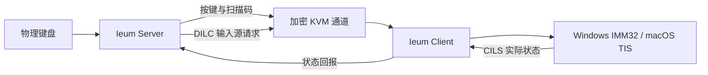

<!-- SPDX-FileCopyrightText: (C) 2026 Cherry Inc. -->
<!-- SPDX-License-Identifier: GPL-2.0-only WITH LicenseRef-OpenSSL-Exception -->

<p align="center">
  
</p>

<h1 align="center">Ieum</h1>

<p align="center"><strong>跨 Windows、macOS 和 Linux 的软件 KVM</strong></p>

<p align="center">开发者与贡献者 <strong>Heesang Kim (PhD)</strong> · 公司 <strong>Cherry Inc.</strong></p>

<p align="center">
  <a href="README.md">한국어</a> · <a href="README.en.md">English</a> · 简体中文
</p>

<p align="center">
  <a href="https://github.com/victoriousian/ieum/releases/tag/v0.1.0-alpha.14"><strong>下载 Ieum</strong></a>
  · <a href="#首次运行时的安全与权限"><strong>安全与权限</strong></a>
  · <a href="#支持开发"><strong>支持开发</strong></a>
</p>

<p align="center">
  <a href="https://github.com/victoriousian/ieum/actions/workflows/continuous-integration.yml"></a>
  <a href="https://github.com/victoriousian/ieum/releases"></a>
  <a href="LICENSE"></a>
</p>

Ieum 让一套键盘和鼠标可以在 Windows、macOS 与 Linux 电脑之间切换。它不仅让指针跨越屏幕边缘，
还试图把不同系统中的 **韩/英输入状态、输入法组合会话、物理按键位置和 Unicode 剪贴板**连接成
一致的输入链路。

> 当前版本为 `v0.1.0-alpha.14`。自动构建和单元测试已经通过，但 Windows/macOS 真机长时间输入矩阵
> 与正式代码签名尚未完成。

## Alpha.14 输入稳定性

- 延迟到达的网络输入会分成有上限的短批次处理，避免长距离鼠标移动被压缩成一次跳跃，也避免
  输入突发长时间占用核心事件循环。
- Windows 绝对指针坐标改为按整个虚拟桌面计算，包括副显示器和负坐标，不再假定只有主显示器。
- macOS 客户端在指针位于远程屏幕时保持原始鼠标捕获，并包含 macOS 27 后台点击与拖动事件编号
  的 upstream 修复。
- 输入语言变化不再反复弹出 Windows 通知。主窗口状态栏、托盘菜单和工具提示以固定的 `한`/`A`
  指示器安静显示状态。
- 断开或拒绝连接的清理会等当前网络回调返回后再执行，事件处理器在整个分发期间保持有效。

坐标转换、限量分发、状态显示和断开连接行为均有回归测试。真实网络路径与鼠标轮询率会因设备
而异，因此仍需在用户的 Windows/macOS 设备组合上继续进行长时间测试。

## 产品名称与界面

韩语界面显示 **이음 (Ieum)**，并突出稳定的韩语与 CJK 输入；其他界面语言显示 **Ieum**，介绍语为
“跨 Windows、macOS 和 Linux 的软件 KVM”。为保持兼容性，可执行文件名与设置路径继续使用
`Ieum`。

主窗口现已采用系统调色板材质、服务端/客户端分段控件、清晰的功能层级和稳定的响应式尺寸。
Qt 实现参考了 Apple WWDC26 Liquid Glass 对层级、标准控件、克制使用效果、可调整窗口和辅助功能
的要求，而不是逐像素模仿 Apple 界面。实现规则与官方资料见
[界面设计原则](docs/design/visual-system.md)。

## 支持开发

**如果 이음 (Ieum) 对你有帮助，请考虑支持项目开发。** 资金将用于 Windows 代码签名、Apple
Developer Program 与公证、真机测试设备、中继基础设施和持续维护。

`victoriousian` 的 GitHub Sponsors 收款资料目前正在准备中。在资料激活之前，项目不会把未获批准的
付款链接或个人银行账户作为官方赞助渠道。激活后，可从这里和代码库的 Sponsor 按钮进行单次或定期
赞助。在此之前，Star、真机测试结果、使用反馈和可复现的错误报告同样能直接帮助项目。

## 韩语输入不只是按键映射

传统软件 KVM 通常把物理按键转换成字符标识，再在远端合成按键。这个模型适用于静态键盘布局，
但韩语、中文和日语文字由 **输入法状态机和组合输入会话（preedit）**生成。缺少这些状态时，按键
即使成功到达，也可能无法得到预期文字。

| 现象 | 结构性原因 |
| --- | --- |
| Windows 韩/英切换键不能切换 Mac 输入源 | 韩/英切换是模式命令而不是字符，却被当作普通按键传输 |
| 服务端指示状态与远端输入框状态不一致 | 缺少把客户端实际输入源回传给服务端的通道 |
| `한` 偶尔变成分离的韩文字母 | 输入源切换、混合注入路径或事件乱序中断了组合会话 |
| 从 macOS 复制的韩语在 Windows 中分离 | macOS 分解形式文本没有在传输前进行 NFC 规范化 |

Ieum 将这些问题视为协议级的 **输入状态同步问题**，而不是缺少某个特殊键映射。

## Ieum 的核心改动

### 1. 输入源控制通道

协议 1.9 增加 `DILC` 与 `CILS`：服务端请求切换输入源，客户端再回报操作系统实际选中的输入源。
客户端的真实状态而不是服务端猜测值，才是唯一可信来源。

### 2. 输入法原生按键链路

输入法启用时，Ieum 可以绕过字符 `KeyID` 翻译，以 PC Set-1 原始扫描码传输物理按键位置。文字
组合完全交给远端系统原生输入法，避免布局翻译干扰 CJK 输入。

### 3. 一致的 macOS 事件合成

输入法路径使用同一个持久 `CGEventSource` 和 FIFO 队列，并明确设置时间戳、键盘类型、修饰键和
重复状态，避免每个按键在不同事件注入层之间切换。

### 4. Unicode 剪贴板规范化

从 macOS 发出的 UTF-8 文本会转换为 NFC，减少 Windows 应用与文件名中的韩文音节拆分。



## 项目状态

| 范围 | 状态 |
| --- | --- |
| Ieum 品牌、图标、应用与安装程序名称 | 已完成 |
| Windows x64/ARM64、macOS Intel/Apple Silicon 安装包 | CI 构建与打包检查通过 |
| `DILC`/`CILS`、原始扫描码、macOS 事件源、NFC 链路 | 已实现并包含自动测试 |
| Linux 与 Flatpak 安装包 | 实验性提供 |
| Windows ↔ macOS 十分钟真机输入矩阵 | **待完成** |
| Windows 签名、Apple 签名与公证 | **待完成** |
| iPadOS | 公共 API 不提供系统级输入注入，因此暂不支持 |

真机验收目标包括：连续切换输入源 20 次不失步、每个应用连续输入十分钟无韩文字母分离、输入
延迟增加低于 p95 2ms。在真机矩阵完成之前，本 Alpha 版本不会宣称已经达到这些结果。

## 下载

[Ieum v0.1.0-alpha.14 发布页](https://github.com/victoriousian/ieum/releases/tag/v0.1.0-alpha.14)

| 操作系统 | 安装文件 |
| --- | --- |
| Apple Silicon Mac | `Ieum-0.1.0-alpha.14-macos-arm64.dmg` |
| Intel Mac | `Ieum-0.1.0-alpha.14-macos-x86_64.dmg` |
| Intel/AMD 64 位 Windows | `Ieum-0.1.0-alpha.14-win-x64.msi` |
| Intel/AMD 64 位 Windows，韩文安装界面 | `Ieum-0.1.0-alpha.14-win-x64-ko-KR.msi` |
| ARM64 Windows | `Ieum-0.1.0-alpha.14-win-arm64.msi` |
| ARM64 Windows，韩文安装界面 | `Ieum-0.1.0-alpha.14-win-arm64-ko-KR.msi` |

发布页还提供 Windows 便携版与实验性 Linux 安装包。请使用随附的 `SHA256SUMS.txt` 校验文件。

### 首次运行时的安全与权限

请只从 `github.com/victoriousian/ieum/releases` 下载，并用 `SHA256SUMS.txt` 校验文件。不要关闭
SmartScreen、Microsoft Defender、Gatekeeper 或 macOS 隐私保护。校验值不一致或安全软件明确报告
恶意软件时，应立即停止安装。

Windows 安装包尚未进行代码签名，因此 SmartScreen 与 UAC 可能显示“未知发布者”。UAC 用于写入
`C:\Program Files\Ieum`、注册 `Ieum` 服务，并为 `ieum-core.exe` 添加 Windows 防火墙程序例外；
安装程序不会关闭防火墙。

macOS 不允许应用自动批准权限开关，这是 Apple 的系统安全边界：

| macOS 权限 | 用途 |
| --- | --- |
| 本地网络 | 连接用户选择的 Ieum 服务端或客户端 |
| 辅助功能 | 在 Mac 服务端或客户端合成远程输入并处理 KVM 输入事件 |
| 输入监控 | 读取物理键盘与鼠标输入；Mac 服务端必须开启 |

只作为客户端使用的 Mac 不应预先开启“输入监控”，除非 macOS 实际提出请求。Ieum 不申请屏幕
录制、完全磁盘访问、摄像头或麦克风权限。切换权限时出现的密码或 Touch ID 由 macOS 处理，
不会交给 Ieum。更多信息请参阅
[完整安全与隐私策略](docs/SECURITY.md)和[韩文图示安装指南](README.md#설치와-첫-연결)。

从 `alpha.11` 开始，`网络 IP：自动`会优先选择活动的物理以太网或 Wi-Fi 地址。Ieum 服务端默认
不再监听 Tailscale、ZeroTier、VMware、Hyper-V/WSL 等虚拟适配器；没有可用物理网络时会回退到
全部接口，以保留连接能力。在高级设置中关闭**优先使用物理网络**即可恢复旧行为。此选项只限制
Ieum 的监听范围，不会隐藏或绕过 Genian NAC 针对操作系统中虚拟适配器或默认路由的策略警告。

`alpha.12` 中，只需启用**设置 → 网络 → Tailscale 快速连接**，Ieum 就会检查 Tailscale 的运行与
登录状态，并自动应用本机的 Tailscale 地址和默认 TCP 端口 `24800`。客户端会用 Tailnet 桌面设备
列表替代手动 IP 输入：只有一台在线电脑时会预先选中，多台电脑时只需选择一个名称。Tailscale
不可用时，Ieum 不会回退到监听所有接口，而是中止启动。此功能不会修改 Tailscale 配置或访问规则，
因此 Tailnet 策略和主机防火墙仍需允许连接服务端 TCP `24800`。

从 `alpha.13` 开始，绑定到 Tailscale 或首选物理地址的服务端会监控该接口，并在地址恢复或变化后
自动重新绑定。客户端断开后会继续解析地址并重试。停止、启动和重启请求现在按顺序执行，避免新核心
与旧核心或本地 IPC 端点发生竞争。macOS 的关闭按钮会可靠地把 Ieum 留在菜单栏中；要完全退出，
请使用菜单栏图标中的**退出**。GUI 日志最多保留 10,000 行，并批量刷新以降低日志突发时的 CPU
开销。

`alpha.5` 的 Mac DMG 代码签名封印已损坏，`alpha.6` 又会在异步“辅助功能”请求完成前退出。
在 `alpha.7` 中，Qt 的 macOS 辅助功能警告可能被反复写回应用日志，持续显示
`QTextCursor::setPosition`。这些权限与日志修复继续保留在 `alpha.14` 中。如果已启用的旧版 Ieum
条目仍然存在，但 macOS 不信任当前应用，`alpha.10` 会提供**重置旧授权**。确认后，它只会删除
Ieum 的“辅助功能”记录，并重新注册当前的 `/Applications/Ieum.app`，无需手动点按减号和加号。

`alpha.14` 最终应用已通过严格的代码签名验证，但尚未使用 Developer ID 证书签名，也未经过 Apple
公证。请将应用移到 `/Applications` 并尝试打开一次；若 macOS 阻止运行，请前往
**系统设置 → 隐私与安全性 → 仍要打开**。应用还需要“辅助功能”和“输入监控”权限。临时签名会让
每个构建具有不同的代码身份，因此后续更新仍可能需要**重置旧授权**并再次批准。要自动继承权限，
必须使用稳定的 Developer ID Application 签名并通过 Apple 公证。

Windows `alpha.2` 至 `alpha.7` 错误复用了 Deskflow 的 MSI `UpgradeCode`，因此已安装 Deskflow
的电脑可能会把 Ieum 误判为较旧版本并拒绝安装。`alpha.8` 分离了安装程序身份，但运行时仍使用
`deskflow-core` 与 `deskflow-daemon` 的可执行文件和 IPC 名称。Deskflow 正在运行时，或 Ieum 的
服务核心与桌面核心重叠时，GUI 可能连接到错误的核心，并让 TLS 授权一直等待到超时。

从 `alpha.9` 开始，Ieum 使用单调递增的 MSI 预发行版本映射（`alpha.14` 对应 `0.1.114`）、
`ieum-core.exe`、`ieum-daemon.exe`，以及带版本的
`ieum-core-v1`/`ieum-daemon-v1` IPC。全局所有权锁会拒绝重复核心；默认认证文件迁移到
`ieum.pem`，从而重新生成 `/CN=Ieum` 证书。CI 会在 x64 与 ARM64 上执行真实的
`alpha.9 → alpha.14` 升级，验证服务 IPC、重复核心拒绝，并确认 Deskflow 1.26.0 与 Ieum 核心可
同时运行。现有 `alpha.8` 至 `alpha.13` 用户可直接运行 `alpha.14` MSI，无需手动卸载。证书更新后，
首次连接时可能需要重新确认一次指纹。

全局安装包在“已安装的应用”和开始菜单中显示为 **Ieum**，韩文安装包显示为 **이음 (Ieum)**。
安装目录为 `C:\Program Files\Ieum`，Windows 服务名为 `Ieum`，开始菜单中还会创建卸载快捷方式。
Windows 安装包尚未进行代码签名，因此 SmartScreen 仍可能显示警告。

## 快速开始

1. 在所有需要控制的电脑上安装 Ieum。
2. 在连接物理键盘和鼠标的电脑上选择 `Server`。
3. 在同一局域网中，在其他电脑上选择 `Client` 并输入服务端地址。
4. 使用 Tailscale 时，在两台电脑上启用**设置 → 网络 → Tailscale 快速连接**，然后在客户端按
   名称选择服务端电脑。
5. 在服务端排列各屏幕位置，然后启动 Ieum。

输入法行为和各平台权限请参阅 [IME 使用说明](docs/user/ime.md)。

## 开源与付费产品方向

本地 KVM 核心和当前发行代码使用
`GPL-2.0-only WITH LicenseRef-OpenSSL-Exception`。Ieum 不会在同一个 GPL 可执行文件中把核心功能
改成闭源模块。

以下是**规划中的商业方向**，目前并不是已经销售的产品。

| 范围 | 开源/付费方向 |
| --- | --- |
| Community | 局域网 KVM、输入法同步、剪贴板和协议核心继续以 GPL 开源 |
| 官方发行 | 签名与公证安装包、稳定更新通道、简化安装和经过验证的二进制可以作为付费便利服务 |
| Teams/Cloud | 托管中继与设备发现、团队策略、SSO、审计记录和管理控制台可作为独立服务 |
| 技术支持 | 优先支持、部署协助、企业集成和维护合同可以收费 |

GPL 二进制可以收费发行，但接收者仍然有权获得对应源代码并重新分发。因此，可持续的付费价值应
来自 **官方可信发行、运维便利、托管服务和技术支持**，而不是限制源代码。任何专有组件都必须
保持清晰的独立进程或网络服务边界，并在发布前完成许可证审查。相关规则请参阅
[GNU GPL v2 FAQ](https://www.gnu.org/licenses/old-licenses/gpl-2.0-faq.en.html)。这只是项目方向而非法律
意见；正式商业发行前仍需单独审查版权、商标和服务边界。

## 路线图

- [x] 完成分支初始化与 Ieum 品牌替换
- [x] 输入源控制协议与各平台控制器
- [x] 输入法原始扫描码、macOS 事件链路和 NFC 规范化
- [x] Windows、macOS 与 Linux 自动打包
- [ ] 发布 Windows ↔ macOS 真机输入矩阵
- [ ] 代码签名、Apple 公证与稳定更新通道
- [ ] 定义托管中继与设备发现的产品边界
- [ ] 确定 `v1.0.0` 验收标准

## 构建与测试

```sh
cmake -S . -B build -DCMAKE_BUILD_TYPE=Release
cmake --build build --config Release
ctest --test-dir build --output-on-failure
```

更多信息请参阅[构建文档](docs/dev/build.md)、[协议参考](docs/dev/protocol_reference.md)和
[Phase 0 报告](phase0_report.md)。GitHub Actions 会验证 Windows x64/ARM64、macOS Intel/Apple
Silicon、多种 Linux 发行版、Flatpak 与 FreeBSD。

## 项目来源与许可证

Ieum 基于 `deskflow/deskflow` 的 `39bf4fb` 提交开发。为便于审查上游合并，部分源代码目录名称
仍然保留。Linux 与 Flatpak 继续使用 `org.deskflow.deskflow` 应用 ID，但运行时可执行文件与本地
IPC 使用 Ieum 专用名称。macOS 使用 `io.github.victoriousian.ieum` 应用包 ID，以避免权限记录
冲突。面向用户的产品名称、图标、安装程序和发布版本均使用 Ieum。

项目按照 `GPL-2.0-only WITH LicenseRef-OpenSSL-Exception` 发布，并保留上游版权与许可证声明。
