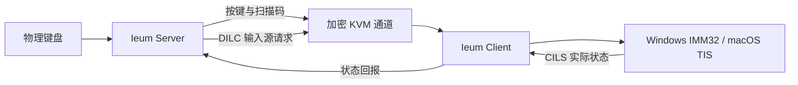

<!-- SPDX-FileCopyrightText: (C) 2026 Ieum Developers -->
<!-- SPDX-License-Identifier: GPL-2.0-only WITH LicenseRef-OpenSSL-Exception -->

<p align="center">
  
</p>

<h1 align="center">Ieum（이음）</h1>

<p align="center"><strong>不把韩语与 CJK 输入视为简单按键映射，而是同步输入法状态的原生软件 KVM</strong></p>

<p align="center">
  <a href="README.md">한국어</a> · <a href="README.en.md">English</a> · 简体中文
</p>

<p align="center">
  <a href="https://github.com/victoriousian/ieum/actions/workflows/continuous-integration.yml"></a>
  <a href="https://github.com/victoriousian/ieum/releases"></a>
  <a href="LICENSE"></a>
</p>

Ieum 让一套键盘和鼠标可以在 Windows、macOS 与 Linux 电脑之间切换。它不仅让指针跨越屏幕边缘，
还试图把不同系统中的 **韩/英输入状态、输入法组合会话、物理按键位置和 Unicode 剪贴板**连接成
一致的输入链路。

> 当前版本为 `v0.1.0-alpha.2`。自动构建和单元测试已经通过，但 Windows/macOS 真机长时间输入矩阵
> 与正式代码签名尚未完成。

## 韩语输入不只是按键映射

传统软件 KVM 通常把物理按键转换成字符标识，再在远端合成按键。这个模型适用于静态键盘布局，
但韩语、中文和日语文字由 **输入法状态机和组合输入会话（preedit）**生成。缺少这些状态时，按键
即使成功到达，也可能无法得到预期文字。

| 现象 | 结构性原因 |
| --- | --- |
| Windows 韩/英切换键不能切换 Mac 输入源 | 韩/英切换是模式命令而不是字符，却被当作普通按键传输 |
| 服务端指示状态与远端输入框状态不一致 | 缺少把客户端实际输入源回传给服务端的通道 |
| `한` 偶尔变成分离的韩文字母 | 输入源切换、混合注入路径或事件乱序中断了组合会话 |
| 从 macOS 复制的韩语在 Windows 中分离 | macOS 分解形式文本没有在传输前进行 NFC 规范化 |

Ieum 将这些问题视为协议级的 **输入状态同步问题**，而不是缺少某个特殊键映射。

## Ieum 的核心改动

### 1. 输入源控制通道

协议 1.9 增加 `DILC` 与 `CILS`：服务端请求切换输入源，客户端再回报操作系统实际选中的输入源。
客户端的真实状态而不是服务端猜测值，才是唯一可信来源。

### 2. 输入法原生按键链路

输入法启用时，Ieum 可以绕过字符 `KeyID` 翻译，以 PC Set-1 原始扫描码传输物理按键位置。文字
组合完全交给远端系统原生输入法，避免布局翻译干扰 CJK 输入。

### 3. 一致的 macOS 事件合成

输入法路径使用同一个持久 `CGEventSource` 和 FIFO 队列，并明确设置时间戳、键盘类型、修饰键和
重复状态，避免每个按键在不同事件注入层之间切换。

### 4. Unicode 剪贴板规范化

从 macOS 发出的 UTF-8 文本会转换为 NFC，减少 Windows 应用与文件名中的韩文音节拆分。



## 项目状态

| 范围 | 状态 |
| --- | --- |
| Ieum 品牌、图标、应用与安装程序名称 | 已完成 |
| Windows x64/ARM64、macOS Intel/Apple Silicon 安装包 | CI 构建与打包检查通过 |
| `DILC`/`CILS`、原始扫描码、macOS 事件源、NFC 链路 | 已实现并包含自动测试 |
| Linux 与 Flatpak 安装包 | 实验性提供 |
| Windows ↔ macOS 十分钟真机输入矩阵 | **待完成** |
| Windows 签名、Apple 签名与公证 | **待完成** |
| iPadOS | 公共 API 不提供系统级输入注入，因此暂不支持 |

真机验收目标包括：连续切换输入源 20 次不失步、每个应用连续输入十分钟无韩文字母分离、输入
延迟增加低于 p95 2ms。在真机矩阵完成之前，本 Alpha 版本不会宣称已经达到这些结果。

## 下载

[Ieum v0.1.0-alpha.2 发布页](https://github.com/victoriousian/ieum/releases/tag/v0.1.0-alpha.2)

| 操作系统 | 安装文件 |
| --- | --- |
| Apple Silicon Mac | `Ieum-0.1.0-alpha.2-macos-arm64.dmg` |
| Intel Mac | `Ieum-0.1.0-alpha.2-macos-x86_64.dmg` |
| Intel/AMD 64 位 Windows | `Ieum-0.1.0-alpha.2-win-x64.msi` |
| ARM64 Windows | `Ieum-0.1.0-alpha.2-win-arm64.msi` |

发布页还提供 Windows 便携版与实验性 Linux 安装包。请使用随附的 `SHA256SUMS.txt` 校验文件。

当前 Alpha 安装包尚未进行代码签名或 Apple 公证。在 macOS 上，请将应用移到 `/Applications`，
允许“辅助功能”和“输入监控”权限；如果 Gatekeeper 将其隔离，可执行：

```sh
xattr -dr com.apple.quarantine /Applications/Ieum.app
```

Windows SmartScreen 也可能显示警告。

## 快速开始

1. 在所有需要控制的电脑上安装 Ieum。
2. 在连接物理键盘和鼠标的电脑上选择 `Server`。
3. 在其他电脑上选择 `Client`，并输入服务端地址。
4. 在服务端排列各屏幕位置，然后启动 Ieum。

输入法行为和各平台权限请参阅 [IME 使用说明](docs/user/ime.md)。

## 开源与付费产品方向

本地 KVM 核心和当前发行代码使用
`GPL-2.0-only WITH LicenseRef-OpenSSL-Exception`。Ieum 不会在同一个 GPL 可执行文件中把核心功能
改成闭源模块。

以下是**规划中的商业方向**，目前并不是已经销售的产品。

| 范围 | 开源/付费方向 |
| --- | --- |
| Community | 局域网 KVM、输入法同步、剪贴板和协议核心继续以 GPL 开源 |
| 官方发行 | 签名与公证安装包、稳定更新通道、简化安装和经过验证的二进制可以作为付费便利服务 |
| Teams/Cloud | 托管中继与设备发现、团队策略、SSO、审计记录和管理控制台可作为独立服务 |
| 技术支持 | 优先支持、部署协助、企业集成和维护合同可以收费 |

GPL 二进制可以收费发行，但接收者仍然有权获得对应源代码并重新分发。因此，可持续的付费价值应
来自 **官方可信发行、运维便利、托管服务和技术支持**，而不是限制源代码。任何专有组件都必须
保持清晰的独立进程或网络服务边界，并在发布前完成许可证审查。相关规则请参阅
[GNU GPL v2 FAQ](https://www.gnu.org/licenses/old-licenses/gpl-2.0-faq.en.html)。这只是项目方向而非法律
意见；正式商业发行前仍需单独审查版权、商标和服务边界。

## 路线图

- [x] 完成分支初始化与 Ieum 品牌替换
- [x] 输入源控制协议与各平台控制器
- [x] 输入法原始扫描码、macOS 事件链路和 NFC 规范化
- [x] Windows、macOS 与 Linux 自动打包
- [ ] 发布 Windows ↔ macOS 真机输入矩阵
- [ ] 代码签名、Apple 公证与稳定更新通道
- [ ] 定义托管中继与设备发现的产品边界
- [ ] 确定 `v1.0.0` 验收标准

## 构建与测试

```sh
cmake -S . -B build -DCMAKE_BUILD_TYPE=Release
cmake --build build --config Release
ctest --test-dir build --output-on-failure
```

更多信息请参阅[构建文档](docs/dev/build.md)、[协议参考](docs/dev/protocol_reference.md)和
[Phase 0 报告](phase0_report.md)。GitHub Actions 会验证 Windows x64/ARM64、macOS Intel/Apple
Silicon、多种 Linux 发行版、Flatpak 与 FreeBSD。

## 项目来源与许可证

Ieum 基于 `deskflow/deskflow` 的 `39bf4fb` 提交开发。为保持协议兼容性和已有 macOS 权限连续性，
部分内部二进制名称和 `org.deskflow.deskflow` 标识仍然保留。面向用户的产品名称、图标、安装程序和
发布版本均使用 Ieum。

项目按照 `GPL-2.0-only WITH LicenseRef-OpenSSL-Exception` 发布，并保留上游版权与许可证声明。
