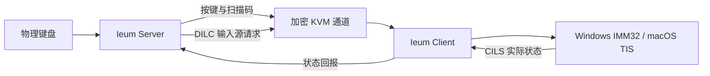
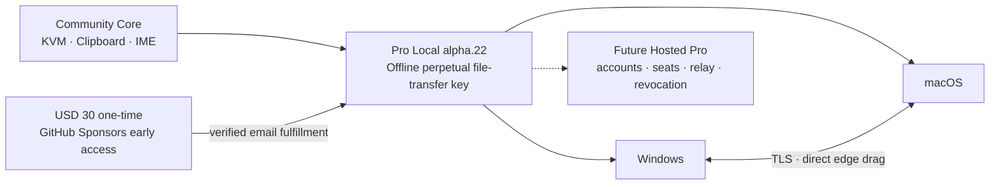
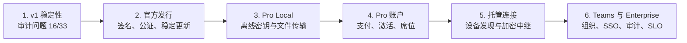

<!-- SPDX-FileCopyrightText: (C) 2026 Ieum contributors -->
<!-- SPDX-License-Identifier: GPL-2.0-only WITH LicenseRef-OpenSSL-Exception -->

<p align="center">
  
</p>

<h1 align="center">Ieum</h1>

<p align="center"><strong>跨 Windows、macOS 和 Linux 的软件 KVM</strong></p>

<p align="center">由 <strong>Cherry Company</strong> 维护</p>

<p align="center">
  <a href="README.md">한국어</a> · <a href="README.en.md">English</a> · 简体中文
</p>

<p align="center">
  <a href="https://github.com/Cherry-Company/ieum/releases/tag/v0.1.0-alpha.23"><strong>下载 Ieum</strong></a>
  · <a href="#首次运行时的安全与权限"><strong>安全与权限</strong></a>
  · <a href="https://github.com/sponsors/victoriousian"><strong>赞助 Ieum</strong></a>
</p>

<p align="center">
  <a href="https://github.com/Cherry-Company/ieum/actions/workflows/continuous-integration.yml"></a>
  <a href="https://github.com/Cherry-Company/ieum/releases"></a>
  <a href="LICENSE"></a>
  <a href="https://github.com/sponsors/victoriousian"></a>
</p>

Ieum 让一套键盘和鼠标可以在 Windows、macOS 与 Linux 电脑之间切换。它不仅让指针跨越屏幕边缘，
还试图把不同系统中的 **韩/英输入状态、输入法组合会话、物理按键位置和 Unicode 剪贴板**连接成
一致的输入链路。

> 当前版本为 `v0.1.0-alpha.23`。自动构建和单元测试已经通过，但 Windows/macOS 真机长时间输入矩阵
> 与正式代码签名尚未完成。

## 帮助 Ieum 完成正式发行

赞助将用于明确的发行工作：**Windows 正式代码签名、Apple Developer ID 签名与公证、Windows
ARM64 和 Apple Silicon 真机回归测试，以及可靠的版本维护**。

**[通过 GitHub Sponsors 赞助 Ieum](https://github.com/sponsors/victoriousian)**

| 每月档位 | 公开承诺 |
| --- | --- |
| **$3 Ieum Backer** | 支持持续开发并接收简明的赞助者动态 |
| **$10 Ieum Sustainer** | 包含 Backer 内容、月度开发报告，以及可选的赞助者姓名展示 |
| **$30 Ieum Quality Sponsor** | 包含 Sustainer 内容，并优先分析可复现的问题；不承诺修复或 SLA |
| **$100 Ieum Organization Sponsor** | 包含 Quality Sponsor 内容，以及可选的组织名称/标志展示和季度技术进展报告；商业支持另行提供 |

仍可选择自定义金额进行单次赞助。无论是否赞助，本地 KVM、韩语/CJK 输入同步和剪贴板核心都将保持
开放。每个版本都会公开[赞助资金分配金额和完成的工作](docs/release/sponsorship-impact.md)。
`alpha.22` 分配的赞助资金为 **USD 0**。Early Access 的标价只有在实际收到并核实付款后才计入赞助收入。

## Alpha.22 Windows ↔ macOS Pro Local 文件拖放

在 `alpha.22` 中，Windows 或 macOS 电脑都可以从已配置的屏幕边缘发起传输，不受服务端/客户端角色
限制。文件传输属于 **Pro Local** 功能；本地 KVM、韩语/CJK 输入同步与剪贴板仍可免费使用。

- 在每台参与传输的 Windows 或 macOS 电脑上，通过 **首选项 → Files** 导入并激活同一个
  `*.ieum-license.txt`。所有电脑都要启用 TLS，并明确开启发送或接收。
- 应用会在服务启动、提议/接受边界和数据传输期间重新检查授权。移除或过期的密钥会使当前会话失败；
  恢复密钥不会让已失败的会话复活。
- 协议 1.12 负责提议、决定、取消和结果；协议 1.13 传输有界数据帧，每次事件循环最多处理一个
  60 KiB 数据块。
- 发送前重新验证文件标识、大小和修改时间。接收端写入权限受限的隐藏暂存目录，验证大小与 SHA-256，
  并以避免冲突的新名称发布，不覆盖已有文件。
- Windows→macOS 与 macOS→Windows 均可沿已配置的拓扑边缘传输。操作始终是复制，不会移动或删除源文件。
- **Pro Local Early Access 为一次性 USD 30。** 从应用打开带 claim code 的 GitHub Sponsors 页面付款，
  再把 GitHub 用户名与 claim code 发到 `easecompany@protonmail.ch`。所有者核实付款后通过邮件发送永久
  文件传输许可证。本次购买不包含未来全部 Pro 功能。
- 当前离线许可证不统计设备，也不能远程撤销。私有签发器和签名密钥仅由项目所有者保管，不会放入
  公开仓库、发布包或赞助者文件。详见 [Pro Local 文件传输说明](docs/dev/pro_local_file_transfer.md)。

## Alpha.19 坐标、更新、权限与诊断可靠性

`alpha.19` 集中修复长时间使用中发现的混合 DPI 坐标偏移、Windows 运行中更新，以及
macOS 权限恢复流程。

- 跨越边缘时，不再选择目标显示器后二次应用源显示器比例。现在用一个归一化坐标映射累积
  物理边缘区间，折叠物理空隙，处理负原点，并为 Windows 核心启用 Per-Monitor V2 DPI 感知。
- Windows MSI 会向当前 GUI 发送**准备更新**命令，使其在替换前保存状态并正常退出。无法理解该
  命令的 `alpha.18` 及更旧进程仍使用有时限的 MSI 关闭后备路径。x64 实时升级验证检查旧进程退出、
  服务/IPC 恢复与新核心启动。
- 用户同意检查更新后，登录自动启动也会在后台安静检查。更新操作会直接打开当前操作系统、CPU
  架构和安装语言对应的 MSI 或 DMG。在签名更新元数据、安装后健康检查和回滚机制就绪前，Ieum 不会
  静默执行已下载的安装程序。
- macOS 的**重置旧授权**会先打开“辅助功能”设置，等待 TCC/UI 状态刷新，仅重置 Ieum 的 bundle ID
  记录，重新请求注册当前 `/Applications/Ieum.app`，然后再次打开设置页。**在“应用程序”中显示 Ieum**
  可在仍需手动点击 `+` 时定位准确的当前应用。要让更新自动继承权限，仍必须配置稳定的 Developer ID
  签名与 Apple 公证。
- 崩溃或严重错误会生成本地、经过隐私脱敏的**诊断护照**，不会伪装上传到不存在的服务。报告不包含
  设置、剪贴板、TLS 材料或完整日志，并会遮罩主目录路径与 IP 地址。即使没有 GitHub 帐号，也可复制或
  通过其他渠道分享该文件；下次启动还会检测上一个 GUI 会话是否异常结束。
- Windows 原生构建、坐标/更新/诊断回归测试，以及 x64 全局/韩文 MSI 结构检查已在本地通过。每种
  物理显示布局的 Windows↔macOS 长时间指针往返和各游戏无边框模式仍属于真机验收项，尚不宣称完全解决。

## Alpha.18 无边框全屏游戏锁定与物理显示器坐标

`alpha.17` 未通过无边框全屏游戏锁定和混合显示器进入坐标的真机验收。`alpha.18` 根据这些结果
重新实现了两条路径，并作为下一轮真机验证版本发布。

- Windows 现在同时检查独占全屏、**无边框全屏窗口**、真实窗口/客户端区域，以及游戏通过
  `ClipCursor` 设置的指针捕获。关闭手动 Scroll Lock 路径不再绕过独立的自动游戏保护；服务端还会
  获取当前活动服务端或客户端屏幕的状态。
- 协议 `1.11` 不再把整块虚拟桌面当作一台显示器，而是交换每台电脑的物理显示器矩形列表。
  坐标会在实际离开与进入的显示器边缘之间映射，从而在横屏、竖屏和混合分辨率布局中保留双向高度。
- 物理边缘映射仅在**两台电脑都运行 alpha.18**时启用。旧版本连接仍使用虚拟桌面整体比例回退，
  用户明确配置的局部边缘映射仍优先于自动转换。
- Windows 原生完整构建、相关回归测试、除当前会话剪贴板环境测试外的 36 个 CTest 目标，以及
  15 个旧版按键测试均已通过。不同游戏的无边框模式和 Windows↔macOS 混合显示器长时间移动仍是
  真机验收项目；完成这些测试前，本版本不会宣称问题已经解决。
- 此公开仓库的 Apple Silicon CI 与 DMG 打包在临时 GitHub-hosted `macos-15-arm64` 环境中运行。
  真机验收测试与发布打包相互独立，其结果也会与托管构建验证分开报告。

## Alpha.17 输入切换、重连与屏幕边缘可靠性

`alpha.17` 包含以下改动：

- 来自 Windows 服务端的 `Alt`/韩英切换键与 `Control+Space` 会作为 Mac 客户端的输入状态控制处理。
  macOS 选择 CJK 输入源后还会激活当前焦点应用的输入上下文，避免菜单栏已变化但实际输入语言未变。
- 开机或网络中断后，客户端先以 250ms 间隔重试 20 次，随后每秒重试，长期最大间隔为两秒。
  连接成功、用户主动停止或应用退出时会可靠地取消剩余重试计时器。
- 针对混合分辨率、缩放比例与负坐标显示器重新计算屏幕联合区域和边缘坐标。Windows DWM 窗口
  边界、隐藏窗口排除、屏幕覆盖率与短暂滞后可减少全屏游戏中的意外切换。
- 日志改为批量渲染，日志面板隐藏时推迟更新，并限制待处理行数。网络与 macOS 菜单栏监控使用
  粗粒度计时器，以减少空闲状态下的 UI 工作。
- IME、CJK、原始按键、屏幕进入和 Mac 按键延迟设置集中到**设置 → 输入**；服务与命令自动化位于
  **系统**，指针与剪贴板设置位于**指针与共享**。
- `alpha.17` Apple Silicon 包针对 ARM64 原生构建，并通过测试、DMG 挂载和签名结构检查。
  Developer ID 签名和 Apple 公证尚未配置，因此此预发行版在
  macOS 上可能仍需手动通过 Gatekeeper。

## Alpha.16 输入、窗口与更新可靠性

`alpha.16` 包含以下改动：

- 开机、分辨率变化或显示器重新连接后，旧坐标会被限制在新屏幕范围内。不同分辨率之间按相同的
  高度或宽度比例计算进入位置。
- 服务端前台应用覆盖整个显示器时会自动锁定边缘切换，无需快捷键即可防止游戏中误切换；可在
  **服务端设置 → 高级**中关闭。
- **远程指针速度**可在 `25%` 至 `400%` 之间调节。低速移动会保留小数余量，保存后无需断开客户端
  即可让运行中的服务端立即重载配置。
- macOS 会定期检查菜单栏项目，并在异常消失时进行有限次数的恢复。用 `X` 隐藏窗口后点击 Dock
  图标，也会重新显示并激活原窗口。
- Windows 物理韩/英键不再让 Mac 盲目切换，而是根据 Mac 报告的当前状态请求明确的目标状态。
  Mac 确认真实的 TIS 输入源变化通知后才继续处理下一按键。
- Windows 剪贴板获取会进行有上限的重试；读取失败时不会向远端发送空剪贴板，剪贴板对象销毁时
  也会释放残留的 Win32 剪贴板锁。
- Windows MSI 会在服务停止期间移除旧包，再启动新服务。实际运行中的 `alpha.16` 替换安装以
  返回码 `0` 完成，无需重启，服务自动恢复，服务端配置、TLS 信任和用户设置逐字节保持一致。

比例映射依据操作系统报告的像素几何信息，无法推断显示器支架高度、边框尺寸或不同尺寸显示器在
现实中的上下偏移。

## Alpha.15 自动启动与连接恢复

- 关闭 macOS 窗口时不再改变应用激活策略；Ieum 的菜单栏图标和菜单会一直保留到应用真正退出。
- Windows 和 macOS 13 及以上版本默认启用**设置 → 常规 → 登录时自动启动 Ieum**。
- Windows 服务会在开机时加载上次保存的核心配置。用户登录后 GUI 再次发送相同命令时，不会替换
  已在 Windows 登录界面运行的核心进程。
- 自动启动时若 Tailscale 服务或地址尚未准备好，Ieum 会静默等待并重试。只有一台在线桌面设备时
  客户端自动选择；多台设备仍使用已保存选择或要求用户明确选择。
- 断开后的前五秒内，客户端会以 250ms 间隔快速重连，给服务端完成启动的时间，之后恢复为默认
  的一秒间隔。
- 服务端和客户端都会监控网络地址变化。用户主动停止或拒绝证书后，自动重试不会擅自重新启动。

在正式代码签名、签名更新元数据、分阶段替换、健康检查和回滚全部就绪前，Ieum 不会自动执行下载的
安装包。详见[安全更新交付设计](docs/dev/update-delivery.md)。

## Alpha.14 输入稳定性

- 延迟到达的网络输入会分成有上限的短批次处理，避免长距离鼠标移动被压缩成一次跳跃，也避免
  输入突发长时间占用核心事件循环。
- Windows 绝对指针坐标改为按整个虚拟桌面计算，包括副显示器和负坐标，不再假定只有主显示器。
- macOS 客户端在指针位于远程屏幕时保持原始鼠标捕获，并包含 macOS 27 后台点击与拖动事件编号
  的 upstream 修复。
- 输入语言变化不再反复弹出 Windows 通知。主窗口状态栏、托盘菜单和工具提示以固定的 `한`/`A`
  指示器安静显示状态。
- 断开或拒绝连接的清理会等当前网络回调返回后再执行，事件处理器在整个分发期间保持有效。

坐标转换、限量分发、状态显示和断开连接行为均有回归测试。真实网络路径与鼠标轮询率会因设备
而异，因此仍需在用户的 Windows/macOS 设备组合上继续进行长时间测试。

## 产品名称与界面

韩语界面显示 **이음 (Ieum)**，并突出稳定的韩语与 CJK 输入；其他界面语言显示 **Ieum**，介绍语为
“跨 Windows、macOS 和 Linux 的软件 KVM”。为保持兼容性，可执行文件名与设置路径继续使用
`Ieum`。

主窗口现已采用系统调色板材质、服务端/客户端分段控件、清晰的功能层级和稳定的响应式尺寸。
Qt 实现参考了 Apple WWDC26 Liquid Glass 对层级、标准控件、克制使用效果、可调整窗口和辅助功能
的要求，而不是逐像素模仿 Apple 界面。实现规则与官方资料见
[界面设计原则](docs/design/visual-system.md)。

## 韩语输入不只是按键映射

传统软件 KVM 通常把物理按键转换成字符标识，再在远端合成按键。这个模型适用于静态键盘布局，
但韩语、中文和日语文字由 **输入法状态机和组合输入会话（preedit）**生成。缺少这些状态时，按键
即使成功到达，也可能无法得到预期文字。

| 现象 | 结构性原因 |
| --- | --- |
| Windows 韩/英切换键不能切换 Mac 输入源 | 韩/英切换是模式命令而不是字符，却被当作普通按键传输 |
| 服务端指示状态与远端输入框状态不一致 | 缺少把客户端实际输入源回传给服务端的通道 |
| `한` 偶尔变成分离的韩文字母 | 输入源切换、混合注入路径或事件乱序中断了组合会话 |
| 从 macOS 复制的韩语在 Windows 中分离 | macOS 分解形式文本没有在传输前进行 NFC 规范化 |

Ieum 将这些问题视为协议级的 **输入状态同步问题**，而不是缺少某个特殊键映射。

## Ieum 的核心改动

### 1. 输入源控制通道

协议 1.9 增加 `DILC` 与 `CILS`：服务端请求切换输入源，客户端再回报操作系统实际选中的输入源。
客户端的真实状态而不是服务端猜测值，才是唯一可信来源。

### 2. 输入法原生按键链路

输入法启用时，Ieum 可以绕过字符 `KeyID` 翻译，以 PC Set-1 原始扫描码传输物理按键位置。文字
组合完全交给远端系统原生输入法，避免布局翻译干扰 CJK 输入。

### 3. 一致的 macOS 事件合成

输入法路径使用同一个持久 `CGEventSource` 和 FIFO 队列，并明确设置时间戳、键盘类型、修饰键和
重复状态，避免每个按键在不同事件注入层之间切换。

### 4. Unicode 剪贴板规范化

从 macOS 发出的 UTF-8 文本会转换为 NFC，减少 Windows 应用与文件名中的韩文音节拆分。



## 项目状态

| 范围 | 状态 |
| --- | --- |
| Ieum 品牌、图标、应用与安装程序名称 | 已完成 |
| Windows x64/ARM64、macOS Intel/Apple Silicon 安装包 | CI 构建与打包检查通过 |
| `DILC`/`CILS`、原始扫描码、macOS 事件源、NFC 链路 | 已实现并包含自动测试 |
| Windows 登录前服务核心、Windows/macOS 登录自动启动 | 已实现并包含安装包回归检查 |
| Linux 与 Flatpak 安装包 | 实验性提供 |
| Windows ↔ macOS 十分钟真机输入矩阵 | **待完成** |
| Windows 签名、Apple 签名与公证 | **待完成** |
| iPadOS | 公共 API 不提供系统级输入注入，因此暂不支持 |

真机验收目标包括：连续切换输入源 20 次不失步、每个应用连续输入十分钟无韩文字母分离、输入
延迟增加低于 p95 2ms。在真机矩阵完成之前，本 Alpha 版本不会宣称已经达到这些结果。

## 下载

[Ieum v0.1.0-alpha.23 发布页](https://github.com/Cherry-Company/ieum/releases/tag/v0.1.0-alpha.23)

| 操作系统 | 安装文件 |
| --- | --- |
| Apple Silicon Mac | `Ieum-0.1.0-alpha.23-macos-arm64.dmg` |
| Intel Mac | `Ieum-0.1.0-alpha.23-macos-x86_64.dmg` |
| Intel/AMD 64 位 Windows | `Ieum-0.1.0-alpha.23-win-x64.msi` |
| Intel/AMD 64 位 Windows，韩文安装界面 | `Ieum-0.1.0-alpha.23-win-x64-ko-KR.msi` |
| ARM64 Windows | `Ieum-0.1.0-alpha.23-win-arm64.msi` |
| ARM64 Windows，韩文安装界面 | `Ieum-0.1.0-alpha.23-win-arm64-ko-KR.msi` |

发布页还提供 Windows 便携版与实验性 Linux 安装包。请使用随附的 `SHA256SUMS.txt` 校验文件。

### 首次运行时的安全与权限

请只从 `github.com/Cherry-Company/ieum/releases` 下载，并用 `SHA256SUMS.txt` 校验文件。不要关闭
SmartScreen、Microsoft Defender、Gatekeeper 或 macOS 隐私保护。校验值不一致或安全软件明确报告
恶意软件时，应立即停止安装。

Windows 安装包尚未进行代码签名，因此 SmartScreen 与 UAC 可能显示“未知发布者”。UAC 用于写入
`C:\Program Files\Ieum`、注册 `Ieum` 服务，并为 `ieum-core.exe` 添加 Windows 防火墙程序例外；
安装程序不会关闭防火墙。

macOS 不允许应用自动批准权限开关，这是 Apple 的系统安全边界：

| macOS 权限 | 用途 |
| --- | --- |
| 本地网络 | 连接用户选择的 Ieum 服务端或客户端 |
| 辅助功能 | 在 Mac 服务端或客户端合成远程输入并处理 KVM 输入事件 |
| 输入监控 | 读取物理键盘与鼠标输入；Mac 服务端必须开启 |

只作为客户端使用的 Mac 不应预先开启“输入监控”，除非 macOS 实际提出请求。Ieum 不申请屏幕
录制、完全磁盘访问、摄像头或麦克风权限。切换权限时出现的密码或 Touch ID 由 macOS 处理，
不会交给 Ieum。更多信息请参阅
[完整安全与隐私策略](docs/SECURITY.md)和[韩文图示安装指南](README.md#설치와-첫-연결)。

### 自动启动与登录界面

**设置 → 常规 → 登录时自动启动 Ieum**会在用户登录后启动 GUI 和菜单栏/托盘图标。它与登录前
核心运行是两个不同层次：

| 平台 | 行为 |
| --- | --- |
| Windows MSI | 自动启动的 `Ieum` 服务在开机时加载上次保存的服务端/客户端配置，并在登录界面会话运行核心 |
| Windows 便携版 | 没有服务，只能在用户登录后启动 GUI |
| macOS 13+ | ServiceManagement 登录项仅在用户登录后启动 `Ieum --background` |

全新 Windows 安装必须先打开一次 Ieum、完成角色与地址配置并启动，服务才有可在后续开机恢复的
有效拓扑。登录前路径可传送键盘和鼠标；用户剪贴板要到用户会话打开后才存在。

FileVault 解锁属于独立的 preboot 环境，此时 macOS、用户数据卷、应用登录项和“辅助功能”授权都
尚不可用，因此 Ieum 无法运行。若远程输入必须覆盖 FileVault 解锁阶段，需要硬件 KVM；Ieum 不会
降低或绕过这个安全边界。

从 `alpha.11` 开始，`网络 IP：自动`会优先选择活动的物理以太网或 Wi-Fi 地址。Ieum 服务端默认
不再监听 Tailscale、ZeroTier、VMware、Hyper-V/WSL 等虚拟适配器；没有可用物理网络时会回退到
全部接口，以保留连接能力。在高级设置中关闭**优先使用物理网络**即可恢复旧行为。此选项只限制
Ieum 的监听范围，不会隐藏或绕过 Genian NAC 针对操作系统中虚拟适配器或默认路由的策略警告。

`alpha.12` 中，只需启用**设置 → 网络 → Tailscale 快速连接**，Ieum 就会检查 Tailscale 的运行与
登录状态，并自动应用本机的 Tailscale 地址和默认 TCP 端口 `24800`。客户端会用 Tailnet 桌面设备
列表替代手动 IP 输入：只有一台在线电脑时会预先选中，多台电脑时只需选择一个名称。Tailscale
不可用时，Ieum 不会回退到监听所有接口，而是中止启动。此功能不会修改 Tailscale 配置或访问规则，
因此 Tailnet 策略和主机防火墙仍需允许连接服务端 TCP `24800`。

从 `alpha.13` 开始，绑定到 Tailscale 或首选物理地址的服务端会监控该接口，并在地址恢复或变化后
自动重新绑定。客户端断开后会继续解析地址并重试。停止、启动和重启请求现在按顺序执行，避免新核心
与旧核心或本地 IPC 端点发生竞争。GUI 日志最多保留 10,000 行，并批量刷新以降低日志突发时的
CPU 开销。

从 `alpha.15` 开始，自动启动会等待 Tailscale 准备完成，不再要求重启整个应用。macOS 关闭按钮会
保留同一个菜单栏状态项；只有菜单中的**退出**才会完全结束应用。断开后的前五秒内客户端每
250ms 重试一次，之后使用默认的一秒间隔。

`alpha.5` 的 Mac DMG 代码签名封印已损坏，`alpha.6` 又会在异步“辅助功能”请求完成前退出。
在 `alpha.7` 中，Qt 的 macOS 辅助功能警告可能被反复写回应用日志，持续显示
`QTextCursor::setPosition`。这些权限与日志修复继续保留在 `alpha.14` 中。如果已启用的旧版 Ieum
条目仍然存在，但 macOS 不信任当前应用，`alpha.10` 会提供**重置旧授权**。确认后，它只会删除
Ieum 的“辅助功能”记录，并重新注册当前的 `/Applications/Ieum.app`，无需手动点按减号和加号。

`alpha.19` 最终应用已通过严格的代码签名验证，但尚未使用 Developer ID 证书签名，也未经过 Apple
公证。请将应用移到 `/Applications` 并尝试打开一次；若 macOS 阻止运行，请前往
**系统设置 → 隐私与安全性 → 仍要打开**。应用还需要“辅助功能”和“输入监控”权限。临时签名会让
每个构建具有不同的代码身份，因此后续更新仍可能需要**重置旧授权**并再次批准。要自动继承权限，
必须使用稳定的 Developer ID Application 签名并通过 Apple 公证。

Windows `alpha.2` 至 `alpha.7` 错误复用了 Deskflow 的 MSI `UpgradeCode`，因此已安装 Deskflow
的电脑可能会把 Ieum 误判为较旧版本并拒绝安装。`alpha.8` 分离了安装程序身份，但运行时仍使用
`deskflow-core` 与 `deskflow-daemon` 的可执行文件和 IPC 名称。Deskflow 正在运行时，或 Ieum 的
服务核心与桌面核心重叠时，GUI 可能连接到错误的核心，并让 TLS 授权一直等待到超时。

从 `alpha.9` 开始，Ieum 使用单调递增的 MSI 预发行版本映射（`alpha.19` 对应 `0.1.119`）、
`ieum-core.exe`、`ieum-daemon.exe`，以及带版本的
`ieum-core-v1`/`ieum-daemon-v1` IPC。全局所有权锁会拒绝重复核心；默认认证文件迁移到
`ieum.pem`，从而重新生成 `/CN=Ieum` 证书。CI 会在 x64 与 ARM64 上执行真实的
`alpha.18 → alpha.19` 升级，验证旧 GUI/核心退出、服务 IPC 与新核心恢复、登录自动启动和重复核心拒绝，
并确认 Deskflow 1.26.0 与 Ieum 核心保持隔离。现有 `alpha.8` 至 `alpha.18` 用户可直接运行
`alpha.19` MSI，无需手动停止或卸载 Ieum。证书更新后，
首次连接时可能需要重新确认一次指纹。

全局安装包在“已安装的应用”和开始菜单中显示为 **Ieum**，韩文安装包显示为 **이음 (Ieum)**。
安装目录为 `C:\Program Files\Ieum`，Windows 服务名为 `Ieum`，开始菜单中还会创建卸载快捷方式。
Windows 安装包尚未进行代码签名，因此 SmartScreen 仍可能显示警告。

正常的 Ieum MSI 更新不应要求重启 Windows。`alpha.19` MSI 会请求当前 GUI 准备并正常退出；对无法回应的
旧进程等待十秒，仅在它仍未退出时才终止并替换文件。`3010` 表示更新已完成但仍需重启，通常由锁定的系统文件
或单独安装的 Visual C++ 运行库引起；`/norestart` 只能阻止自动重启，不能消除该待重启状态。

## 快速开始

1. 在所有需要控制的电脑上安装 Ieum。
2. 在连接物理键盘和鼠标的电脑上选择 `Server`。
3. 在同一局域网中，在其他电脑上选择 `Client` 并输入服务端地址。
4. 使用 Tailscale 时，在两台电脑上启用**设置 → 网络 → Tailscale 快速连接**，然后在客户端按
   名称选择服务端电脑。
5. 在服务端排列各屏幕位置，然后启动 Ieum。

输入法行为和各平台权限请参阅 [IME 使用说明](docs/user/ime.md)。

## Community 与 Pro 计划

Ieum 的局域网 KVM、输入法同步、剪贴板、协议和桌面应用继续使用
`GPL-2.0-only WITH LicenseRef-OpenSSL-Exception` 发布。Ieum 不会在同一个可执行文件中把核心功能
改成闭源代码。

Pro 会增加文件传输、官方发行以及后续的连接和管理功能，不会从 Community 收回现有功能。
`alpha.22` 使用手动签发的 **Pro Local 离线许可证**开放 Windows ↔ macOS 双向文件传输。当前没有
Ieum 账户或激活服务器；所有者核实付款后通过邮件发送许可证。

| 产品 | 范围 |
| --- | --- |
| Community | 局域网 KVM、输入法同步、剪贴板和公开协议 |
| Pro Local | `alpha.22` 离线永久文件传输权限，以及 Windows ↔ macOS 直接边缘拖放 |
| Pro Cloud | 账户、多设备注册、远程连接和有明确用量限制的加密中继 |
| Teams | 组织与设备策略、角色管理、审计记录、SSO 和管理控制台 |
| 技术支持 | 优先支持、部署协助、企业集成和维护合同 |

第一个 Pro 实现是**在电脑之间拖放文件**。两端都需要有效的 Pro Local 文件；Windows 和 macOS
都可以作为服务端或客户端。文件沿已配置的边缘通过现有 TLS 连接传输，校验 SHA-256 后以不覆盖
现有文件的方式保存到 `下载/Ieum`。数据不会经过 Ieum 运营的服务器。逐次确认、进度界面、暂停/
续传以及直接放入远程应用仍是后续工作。

Early Access 价格为**一次性 USD 30**，为购买者自己的 Windows/macOS 电脑提供永久文件传输权限。
该优惠仅在预发布阶段限时提供，不代表未来所有 Pro 功能。**首选项 → Files → Get Pro Local Early
Access** 会打开带应用 claim code 的 GitHub Sponsors 页面。付款后把 GitHub 用户名和 claim code
发送到 `easecompany@protonmail.ch`；所有者核实交易后通过邮件发送 `*.ieum-license.txt`。GitHub
不会向应用公开赞助者的私人邮箱，因此必须发送申请邮件。

离线密钥不绑定设备、不统计席位，也不能远程撤销。同一赞助者可在自己的电脑上使用同一个文件。
签名私钥、签发器和私有台账由项目所有者保管，不会分发；赞助者只会收到 `.ieum-license.txt` 文件。



Ieum 不会承诺无限量的终身中继。局域网直接传输可以放在一次性购买的官方版本中；由 Ieum 运营并
承担带宽成本的互联网中继采用按月或按年订阅，并设置明确的用量限制。

GPL 二进制可以收费发行，但接收者仍然有权获得对应源代码并重新分发。如果以后需要付费服务器，
接收者也可以修改并重新构建公开验证器，因此离线密钥是官方二进制的授权凭证，而不是不可破解的
DRM，也不会把桌面源代码变成闭源。如果以后需要付费服务器，它会在独立仓库中从头开发，不会移动
现有 GPL 源代码，并通过公开网络 API 与桌面应用通信。详细
规则请参阅[产品与商业化路线图](docs/product/commercialization-roadmap.md)和
[GNU GPL FAQ](https://www.gnu.org/licenses/gpl-faq.en.html)。这只是项目方向而非法律意见；正式商业
发行前仍需单独审查版权、商标和服务边界。

## 实现路线图

Ieum 目前处于第 1 阶段。33 个代码审计问题中已经关闭 16 个，还剩 17 个。



| 阶段 | 完成条件 | 状态 |
| --- | --- | --- |
| 1. v1 稳定性 | 完成审计问题 #6–#38、必需 CI 和各平台验收记录 | **进行中 — 16/33** |
| 2. 官方发行 | Windows 签名、Apple 公证、稳定更新和回滚 | 等待 |
| 3. Pro Local | 离线许可、两端授权、直接传输与恢复体验 | **alpha.22 Windows ↔ macOS 基础已实现；真机验收、进度与续传仍待完成** |
| 4. Pro 账户 | 支付、登录、设备激活、席位、退款与离线宽限期 | 等待 |
| 5. 托管连接 | 设备发现、端到端加密中继和本地连接回退 | 等待 |
| 6. Teams 与 Enterprise | 组织、策略、审计、SSO/SCIM、灾难恢复和合同 SLO | 等待 |

## 构建与测试

```sh
cmake -S . -B build -DCMAKE_BUILD_TYPE=Release
cmake --build build --config Release
ctest --test-dir build --output-on-failure
```

更多信息请参阅[构建文档](docs/dev/build.md)、[协议参考](docs/dev/protocol_reference.md)和
[Phase 0 报告](phase0_report.md)。GitHub Actions 会验证 Windows x64/ARM64、macOS Intel/Apple
Silicon、多种 Linux 发行版、Flatpak 与 FreeBSD。

## 项目来源与许可证

Ieum 基于 `deskflow/deskflow` 的 `39bf4fb` 提交开发。为便于审查上游合并，部分源代码目录名称
仍然保留。Linux 与 Flatpak 继续使用 `org.deskflow.deskflow` 应用 ID，但运行时可执行文件与本地
IPC 使用 Ieum 专用名称。macOS 使用 `io.github.victoriousian.ieum` 应用包 ID，以避免权限记录
冲突。面向用户的产品名称、图标、安装程序和发布版本均使用 Ieum。

项目按照 `GPL-2.0-only WITH LicenseRef-OpenSSL-Exception` 发布，并保留上游版权与许可证声明。
