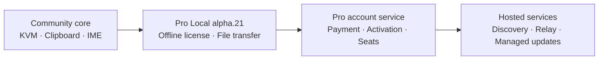

# Pro Local Offline License Gate Implementation Plan

> **For agentic workers:** Execute this plan in order with the
> `superpowers:executing-plans` and `superpowers:test-driven-development`
> workflows. Do not parallelize changes that share the license schema, settings
> key, production public key, or release state.

**Goal:** Release `0.1.0-alpha.21` with Windows file sending and receiving
available only to a valid Pro Local license, provide the owner with a private
offline issuer outside Git, and retire `alpha.20` only after the new release is
independently verified.

**Architecture:** A small public `licensing` library parses and verifies an
Ed25519-signed, versioned envelope against an embedded public key. Settings
store the accepted license line, the GUI exposes import/activate/remove, and
file transfer is checked independently at the UI, app startup, and Windows
transfer-service boundaries. The signing key and issuer executable live under
`C:\Users\LYR\Ieum-License-Authority-PRIVATE`, outside every Git worktree.

**Tech Stack:** C++20, Qt 6 Core/Widgets/Test, OpenSSL 3 Crypto (Ed25519),
CMake/Ninja, Python 3 + `cryptography` + PyInstaller for the private Windows
issuer, GitHub Actions, GitHub CLI.

**Spec:** `docs/superpowers/specs/2026-08-31-pro-local-offline-license-gate-design.md`

## Global constraints

- Never commit, stage, print, upload, or attach the production private key,
  issuer source, issuer executable, issuance ledger, owner license, or full
  supporter license.
- The repository may contain only the production public key, public verifier,
  test public key, and test-only signed fixtures.
- Never log the stored license line, payload, signature, or recipient. Public
  logs may contain only a validation status and license ID.
- Keep `v0.1.0-alpha.20` available until the alpha.21 release, checksums, and
  post-fetch verification all pass. Delete alpha.20 only at the final cutover.
- Preserve Community KVM, clipboard, IME synchronization, and all non-file
  transfer behavior when no license is installed.
- A valid key must be required on both participating Windows computers.
- Do not claim the GPL desktop gate is unbreakable DRM. It gates official
  builds; a determined party can modify GPL-covered source.
- Keep all source edits in `feat/pro-license-gate-alpha21` until protected PR
  checks pass and the pull request is merged into `ieum/main`.

---

## Task 1: Add the strict Ed25519 license verifier

**Files:**

- Create: `src/lib/licensing/CMakeLists.txt`
- Create: `src/lib/licensing/ProLicense.h`
- Create: `src/lib/licensing/ProLicense.cpp`
- Create: `src/lib/licensing/ProLicensePublicKey.h`
- Modify: `src/lib/CMakeLists.txt`
- Create: `src/unittests/licensing/CMakeLists.txt`
- Create: `src/unittests/licensing/ProLicenseTests.cpp`
- Create: `src/unittests/licensing/fixtures/test-public-key.h`
- Create: `src/unittests/licensing/fixtures/valid-perpetual-license.h`
- Modify: `src/unittests/CMakeLists.txt`

**Public interface:**

```cpp
namespace deskflow::licensing {

inline constexpr auto kFileTransferFeature = "file-transfer";

enum class ProLicenseStatus {
  Missing,
  TooLarge,
  Malformed,
  Unsupported,
  InvalidSignature,
  NotYetValid,
  Expired,
  Valid,
};

struct ProLicenseEntitlement {
  ProLicenseStatus status{ProLicenseStatus::Missing};
  QString licenseId;
  QString recipient;
  QStringList features;
  QDateTime notBefore;
  std::optional<QDateTime> expiresAt;

  [[nodiscard]] bool permits(QStringView feature) const noexcept;
};

using ProLicenseKeyRing = QHash<QString, QByteArray>;

[[nodiscard]] ProLicenseEntitlement verifyProLicense(
    const QString &licenseText,
    const QDateTime &nowUtc,
    const ProLicenseKeyRing &keyRing);
[[nodiscard]] ProLicenseEntitlement verifyProductionProLicense(
    const QString &licenseText,
    const QDateTime &nowUtc = QDateTime::currentDateTimeUtc());
[[nodiscard]] bool permitsProductionFileTransfer(
    const QString &licenseText,
    const QDateTime &nowUtc = QDateTime::currentDateTimeUtc());
[[nodiscard]] QString proLicenseStatusText(ProLicenseStatus status);

} // namespace deskflow::licensing
```

### Step 1.1: Generate test-only material outside the repository

- [ ] Use an ephemeral Python process to generate an Ed25519 test key pair and
  one deterministic fixture matching the exact schema.
- [ ] Put only the raw test public key and signed fixture in test headers.
- [ ] Confirm `rg -n "PRIVATE KEY|BEGIN PRIVATE|private_bytes" src docs`
  finds no secret material.

The fixed test payload must use `key_id=test-key-2026-01`, UUID
`11111111-2222-4333-8444-555555555555`, `product=pro-local`, the single
`file-transfer` feature, `not_before=2026-08-01T00:00:00Z`, and no expiry.

### Step 1.2: Write the failing verifier tests

- [ ] Add table-driven Qt tests for a valid perpetual license and a valid dated
  license at a fixed UTC time.
- [ ] Add rejection cases for empty input, 4 KiB total limit, wrong prefix,
  wrong segment count, padded/invalid base64url, 2 KiB payload limit, wrong
  signature size, malformed JSON, wrong schema/key/product/feature, malformed
  UUID, non-UTC timestamps, future `not_before`, elapsed `expires_at`, payload
  tampering, and signature tampering.
- [ ] Assert that invalid results do not expose recipient or features.
- [ ] Configure and run only `ProLicenseTests`; record the expected failure
  because `licensing/ProLicense.h` or the target implementation is absent.

Focused command:

```powershell
cmake --build build --target ProLicenseTests --parallel
ctest --test-dir build -R '^ProLicenseTests$' --output-on-failure
```

### Step 1.3: Implement the smallest strict parser and verifier

- [ ] Enforce one trimmed line, the 4 KiB whole-input limit, exactly three
  segments, `IEUM1`, and unpadded `[A-Za-z0-9_-]+` base64url.
- [ ] Decode with `AbortOnBase64DecodingErrors`; enforce 2 KiB payload, 64-byte
  signature, and 32-byte selected public key.
- [ ] Parse compact JSON without reserializing it and validate every required
  field and exact type before signature acceptance.
- [ ] Verify Ed25519 with `EVP_PKEY_new_raw_public_key_ex`,
  `EVP_DigestVerifyInit`, and `EVP_DigestVerify`.
- [ ] Treat `expires_at` as either JSON null or a strict UTC timestamp; compare
  all timestamps against the injected UTC clock.
- [ ] Ensure `permits()` returns true only for `Valid` plus a matching feature.

### Step 1.4: Wire CMake and make the test green

- [ ] Create a `licensing` static library linked to `Qt6::Core` and
  `OpenSSL::Crypto`.
- [ ] Add `add_subdirectory(licensing)` before `common` in `src/lib/CMakeLists.txt`.
- [ ] Add the licensing unit-test directory to `src/unittests/CMakeLists.txt`.
- [ ] Reconfigure, build, and run `ProLicenseTests` until all cases pass.
- [ ] Commit only the verifier and its tests as `feat: add offline Pro license verifier`.

---

## Task 2: Store licenses safely and migrate alpha.20 preferences

**Files:**

- Modify: `src/lib/common/Settings.h`
- Modify: `src/lib/common/Settings.cpp`
- Modify: `src/lib/common/CMakeLists.txt`
- Create: `src/unittests/common/ProLicenseSettingsTests.cpp`
- Modify: `src/unittests/common/CMakeLists.txt`

**Settings contract:**

```cpp
struct Pro
{
  static inline const QString LicenseKey = QStringLiteral("pro/licenseKey");
};

static bool hasProFileTransferEntitlement(
    const QDateTime &nowUtc = QDateTime::currentDateTimeUtc());
static bool clearUnauthorizedFileTransferPreferences(
    const QDateTime &nowUtc = QDateTime::currentDateTimeUtc());
```

### Step 2.1: Write failing settings-policy tests

- [ ] Isolate `QSettings` to a temporary INI file for every test.
- [ ] Prove that missing and malformed licenses report no entitlement.
- [ ] Seed alpha.20 send/receive preferences and prove migration clears both
  without changing the destination directory.
- [ ] Prove repeated migration is idempotent and never persists a plaintext
  license into logs or test output.
- [ ] Run only `ProLicenseSettingsTests` and observe the expected compile/test
  failure before adding production helpers.

### Step 2.2: Add the setting and migration helper

- [ ] Add `Settings::Pro::LicenseKey` to the valid-key set with an empty default.
- [ ] Link `common` privately to `licensing`.
- [ ] Implement entitlement lookup through `verifyProductionProLicense`.
- [ ] During settings initialization/upgrade, clear `FileTransfer::Enabled`
  and `FileTransfer::ReceiveEnabled` when entitlement is absent or invalid.
- [ ] Never clear a destination directory and never auto-enable flags after a
  license is added later.
- [ ] Run focused settings and existing settings tests.
- [ ] Commit as `feat: migrate file transfer behind Pro entitlement`.

---

## Task 3: Enforce the entitlement in application and service boundaries

**Files:**

- Modify: `src/lib/deskflow/ClientApp.cpp`
- Modify: `src/lib/deskflow/ServerApp.cpp`
- Modify: `src/lib/deskflow/CMakeLists.txt`
- Modify: `src/lib/deskflow/win32/MSWindowsFileTransferService.h`
- Modify: `src/lib/deskflow/win32/MSWindowsFileTransferService.cpp`
- Modify: `src/unittests/deskflow/MSWindowsFileTransferServiceTests.cpp`

**Service option:**

```cpp
using AuthorizationCheck = std::function<bool()>;
AuthorizationCheck authorizeFileTransfer;
```

### Step 3.1: Write failing revocation tests

- [ ] Extend service fixtures with a mutable authorization flag.
- [ ] Prove a denied sender cannot call `offerLocalFiles` and emits no control
  or data frame.
- [ ] Prove an incoming offer is rejected when authorization is denied.
- [ ] Start an authorized outgoing session, revoke authorization, and prove the
  next data step fails the session without leaking another payload chunk.
- [ ] Prove authorization restoration does not resurrect a failed session.
- [ ] Run `MSWindowsFileTransferServiceTests` and observe red assertions.

### Step 3.2: Add service-level checks

- [ ] Default an omitted callback to deny, so every production/test caller must
  choose authorization explicitly.
- [ ] Check authorization before `offerLocalFiles`, before accepting an incoming
  offer, before outgoing decision handling, and before each outgoing data step.
- [ ] Cancel/fail an in-flight session when access is withdrawn and ensure
  temporary files are cleaned by the existing failure path.
- [ ] Keep status logs free of full license data.

### Step 3.3: Gate ClientApp and ServerApp startup

- [ ] Return before service creation when
  `Settings::hasProFileTransferEntitlement()` is false, regardless of manually
  edited send/receive flags.
- [ ] Pass a callback that re-reads current settings entitlement for every
  service authorization check; do not capture a one-time boolean.
- [ ] Keep the existing Windows, TLS, send, receive, and destination checks.
- [ ] Link `deskflow` to the required public licensing/common dependency.
- [ ] Run the focused service tests plus existing transfer protocol tests.
- [ ] Commit as `feat: enforce Pro license during file transfer`.

---

## Task 4: Add license activation to the Files settings page

**Files:**

- Modify: `src/lib/gui/dialogs/SettingsDialog.ui`
- Modify: `src/lib/gui/dialogs/SettingsDialog.h`
- Modify: `src/lib/gui/dialogs/SettingsDialog.cpp`
- Modify: `src/lib/gui/CMakeLists.txt`
- Create: `src/unittests/gui/ProLicenseUiPolicyTests.cpp`
- Modify: `src/unittests/gui/CMakeLists.txt`

### Step 4.1: Extract and test a deterministic UI policy

- [ ] Add a small non-widget policy function mapping entitlement status,
  platform, TLS, and writability to status text and control-enabled booleans.
- [ ] Test locked, malformed, expired, not-yet-valid, and active states.
- [ ] Prove transfer controls remain disabled if any of Windows, TLS,
  writability, or entitlement is false.
- [ ] Prove an invalid candidate never replaces a previously valid stored key.
- [ ] Run the new test red before implementing the policy.

### Step 4.2: Build the Files-tab activation controls

- [ ] Add a `Pro Local license` group above file-transfer controls.
- [ ] Add a password-echo `QLineEdit`, Import, Activate, and Remove buttons, and
  a status label.
- [ ] Import only one UTF-8 line from a selected `.ieum-license.txt` file,
  trim surrounding whitespace, and reject input over 4 KiB before display.
- [ ] Activate only after production verification succeeds; on failure retain
  the previous stored valid key and show the structured status.
- [ ] Remove the stored key and immediately clear both send/receive preferences.
- [ ] Show active license ID and recipient but never unmask or copy the full key.
- [ ] Make `updateFileTransferControls()` use the tested policy.

### Step 4.3: Preserve dialog semantics

- [ ] Include the license and gated flags in change detection and reset logic.
- [ ] Prevent Cancel from persisting a candidate license; only Activate writes it.
- [ ] Ensure Restore Defaults removes the key and disables both transfer flags.
- [ ] Run UI policy tests and build `deskflow-gui`.
- [ ] Commit as `feat: add Pro license activation controls`.

---

## Task 5: Create the private production authority and owner license

**Private files only; none may appear beneath the repository:**

- Create: `C:\Users\LYR\Ieum-License-Authority-PRIVATE\keygen.py`
- Create: `C:\Users\LYR\Ieum-License-Authority-PRIVATE\IeumLicenseKeygen.spec`
- Create: `C:\Users\LYR\Ieum-License-Authority-PRIVATE\IeumLicenseKeygen.exe`
- Create: `C:\Users\LYR\Ieum-License-Authority-PRIVATE\Ieum-Pro-Local-Ed25519-private.pem`
- Create: `C:\Users\LYR\Ieum-License-Authority-PRIVATE\Ieum-Pro-Local-public-key.txt`
- Create: `C:\Users\LYR\Ieum-License-Authority-PRIVATE\README-PRIVATE.txt`
- Create: `C:\Users\LYR\Ieum-License-Authority-PRIVATE\ledger.jsonl`
- Create: `C:\Users\LYR\Ieum-License-Authority-PRIVATE\issued\ieum-owner-pro-local.ieum-license.txt`
- Create: `C:\Users\LYR\Ieum-License-Authority-PRIVATE\issued\ieum-owner-pro-local.receipt.json`
- Modify public only: `src/lib/licensing/ProLicensePublicKey.h`

### Step 5.1: Prepare and lock down the private directory

- [ ] Detect the bundled Python runtime and availability of `cryptography`,
  Tkinter, and PyInstaller; install only into a private virtual environment if
  a packaging dependency is missing.
- [ ] Create the exact private directory structure outside the worktree.
- [ ] Apply explicit NTFS ACLs for the current user, Administrators, and SYSTEM;
  remove inherited access and verify the resulting ACL.
- [ ] Confirm `git -C <worktree> status --short --untracked-files=all` cannot see
  any private path.

### Step 5.2: Write a private failing round-trip test

- [ ] Create a private test that invokes the issuer core with a temporary key,
  parses the emitted payload, verifies its Ed25519 signature independently,
  checks file non-overwrite behavior, and checks ledger SHA-256.
- [ ] Run it before the issuer implementation and record the expected failure.

### Step 5.3: Implement and package the private issuer

- [ ] Generate a new Ed25519 production private PEM exactly once; never echo it.
- [ ] Export its raw 32-byte public key and record key ID
  `pro-local-2026-01` in the public-key text file.
- [ ] Implement sorted compact JSON, UUIDv4 IDs, UTC timestamps, optional
  expiry, envelope signing, non-overwriting license/receipt writes, and an
  append-only ledger record containing only metadata and full-license SHA-256.
- [ ] Build a Tkinter GUI requesting recipient alias/order reference and
  optional expiry; it must never display private key material.
- [ ] Package a windowed standalone `IeumLicenseKeygen.exe` with PyInstaller.
- [ ] Run the private unit test and a packaged-executable smoke test.

### Step 5.4: Embed only the production public key

- [ ] Patch the raw public key into `ProLicensePublicKey.h` under key ID
  `pro-local-2026-01`.
- [ ] Issue one perpetual owner license and private receipt.
- [ ] Verify that license using the repository's production verifier binary.
- [ ] Write private backup/recovery and supporter-delivery instructions to
  `README-PRIVATE.txt` without copying them into Git.
- [ ] Re-check ACLs and ensure no private artifact is staged, tracked, logged,
  or present in a build/release directory.
- [ ] Amend no earlier commit; commit only the public-key update with the next
  repository task.

---

## Task 6: Update product documentation, translations, version, and code graph

**Files:**

- Modify: `VERSION`
- Modify: `README.md`
- Modify: `docs/dev/pro_local_file_transfer.md` or the existing canonical
  file-transfer guide discovered by `rg`
- Modify: `docs/dev/protocol_reference.md`
- Modify: `docs/codegraph/README.md`
- Regenerate: `docs/codegraph/component-graph.mmd`
- Regenerate: `docs/codegraph/codegraph.json`
- Modify generated translation catalogs discovered by the repository's
  translation update target

### Step 6.1: Write public product copy

- [ ] Change version to `0.1.0-alpha.21`.
- [ ] Describe File Transfer as a Pro Local feature requiring activation on
  both Windows computers; remove `preview` wording.
- [ ] Add concise supporter instructions: receive the text file, import it in
  Files settings on both computers, activate, enable TLS, then explicitly
  enable send/receive.
- [ ] Add a roadmap diagram showing Community local core, Pro Local offline
  license/file transfer, and later hosted activation/discovery/relay.
- [ ] State that current offline licenses are not device-counted or remotely
  revocable, and that GPL source remains available and modifiable.
- [ ] State clearly that the private issuer is intentionally not distributed.

Roadmap diagram to include:



### Step 6.2: Update translatable UI and protocol wording

- [ ] Regenerate translation sources using the repository command, rather than
  hand-editing generated catalog structure.
- [ ] Verify every new visible string has a translation entry and no obsolete
  `file transfer preview` string remains in current UI/docs.
- [ ] Clarify that wire protocol capability remains negotiated but local use is
  subject to entitlement before offers/data are emitted.

### Step 6.3: Regenerate the code graph

- [ ] Run the repository code-graph generator.
- [ ] Confirm `licensing`, `test:licensing`, and their dependencies appear in
  JSON, Mermaid, and the human-readable component table.
- [ ] Confirm the generated graph contains no private-directory paths or license
  strings.
- [ ] Commit as `docs: publish alpha.21 Pro Local roadmap`.

---

## Task 7: Perform focused and release-grade verification

### Step 7.1: Run focused checks

- [ ] Run `ProLicenseTests`, `ProLicenseSettingsTests`,
  `ProLicenseUiPolicyTests`, and `MSWindowsFileTransferServiceTests`.
- [ ] Run all existing file-transfer protocol, routing, state, source-manifest,
  edge-drop, and Windows I/O tests.
- [ ] Build the GUI and package targets used by the release workflow.
- [ ] Run format/lint only over files changed by this feature.

### Step 7.2: Run security/privacy assertions

- [ ] Search tracked files, Git diffs, build outputs, and staged paths for
  `BEGIN PRIVATE KEY`, the private directory name, the owner license ID, the
  full production license prefix plus payload, and issuer source names.
- [ ] Confirm only the expected raw public key and key ID are public.
- [ ] Inspect `git diff --check`, `git status`, and every commit planned for PR.
- [ ] Verify license failures never include the candidate key in logs/messages.

### Step 7.3: Exercise the upgrade boundary

- [ ] Install/seed alpha.20 settings with send and receive enabled in an isolated
  test profile, start alpha.21 without a key, and confirm both flags are cleared.
- [ ] Activate the owner key locally, opt into file transfer, restart, and
  confirm the service can start only while the entitlement remains valid.
- [ ] Remove the key during an idle session and during a synthetic transfer;
  confirm no new offer/data is emitted.
- [ ] Record that a physical two-PC manual transfer remains unclaimed unless a
  second Windows machine is actually exercised.

### Step 7.4: Commit final verification corrections

- [ ] Fix only failures attributable to this feature and repeat the narrowest
  affected test before expanding verification.
- [ ] Commit final source adjustments as `fix: harden Pro file transfer gate` if
  any are needed; do not create an empty commit.

---

## Task 8: Merge alpha.21 through the protected main branch

### Step 8.1: Push and open the pull request

- [ ] Rebase or merge the latest `ieum/main` only if needed and rerun affected
  focused tests.
- [ ] Push `feat/pro-license-gate-alpha21` to the `ieum` remote.
- [ ] Open a PR summarizing the three enforcement layers, private/public key
  boundary, migration, tests, roadmap, and alpha.20 deletion condition.
- [ ] Confirm no release/deployment was triggered by branch push alone.

### Step 8.2: Pass protected CI and merge

- [ ] Monitor required Windows, Linux/WSL, Docker/Android, and Apple lanes as
  defined by repository workflows and registered labels; do not silently move
  compatible lanes to GitHub-hosted runners.
- [ ] Diagnose only genuine failures, push minimal fixes, and wait for all
  required checks to become green.
- [ ] Squash-merge into `ieum/main`, delete the remote feature branch, and verify
  the main commit contains the version/public-key/gate/docs changes.

---

## Task 9: Release alpha.21, verify it, then retire alpha.20

### Step 9.1: Create the alpha.21 tag

- [ ] Fetch `ieum/main`, verify a clean release commit, and create annotated tag
  `v0.1.0-alpha.21` on that exact merged commit.
- [ ] Push only the alpha.21 tag and confirm the release workflow starts.

### Step 9.2: Wait for all release evidence

- [ ] Monitor package, privacy scan, release publication, deployment, and
  post-fetch verification jobs through terminal states.
- [ ] Confirm the GitHub Release is non-draft and non-prerelease status matches
  repository policy, with the expected package matrix and `checksums.txt`.
- [ ] Download every alpha.21 asset to a fresh temporary directory and verify
  every declared SHA-256 independently.
- [ ] Search downloaded assets for exact private tokens/paths and confirm none
  are present.
- [ ] Verify the tag, release target commit, package metadata, and `VERSION` all
  identify `0.1.0-alpha.21`.

### Step 9.3: Delete alpha.20 only after Step 9.2 is green

- [ ] Record alpha.20's release URL, tag object, and target commit for audit and
  recovery reference without retaining its binaries in the repository.
- [ ] Delete GitHub Release `v0.1.0-alpha.20`.
- [ ] Delete remote tag `refs/tags/v0.1.0-alpha.20` and the local tag.
- [ ] Verify `gh release view v0.1.0-alpha.20` no longer resolves and
  `git ls-remote --tags ieum v0.1.0-alpha.20` returns no tag.
- [ ] Re-open alpha.21 and re-check its assets/checksums after the deletion.

### Step 9.4: Final handoff

- [ ] Report the alpha.21 release URL, merged commit, tag, workflow conclusions,
  asset/checksum totals, alpha.20 deletion evidence, and private issuer path.
- [ ] Explain exactly how to create and send a supporter key: launch the private
  keygen, enter a display alias/order reference, choose optional expiry, click
  Issue, and send only the generated `.ieum-license.txt`.
- [ ] Remind the owner to back up the private PEM encrypted and never send the
  PEM, keygen, receipt, or ledger to supporters.
- [ ] State the remaining limitation honestly: GPL source can be patched, while
  future hosted activation/relay can enforce server-side paid entitlements.

## Definition of done

The work is complete only when all of the following are simultaneously true:

- alpha.21 packages refuse file-transfer start, offers, and data without a
  current valid production entitlement;
- GUI activation works without exposing or overwriting a valid stored key;
- alpha.20 enabled preferences are cleared on an unlicensed upgrade;
- the owner has a functioning private keygen, private PEM, owner license,
  receipt, and ledger outside Git with restricted ACLs;
- the public repository and release contain only the production public key;
- focused tests and protected CI pass;
- alpha.21 release assets pass independent post-download checksums and privacy
  scans; and
- only then, the alpha.20 GitHub Release and remote/local tag are gone.
